
<h1> Obsession</h1>
  

## ❓ ¿Qué es Obsession?

Obsession es una máquina vulnerable orientada al aprendizaje de ciberseguridad ofensiva, centrada en la enumeración de servicios, análisis web y escalada de privilegios en sistemas Linux. A través de servicios mal configurados como FTP, SSH y HTTP, el usuario deberá recopilar información clave para obtener acceso al sistema y, posteriormente, elevar privilegios hasta root mediante el abuso de permisos sudo y binarios vulnerables.

Esta máquina está pensada para quienes quieren dar sus primeros pasos en pentesting y comprender la importancia de una correcta configuración de servicios y permisos en entornos Linux.

> [!NOTE]
>
>Puede descargar la máquina a través del **[enlace mega](https://mega.nz/file/JHUEFZ4J#SyfKRfM6_xKBXLxP8JZKW-sVQnB0Nv2B1Dwbw6pRn9w)**

## 🔝 Despliegue Obsession

Al descargar la máquina, es necesario descompromirlo para poder encontrar los archivos necesarios para poder desplegarla, para ello, utilizaremos el comando.

**unzip obsession.zip.**

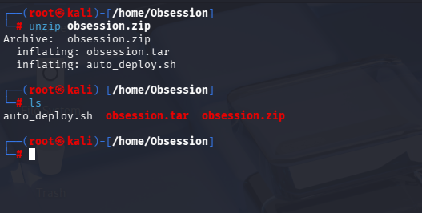

Obtendremos dos ficheros:
- **Auto_deploy.sh:** Script Bash para desplegar nuestra máquina localmente.
- **Obsession.tar:** Máquina vulnerable contenizada.

Para desplegar el servicio será necesario carle permisos de ejecución a auto_deploy.sh, ya que por defecto tiene permisos 644. Para ello, usaremos el comando:

 **chmod +x auto_deploy.sh**

 Una vez ejecutado, se utilizará el comando **./auto_deploy.sh obsession.tar** para lanzar la máquina

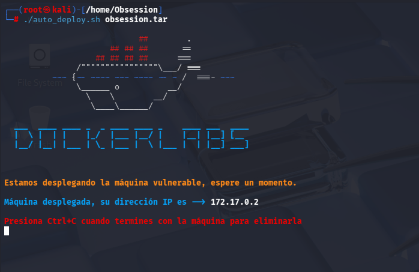

## 🔎 Fase de Descubrimiento 
Ahora, se abrirá una nueva terminal para empezar a realizar el descubrimiento del sistema. Cómo sabemos la dirección IP de la máquina vulnerable **(172.17.0.2)**, comenzaremos realizando un escaneo de red nmap. 
En esta ocación, se usará el comando **nmap -sC -sV --min-rate 5000 172.12.0.2**

| Argumento | Significado |
|---|---|
| -sC | Ejecuta los scripts para comprobaciones comunes |
| -sV | Detección de versiones de servicios |
| --min-rate 5000 | Envía al  5000 paquetes por segundo (aumenta velocidad; puede causar pérdida o detección) |
| 172.17.0.2 | Dirección IP del objetivo a escanear |

> [!NOTE]
>
>Se ha realizado un escaneo agresivo debido a que se está realizando en un entorno controlado y no es importante el ser detectado. Si se busca hacer el mínimo ruido posible será necesario utilizar el argumento **-sS** se usa para no ser detectado fácilmente, porque no completa la conexión TCP. Además, **no se usará --min-rate.**

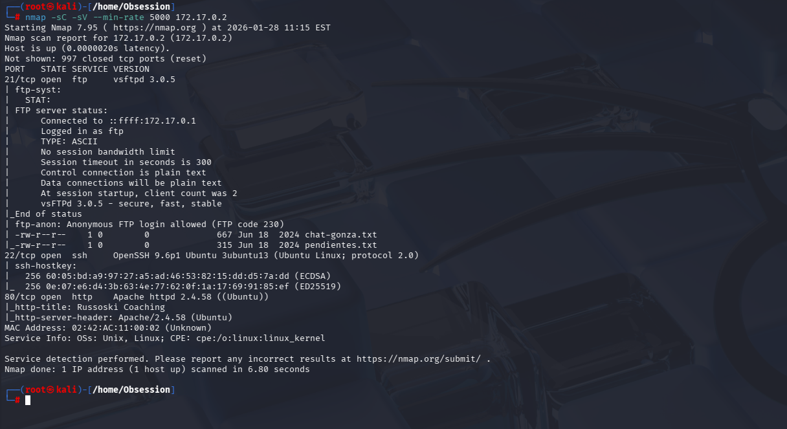

Cómo vemos, se encuentra tres servicios activos:
- **FTP con acceso anónimo (Puerto 21):** Se encuentra 2 ficheros.txt
- **SSH (Puerto: 22):** para conexiones remotas: Será el servicio que usaremos para entrar al equipo.
- **HTTP (Puerto 80):** Servidor Web.

## 📂 Análisis FTP
Primero se intenta acceder al servidor FTP de forma anónima, ya que normalmente viene configurado por defecto con las credenciales **anonymous / anonymous**. Si esto no funciona, se puede probar fuerza bruta con Hydra o utilizar scripts de Nmap para enumerar el servicio.

Para acceder al servidor FTP se usa el comando **ftp**. Posteriormente se utiliza el comando **open 172.17.0.2** para abrir la conexión con el servidor. Por último, se introduce las credenciales.

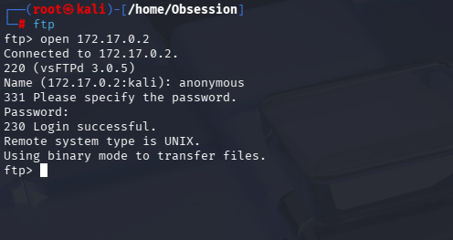

Con el comando **dir** se podrá listar los archivos disponibles.
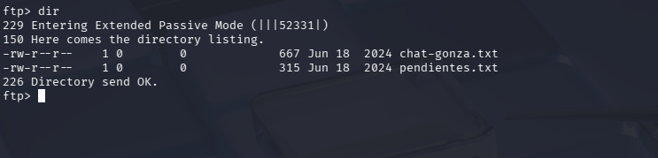

A continuación, se descarga los ficheros utilizando el comando **get**

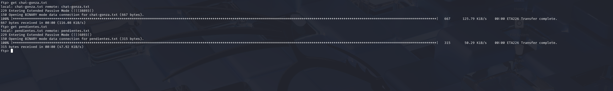
Una vez descargado, con **cat**, se verá el contenido de estos ficheros.

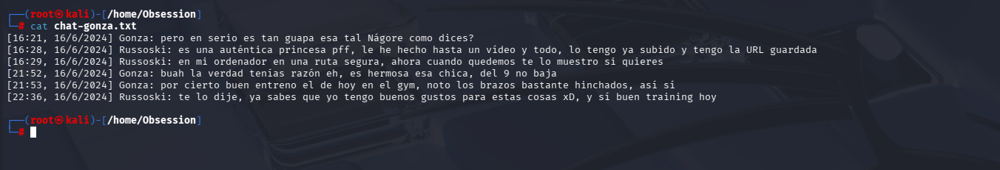

<b>Chat-gonza.txt</b>

En el segundo documento, se puede encontrar información importante en el cuarto punto: Dice que algunos permisos habilitados cree que no son del todo seguros. Una pista para cuando se escale privilegios.
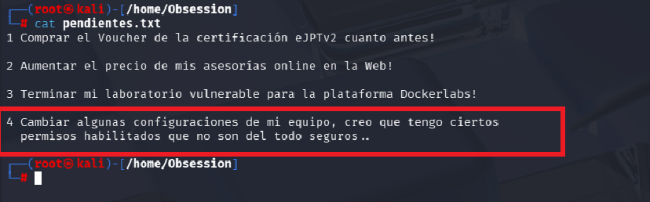

<b>pendientes</b>

## 🌐 Análisis Web
A continuación, se empezará a analizar el servidor web.

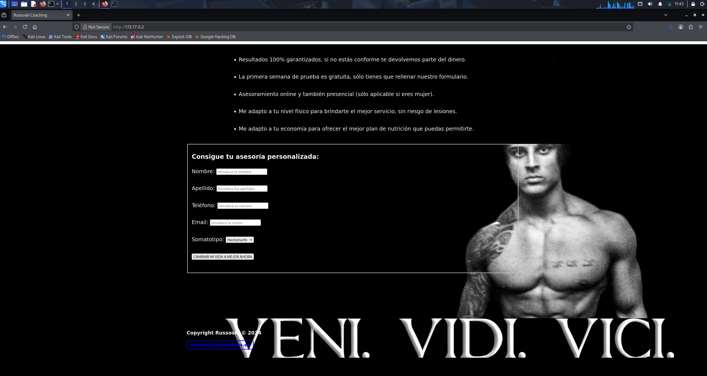

Se encuentra un formulario web, donde redirige a esta página.
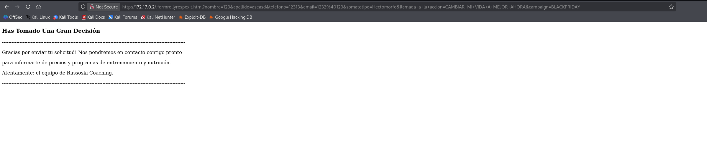

Nos interesa la raíz de la web, donde se verá el código fuente del servidor usando **Control + U**.

En la **línea 52**, se encuentra una pista, donde índica que se utiliza el mismo usuario para todos los permisos.

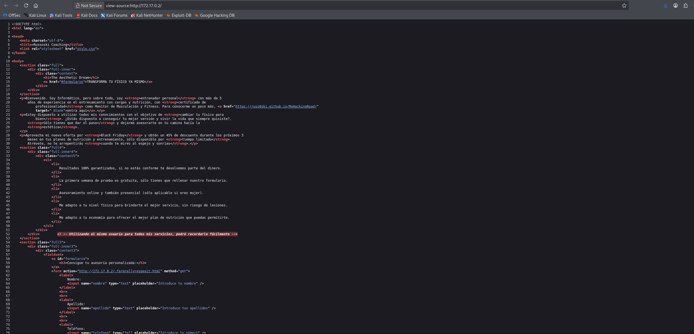

Ahora, cómo no se cuenta con más directorio faciles de encontrar, usaremos dirbuster para realizar una enumeración de directorios:

Será necesario establecer la dirección IP del servidor objetivo, con su protocolo (http) y puerto (:80). Posteriormente se establecerá el número de hilos (velocidad), en mi caso, he usado 200 que es el máximo para mí. Por último, se ha establecido un diccionario de directorios comunes para que dirbuster haga peticiones y nos reporte el estado de cada uno, estos diccionarios se encuentran en **/usr/share/wordlist**.

Una vez terminada la prueba, se mostrará el resultado en el apartado **Results - List View**.

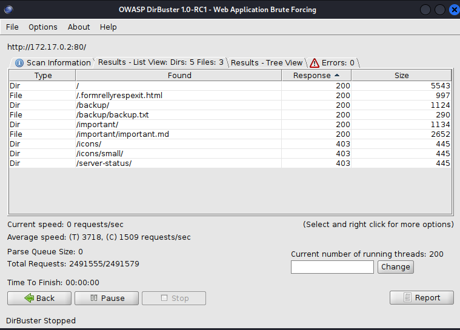

A continuación, se muestra la información extraída mediante los directorios y archivos encontrados con respuesta 200 (OK):

- **/backup/backup.txt:** Usuario para los servicios: russoski.
  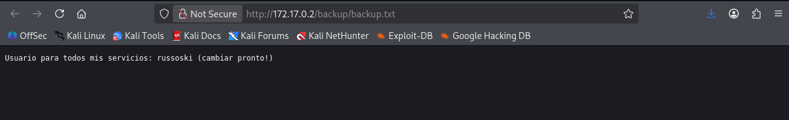

- **/important/important.md:** Manifiesto Hacker. No hay información relevante .
  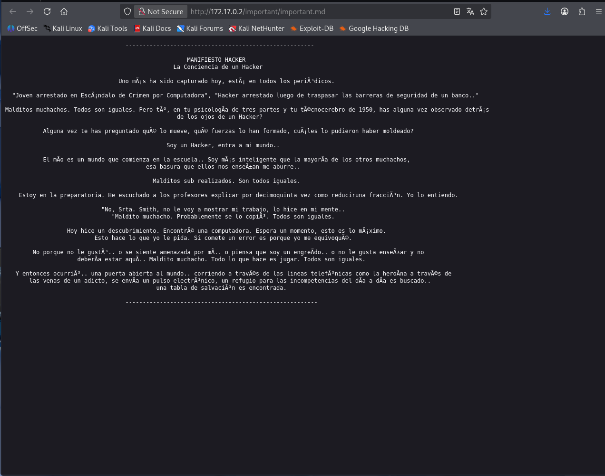

## 🛜 Análisis SSH
Cómo ya conocemos el usuario, podemos realizar un ataque de fuerza bruta para encontrar la contraseña. Se puede realizar de dos maneras:
- **Nmap:** nmap -p 22 --script ssh-brute --script-args userdb=users.txt --min-rate 5000 172.17.0.2

    | Argumento | Significado |
    |---|---|
    | -p 22 | Especifica el puerto SSH a escanear. |
    | --script ssh-brute | Ejecuta el script NSE para ataque de fuerza bruta en SSH. |
    | --script-args userdb=users.txt | Proporciona el archivo con lista de usuarios para el ataque. |
    | --min-rate 5000 | Envía al menos 5000 paquetes por segundo (aumenta velocidad). |

    >[!CAUTION]
    >
    >Se debe crear con un editor de texto cómo **nano**  llamado **users.txt** con el usuario russoski dentro.

    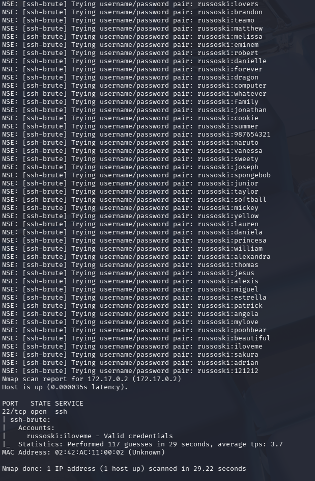

- **Hydra [RECOMENDADO]**: hydra -l ryssoski -P /usr/share/wordlists/rockyou.txt.gz ssh://172.17.0.2 -t 64

    | Argumento | Significado |
    |---|---|
    | hydra | Herramienta de ataque de fuerza bruta. |
    | -l russoski | Especifica un usuario. |
    | -P /usr/share/wordlists/rockyou.txt.gz| Archivo con diccionario de contraseñas a probar. |
    | ssh://192.168.1.100 | Protocolo y dirección IP del objetivo. |
    | -t 64 | Número de hilos utilizados (velocidad). |

    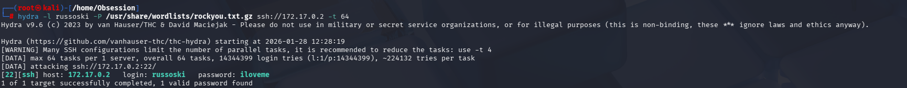

## 🖥️ Acceso al servidor
Cómo ya se ha obtenido el usuario (russoski) y su contraseña (iloveme), se procede a la conexión por ssh mediante el comando **ssh russoski:172.17.0.2**.

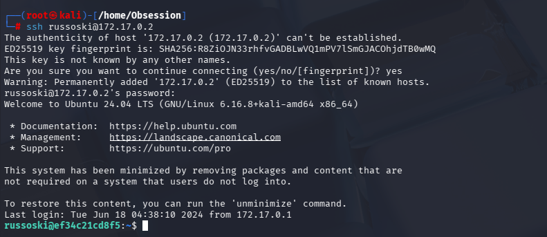

Se lista todos los recursos que tenemos disponible:

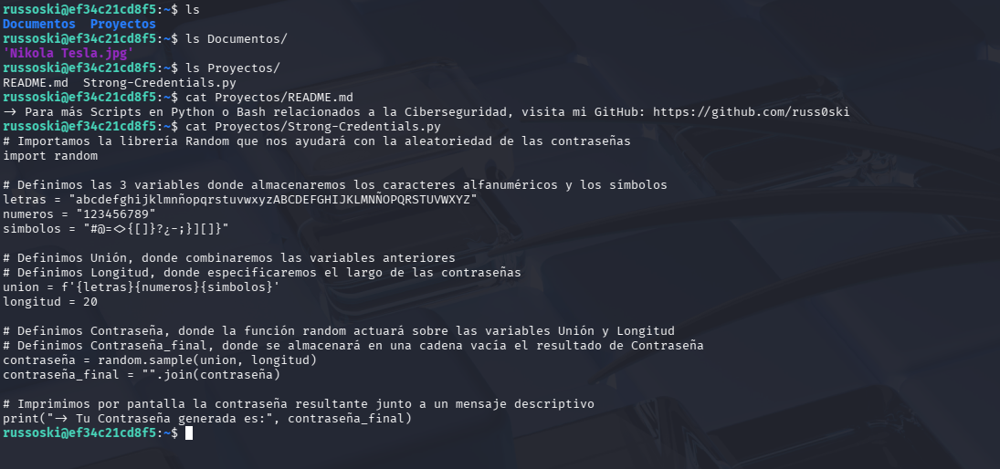

## 🔓 Escalada de permisos
Se usará el comando **sudo -l** para mostrar los binarios que el usuario russoski puede ejecutar cómo **root**.

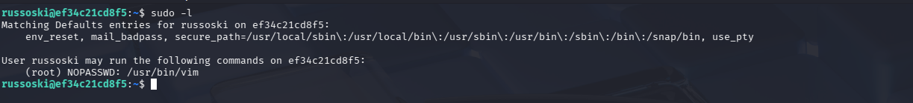

A continuación, se consulta **[GTFOBins](https://int0x33.github.io/)** para identificar posibles técnicas de escalada de privilegios, ya que el binario vim puede ejecutarse con permisos elevados. En esta plataforma se revisa qué acciones pueden realizarse con dicho binario para obtener una shell o ejecutar comandos como usuario root.

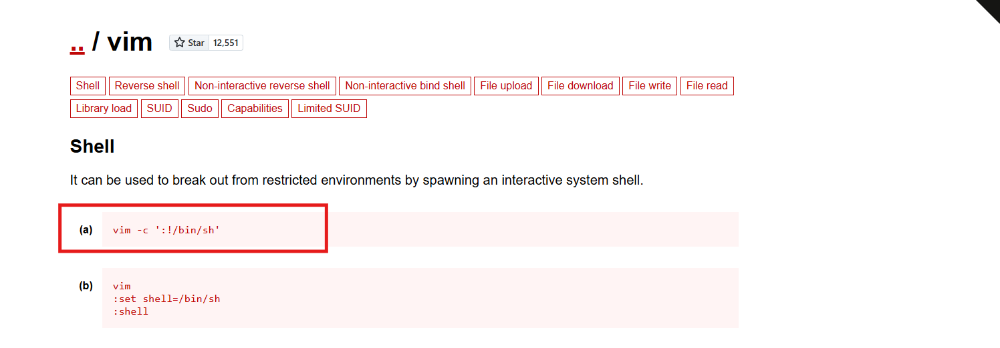

Posteriormente se introduce el comando, se confirma que se accede al usuario root usando el comando **whoami**.

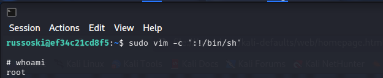

## 🧪 Post-Laboratorio
Una vez finalizada la máquina, en la terminal donde se tiene desplegada la máquina vulnerable se utilizará la combinación de teclas **Control + C** para eliminarla.

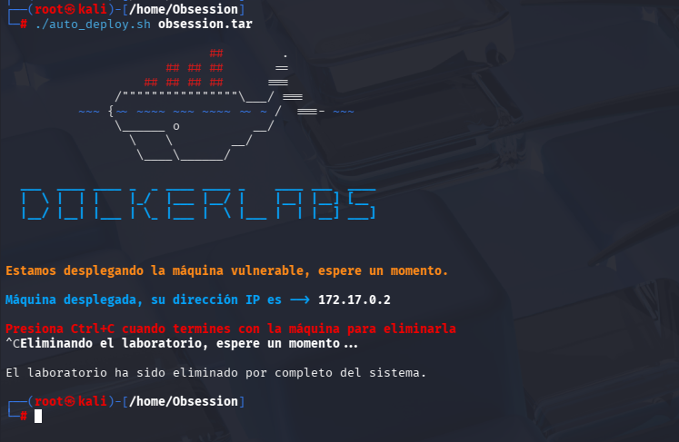

##   ¡Hola! Me llamo Saúl Ruiz 
### Estudiante en Ciberseguridad

Soy estudiante de Administración de Sistemas Informáticos en Red con pasión por la ciberseguridad y el mundo de la informática. Desde pequeño disfruto explorando tecnología y aprendiendo de manera autónoma. Además, combino mis estudios con la creación de contenido y recursos educativos sobre informática a través de mi proyecto personal <b>[@PlaSysX](https://linktr.ee/PlaSysx)</b>

Si quieres aprender informática, mejorar tus habilidades, descubrir trucos y soluciones prácticas, y formar parte de nuestra comunidad, puedes seguirnos en PlaSysX.

 

