
<h1> Vacaciones</h1>
  

## ❓ ¿Qué es Vacaciones?

Vacaciones es una máquina vulnerable orientada al aprendizaje de ciberseguridad ofensiva, centrada en la enumeración de servicios, análisis web y escalada de privilegios en sistemas Linux. A través de servicios expuestos como SSH y HTTP, el usuario deberá recopilar información clave, realizar ataques de fuerza bruta controlados y analizar el sistema para obtener acceso inicial.

Esta máquina está pensada para quienes quieren dar sus primeros pasos en pentesting, permitiendo comprender la importancia de la enumeración, la gestión de credenciales y el correcto control de permisos y binarios en entornos Linux, culminando en la obtención de privilegios root mediante técnicas de escalada locales.
> [!NOTE]
>
>Puede descargar la máquina a través del **[enlace mega](https://mega.nz/file/YCEGAISD#y6iWUG_auH4vUApClb9ix7H6JmOCKm4vAYS2TjQn59g)**

## 🔝 Despliegue Vacaciones

Al descargar la máquina, es necesario descompromirlo para poder encontrar los archivos necesarios para poder desplegarla, para ello, utilizaremos el comando.

**unzip vacaciones.zip.**

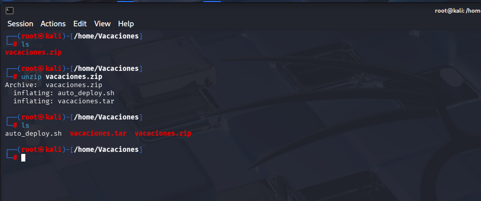

Obtendremos dos ficheros:
- **Auto_deploy.sh:** Script Bash para desplegar nuestra máquina localmente.
- **vacaciones.tar:** Máquina vulnerable contenizada.

Para desplegar el servicio será necesario carle permisos de ejecución a auto_deploy.sh, ya que por defecto tiene permisos 644. Para ello, usaremos el comando:

 **chmod +x auto_deploy.sh**

 Una vez ejecutado, se utilizará el comando **./auto_deploy.sh vacaciones.tar** para lanzar la máquina

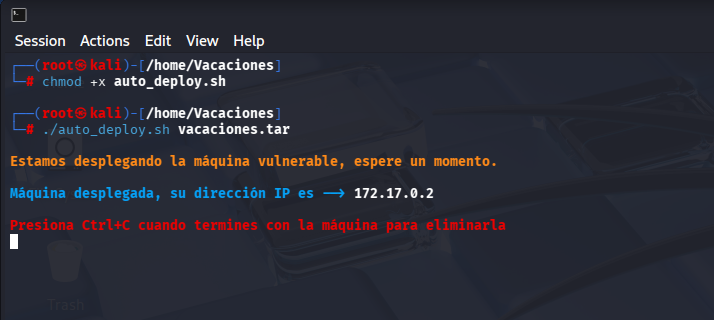

## 🔎 Fase de Descubrimiento 
Ahora, se abrirá una nueva terminal para empezar a realizar el descubrimiento del sistema. Cómo sabemos la dirección IP de la máquina vulnerable **(172.17.0.2)**, comenzaremos realizando un escaneo de red nmap. 
En esta ocación, se usará el comando **nmap -sC -sV --min-rate 5000 172.12.0.2**

| Argumento | Significado |
|---|---|
| -sC | Ejecuta los scripts para comprobaciones comunes |
| -sV | Detección de versiones de servicios |
| --min-rate 5000 | Envía al  5000 paquetes por segundo (aumenta velocidad; puede causar pérdida o detección) |
| 172.17.0.2 | Dirección IP del objetivo a escanear |

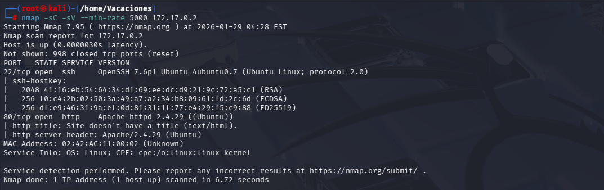

> [!NOTE]
>
>Se ha realizado un escaneo agresivo debido a que se está realizando en un entorno controlado y no es importante el ser detectado. Si se busca hacer el mínimo ruido posible será necesario utilizar el argumento **-sS** se usa para no ser detectado fácilmente, porque no completa la conexión TCP. Además, **no se usará --min-rate.**

En este caso, se ha encontrado dos servicios activos:
- **SSH (Puerto: 22):** para conexiones remotas
- **HTTP (Puerto 80):** Servidor Web.

A continuación, se procede a visitar el sitio web utilizando el protocolo http. Aparentemente, no hay contenido.

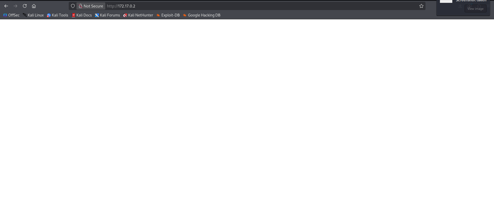

Para ver alguna información extra, se puede inspeccionar la página utilizando **F12** o ver el código fuente utilizando el atajo **Control + U**.

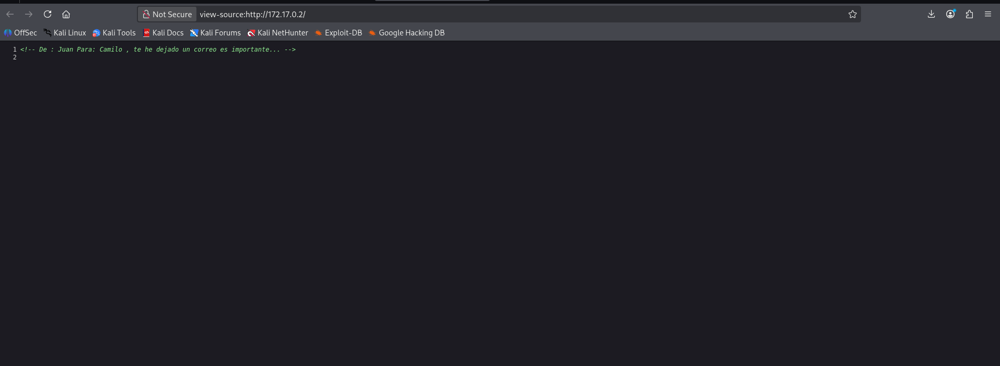

En el código fuente se encuentra un comentario que muestra un mensaje de juan a camilo. Esta información es bastante útil, ya que se podría decir que Juan o Camilo es uno de los usuarios del sistema.

## 🖥️ Acceso al servidor
Para poder acceder al servidor, se ha realizado un ataque de fuerza bruta con hydra.
Primeramente, es necesario crear un diccionario llamado **usuarios.txt** dónde se introducirá los posibles usuarios juan y camilo.

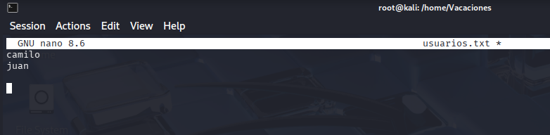

Para utilizar hydra, se utiliza el comando: **hydra -L usuarios.txt -P /usr/share/wordlists/rockyou.txt.gz -t 64 ssh://172.17.0.2**

  | Argumento | Significado |
  |---|---|
  | hydra | Herramienta de ataque de fuerza bruta. |
  | -L usuarios.txt | Archivo con los usurios juan y cmailo. |
  | -P /usr/share/wordlists/rockyou.txt.gz| Archivo con diccionario de contraseñas a probar. |
  | ssh://172.17.0.2| Protocolo y dirección IP del objetivo. |
  | -t 64 | Número de hilos utilizados (velocidad). |

  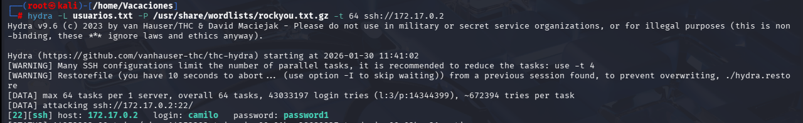

Se ha conseguido correctamente acceso SSH desde el usuario **camilo** cuya contraeña es **password1**

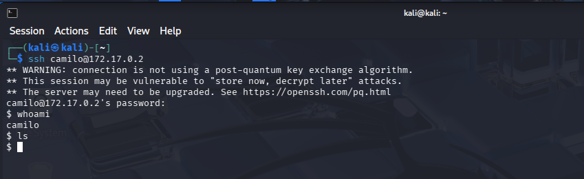

## 🔓 Escalada de privilegios

Al tener acceso al servidor, lo primero es ver que binarios puede ejecutar el usuario usando **sudo -l**.

Cómo no tiene ningún binario disponible, es necesario ver que directorios tenemos acceso, se encuentra que se puede acceder a subdirectorios donde se encuentra usuarios camilo, juan pedro.

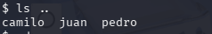

En estos directorios no encontramos información, por ende, se continua buscando el directorio raiz (/).

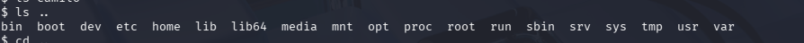

Una vez dentro, se restringue el acceso a la carpeta /root, pero no a la carpeta /bin, donde podemos ver los binarios descargados.

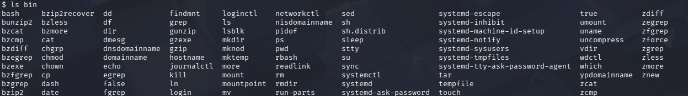

Se encuentra el binario bash, se ejecuta utilizando el comando **bash**.

A continuación, se seguirá utilizando la pista que nos encontramos en el servidor web: "te he dejado un correo importante". Posiblemente se encuentre en el sistema, por ende, se filtrará desde la raíz todos los ficheros que tenga un nombre que con formato.txt. Además se utilizará **2>/dev/null** para eliminar el output de permisos inecesarios.

Comando: **find / -type f -iname "*.txt" 2>/dev/null**

Se realiza **cat** para poder visualizar el contenido del fichero correo.txt

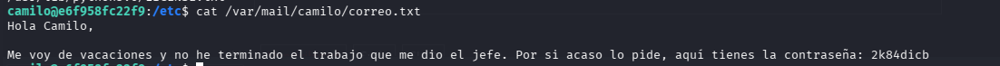

En el correo electrónico muestra que la contraseña de juan es **2k84dicb**

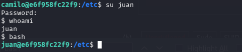

A continuación, se utiliza el comando **sudo -l** para visualizar los binarios ejecutables por juan. En este caso ruby.

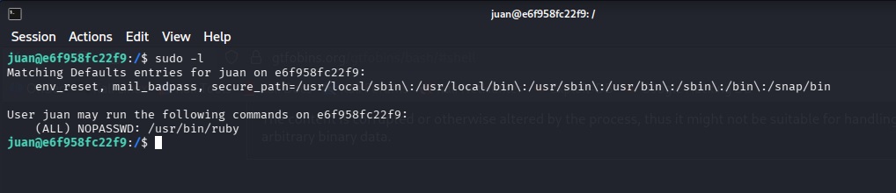

Se consultará a GFTObins para ver el método de acceso al usuario root

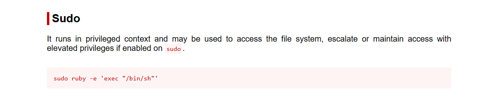

Tras ejecutar dicho comando, tenemos acceso root

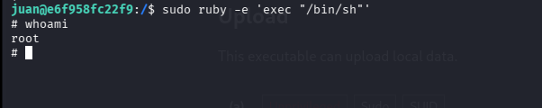

## 🧪 Post-Laboratorio
Una vez finalizada la máquina, en la terminal donde se tiene desplegada la máquina vulnerable se utilizará la combinación de teclas **Control + C** para eliminarla.

##   ¡Hola! Me llamo Saúl Ruiz 
### Estudiante en Ciberseguridad

Soy estudiante de Administración de Sistemas Informáticos en Red con pasión por la ciberseguridad y el mundo de la informática. Desde pequeño disfruto explorando tecnología y aprendiendo de manera autónoma. Además, combino mis estudios con la creación de contenido y recursos educativos sobre informática a través de mi proyecto personal <b>[@PlaSysX](https://linktr.ee/PlaSysx)</b>

Si quieres aprender informática, mejorar tus habilidades, descubrir trucos y soluciones prácticas, y formar parte de nuestra comunidad, puedes seguirnos en PlaSysX.

 

