
<h1>Backend</h1>
  

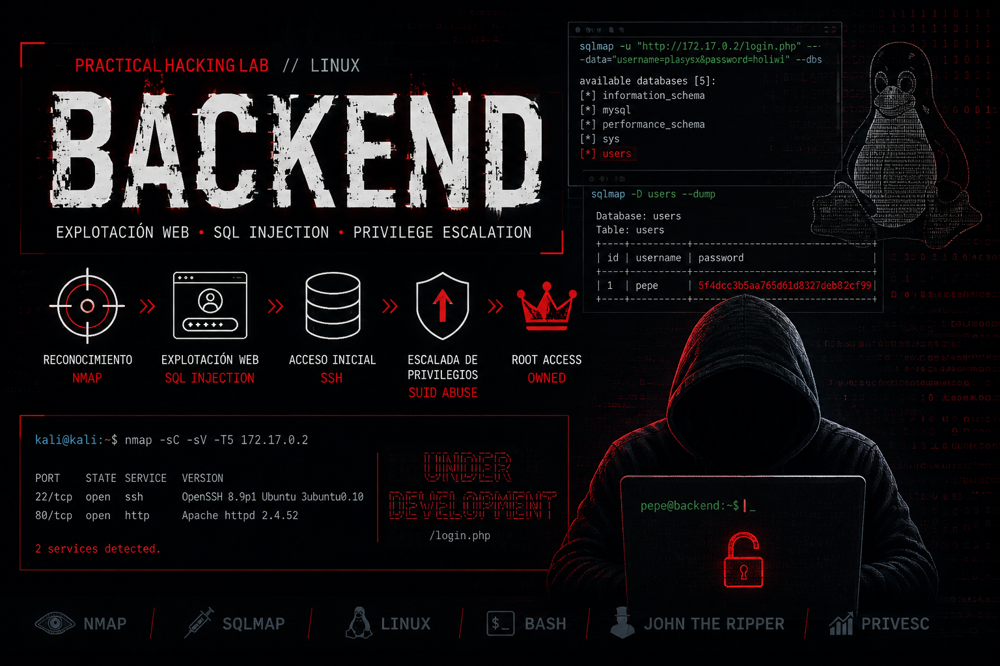

## ❓ ¿Qué es Backend?

Backend es una máquina vulnerable orientada a la explotación de una aplicación web en entorno Linux, combinando reconocimiento de servicios, análisis de formularios de autenticación y explotación de una inyección SQL. Durante el laboratorio se identifican servicios expuestos como SSH y HTTP, se enumera un panel de login vulnerable y se utiliza sqlmap para extraer información de la base de datos, obteniendo credenciales válidas para acceder al servidor por SSH. Posteriormente, la máquina permite practicar enumeración interna y escalada de privilegios mediante la búsqueda de binarios con permisos SUID, abusando de herramientas como ls y grep para acceder a información sensible en el directorio de root. Finalmente, se realiza el crackeo de un hash MD5 con John the Ripper para obtener la contraseña de root y comprometer completamente el sistema.

> [!NOTE]
>
>Puede descargar la máquina a través del **[enlace mega](https://mega.nz/file/DJlBRQyK#B63IORNn8g03XetnPC7tfG5QFfic_ngyDhTTqI-pb9U)**

## 🔝 Despliegue Backend

Al descargar la máquina, es necesario descompromirlo para poder encontrar los archivos necesarios para poder desplegarla, para ello, utilizaremos el comando.

**unzip backend.zip.**

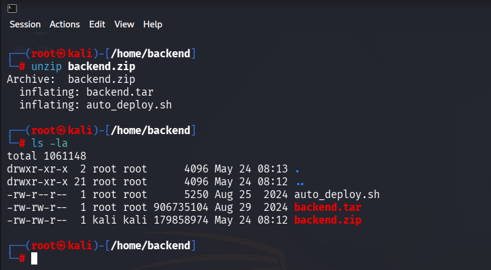

Obtendremos dos ficheros:
- **Auto_deploy.sh:** Script Bash para desplegar nuestra máquina localmente.
- **backend.tar:** Máquina vulnerable contenizada.

Para desplegar el servicio será necesario carle permisos de ejecución a auto_deploy.sh, ya que por defecto tiene permisos 644. Para ello, usaremos el comando:

 **chmod +x auto_deploy.sh**

 Una vez ejecutado, se utilizará el comando **./auto_deploy.sh backend.tar** para lanzar la máquina

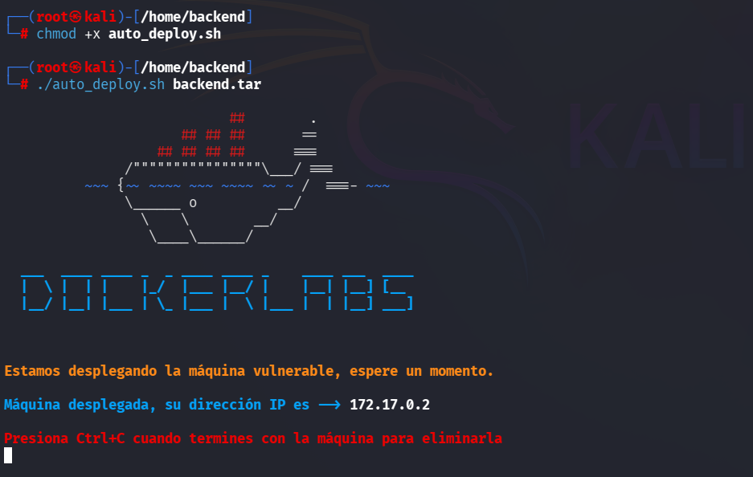

## 🔎 Fase de Descubrimiento 
Ahora, se abrirá una nueva terminal para empezar a realizar el descubrimiento del sistema. Cómo sabemos la dirección IP de la máquina vulnerable **(172.17.0.2)**, comenzaremos realizando un escaneo de red nmap. 
En esta ocación, se usará el comando **nmap -sC -sV -T5 172.17.0.2**

En este caso, he añadido -oN escaneo.txt para tener el escaneo guardado en un fichero sin necesidad repetirlo en un futuro.

| Argumento | Significado |
|---|---|
| -sC | Ejecuta los scripts para comprobaciones comunes |
| -sV | Detección de versiones de servicios |
| -T5 | Velocidad máxima |
| 172.17.0.2 | Dirección IP del objetivo a escanear |

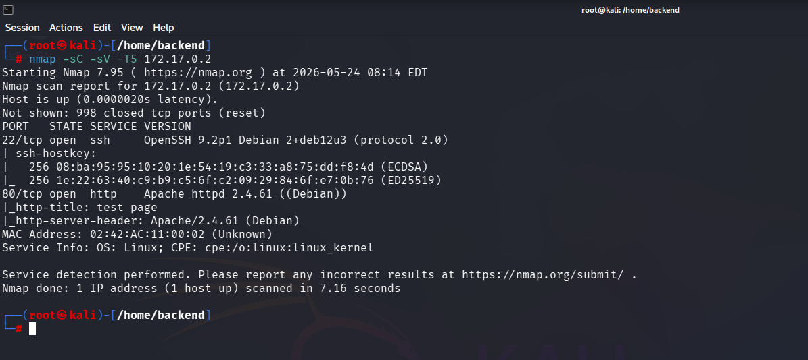

> [!NOTE]
>
>Se ha realizado un escaneo agresivo debido a que se está realizando en un entorno controlado y no es importante el ser detectado. Si se busca hacer el mínimo ruido posible será necesario utilizar el argumento **-sS** se usa para no ser detectado fácilmente, porque no completa la conexión TCP. Además, **no se usará -T5.**

En este caso, se ha encontrado un servicio activo:

- **SSH (puerto 22):** Servicio de acceso remoto seguro para administración del sistema.
- **HTTP (puerto 80):** Servicio web. 

A continuación, se dispone a visitar la página web, se visualiza un landing page con titulo Under Development:

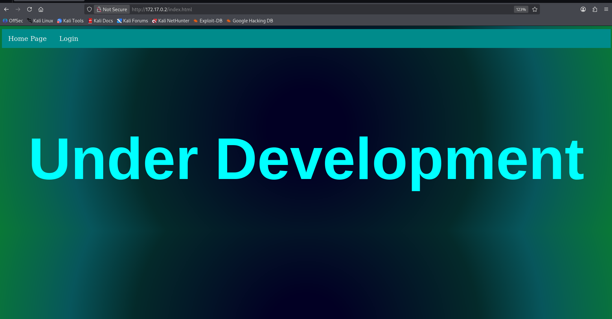

## 🖥️ Acceso al servidor

Se enumera el fichero login.html pertenece a un formulario para poder iniciar sesión

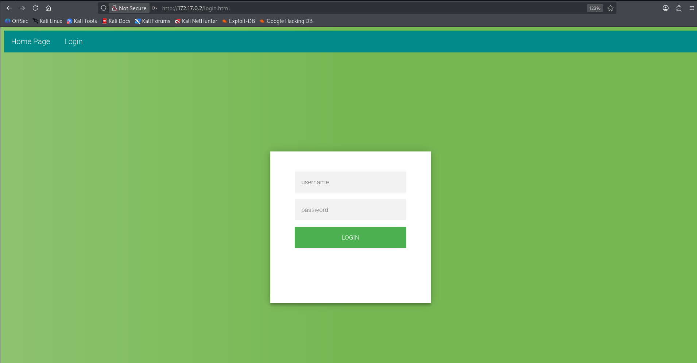

Se intenta iniciar sesión usando cómo usuario `'`. Nos devuelve el siguiente error

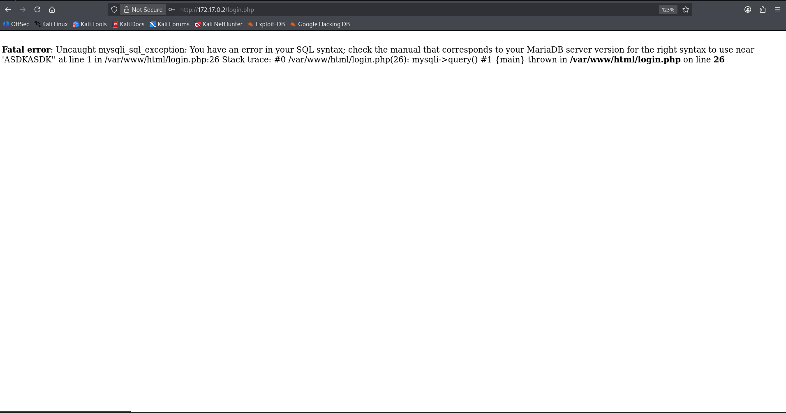

Eso significa que es sucentible a ataques de inyección sql. Para ello, se ejecuta el comando **sqlmap -u "http://172.17.0.2/login.php" --data="username=plasysx&password=holiwi" --batch --risk=3 --level=5 --dbs**

| Argumento | Significado |
|---|---|
| sqlmap | Herramienta para automatizar la detección y explotación de inyecciones SQL |
| -u "http://172.17.0.2/login.php" | Indica la URL objetivo que se va a analizar |
| --data="username=plasysx&password=holiwi" | Envía datos por POST, simulando el formulario de login |
| --batch | Ejecuta sqlmap en modo automático, usando respuestas por defecto |
| --risk=3 | Aumenta el nivel de riesgo de las pruebas realizadas |
| --level=5 | Aumenta la profundidad y cantidad de pruebas |
| --dbs | Enumera las bases de datos disponibles si la inyección es explotable |

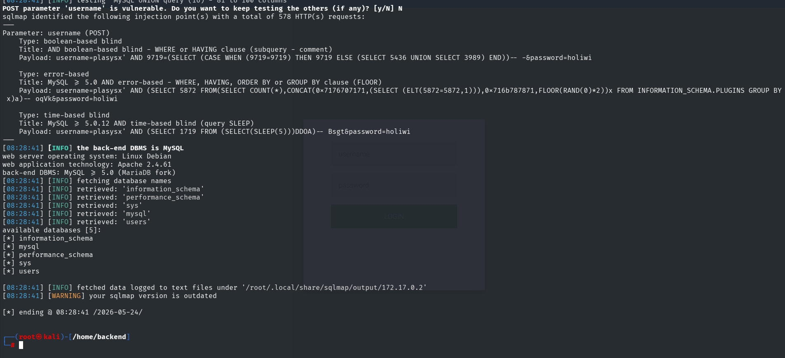

La herramienta encuentra que el sistema es vulnerable a 3 tipos de ataques:
1. Boolean-based blind
2. Error-based
3. Time-based blind

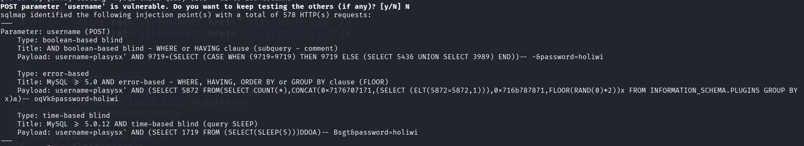

Además, se enumera los siguientes base de datos:
1. Information_schema
2. mysql
3. perfomance_schema
4. sys
5. users

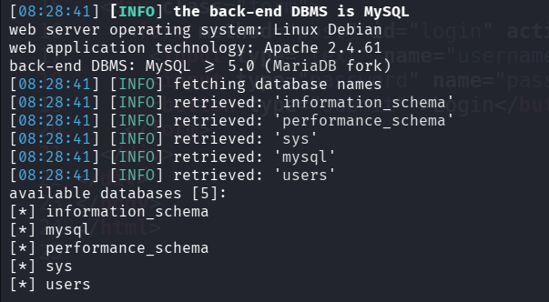

Para mostrar las tablas que tiene esa base de datos es necesario utilizar el comando **sqlmap -u "http://172.17.0.2/login.php" --data="username=plasysx&password=holiwi" --batch --risk=3 --level=5 -D users --tables**

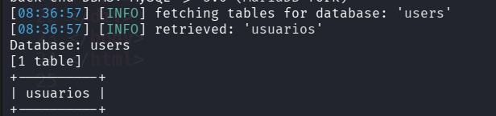

Mostramos la información de la tabla users realizando un dump: **sqlmap -u "http://172.17.0.2/login.php" --data="username=plasysx&password=holiwi" --batch --risk=3 --level=5 -D users --dump**

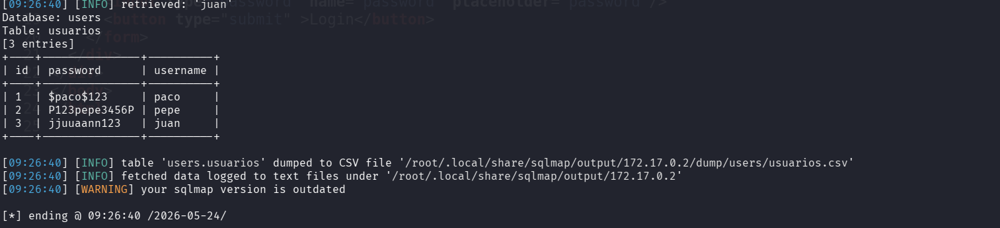

Se accede al servidor por SSH con el usuario pepe y su contraseña

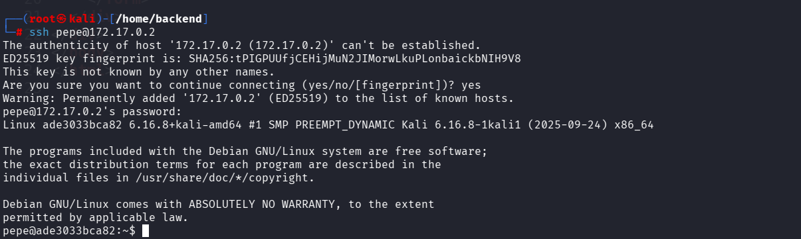

## 🔓 Escalada de privilegios

Como el sistema no tiene instalado sudo, se realiza una busqueda de binarios con permisos **SUID**, para ello se ejecuta el comando **find / -perm -4000 2>/dev/null**

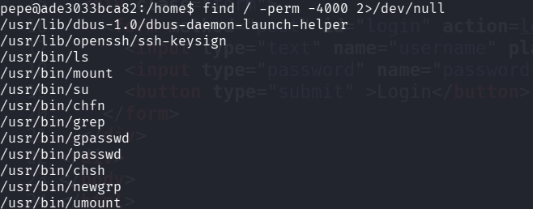

Se detecta que se puede ejecutar el binario ls, que permite listar directorios. En el directorio /root se encuentra un fichero llamado pass.hash

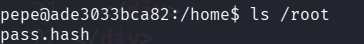

Además, se cuenta con el binario Grep, que permite filtrar contenido de un fichero por algún expresión, se utiliza el comando **grep "" /root/pass.hash** para listar su contenido

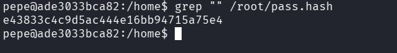

Se obtiene la credencial utilizando john: **john --wordlist=/usr/share/wordlists/rockyou.txt --format=Raw-MD5 pass.hash**

Contraseña: **spongebob34**

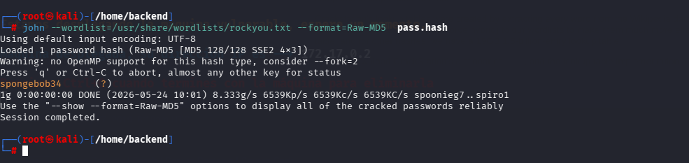

Se accede a root utilizando **su root**

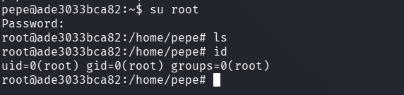

## 🧪 Post-Laboratorio
Una vez finalizada la máquina, en la terminal donde se tiene desplegada la máquina vulnerable se utilizará la combinación de teclas **Control + C** para eliminarla.

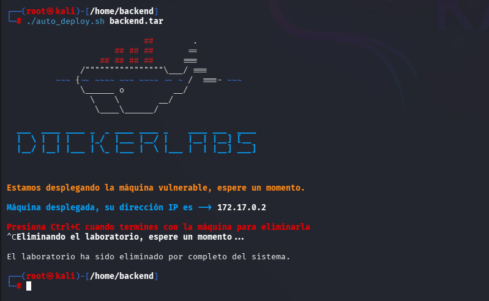
##   ¡Hola! Me llamo Saúl Ruiz 
### Estudiante en Ciberseguridad

Soy estudiante de Administración de Sistemas Informáticos en Red con pasión por la ciberseguridad y el mundo de la informática. Desde pequeño disfruto explorando tecnología y aprendiendo de manera autónoma. Además, combino mis estudios con la creación de contenido y recursos educativos sobre informática a través de mi proyecto personal <b>[@PlaSysX](https://linktr.ee/PlaSysx)</b>

Si quieres aprender informática, mejorar tus habilidades, descubrir trucos y soluciones prácticas, y formar parte de nuestra comunidad, puedes seguirnos en PlaSysX.

 

