
<h1>Borazuwarahctf</h1>
  

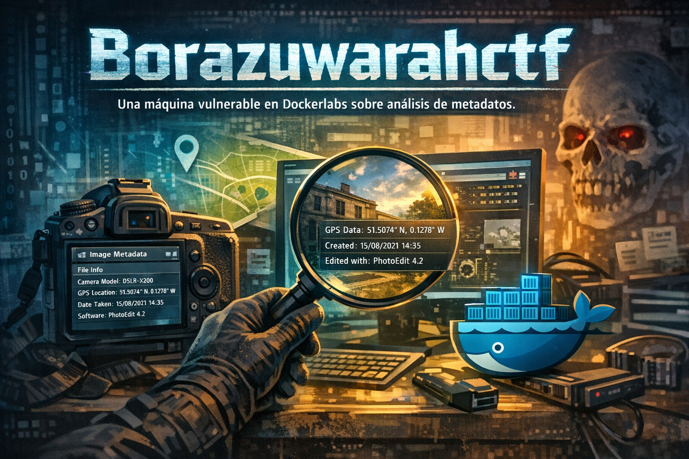

## ❓ ¿Qué es BorazuwarahCTF?

BorazuwarahCTF es una máquina vulnerable enfocada en practicar enumeración básica, análisis de metadatos, fuerza bruta y acceso inicial por SSH. Permite aplicar técnicas de reconocimiento y escalada de privilegios en un entorno controlado.

> [!NOTE]
>
>Puede descargar la máquina a través del **[enlace mega](https://mega.nz/file/gWNQlaZD#CgYMb_EEBL0jcypTg0xZZUaIqhO47ueX6pPU6utLy1U)**

## 🔝 Despliegue Borazuwarahctf

Al descargar la máquina, es necesario descompromirlo para poder encontrar los archivos necesarios para poder desplegarla, para ello, utilizaremos el comando.

**unzip breakmyssh.zip.**

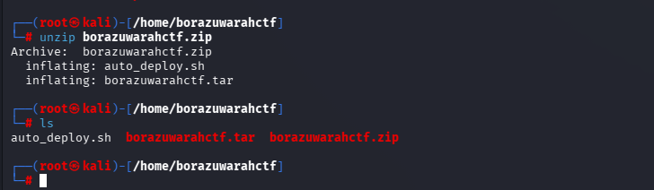

Obtendremos dos ficheros:
- **Auto_deploy.sh:** Script Bash para desplegar nuestra máquina localmente.
- **borazuwarahctf.tar:** Máquina vulnerable contenizada.

Para desplegar el servicio será necesario carle permisos de ejecución a auto_deploy.sh, ya que por defecto tiene permisos 644. Para ello, usaremos el comando:

 **chmod +x auto_deploy.sh**

 Una vez ejecutado, se utilizará el comando **./auto_deploy.sh borazuwarahctf.tar** para lanzar la máquina

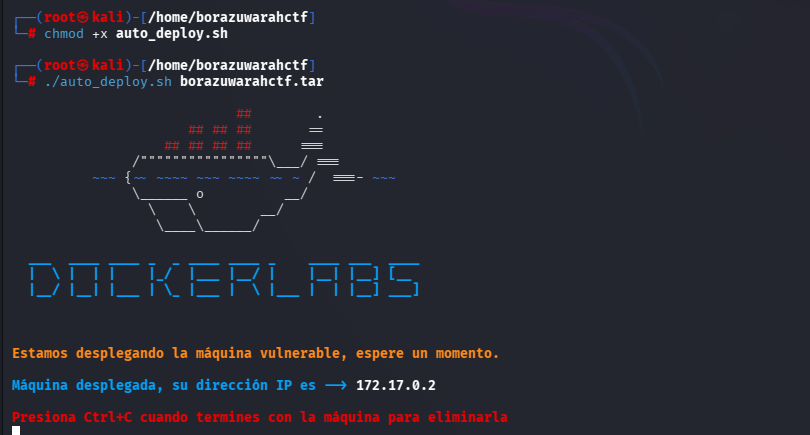

## 🔎 Fase de Descubrimiento 
Ahora, se abrirá una nueva terminal para empezar a realizar el descubrimiento del sistema. Cómo sabemos la dirección IP de la máquina vulnerable **(172.17.0.2)**, comenzaremos realizando un escaneo de red nmap. 
En esta ocación, se usará el comando **nmap -sC -sV --min-rate 5000 172.17.0.2**

| Argumento | Significado |
|---|---|
| -sC | Ejecuta los scripts para comprobaciones comunes |
| -sV | Detección de versiones de servicios |
| --min-rate 5000 | Envía al  5000 paquetes por segundo (aumenta velocidad; puede causar pérdida o detección) |
| 172.17.0.2 | Dirección IP del objetivo a escanear |

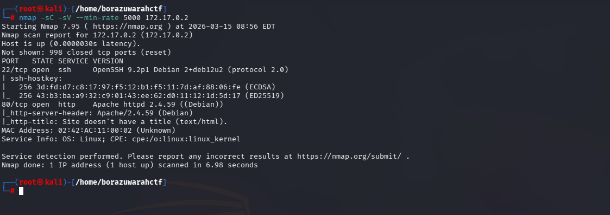

> [!NOTE]
>
>Se ha realizado un escaneo agresivo debido a que se está realizando en un entorno controlado y no es importante el ser detectado. Si se busca hacer el mínimo ruido posible será necesario utilizar el argumento **-sS** se usa para no ser detectado fácilmente, porque no completa la conexión TCP. Además, **no se usará --min-rate.**

En este caso, se ha encontrado un servicio activo:
- **SSH (Puerto: 21):** Conexión remota.
- **HTTP (Puerto 80):** Servidor web.

A continuación, se dispone a visitar la página web, se encuentra lo siguiente:
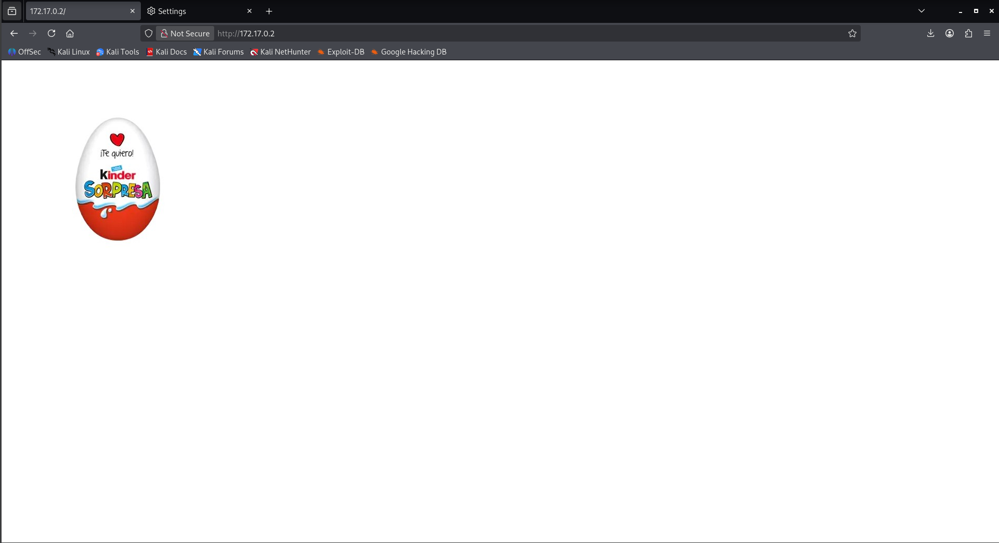

Tras analizar los servicios, no se encuentra una forma de acceso a través de ellos. Así que se dispondrá a descargar la imagen proporcionada por el servidor web http y analizar sus metadatos a través de **exiftool**.

Los metadatos son información oculta dentro de un archivo, como autor, fecha o programa usado. No eliminarlos es una mala práctica porque pueden revelar datos sensibles útiles para un atacante.

Con el comando **wget http://172.17.0.2/imagen.jpge** permite descargar la imagen 

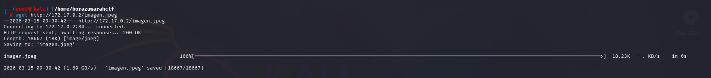

> [!NOTE]
>
>Se puede extraer la ruta completa de descarga utilizando **Control + U** (Inspeccionar códgio)

Una vez descargado solo basta utilizar el comando exiftool imagen.jpge

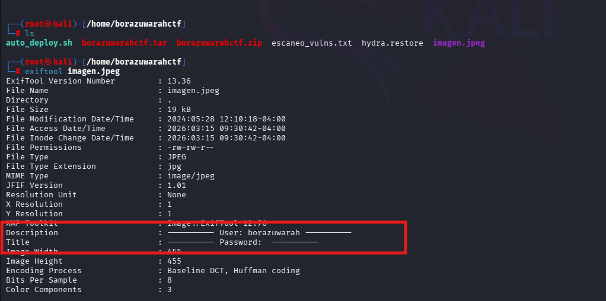

Se ha encontrado las credenciales:
  - Usuario: borazuwarah
  - Contraseña Se desconoce.
  
Para obtener la contraseña, solo basta realizar un ataque de fuerza bruta con hydra con el comando **hydra -l borazuwarah -P /usr/share/wordlists/rockyou.txt.gz ssh://172.17.0.2 -t 64**

| Argumento | Significado |
|---|---|
| hydra | Herramienta de ataque de fuerza bruta. |
| -l lovely | Especifica un usuario. |
| -P /usr/share/wordlists/Rockyou.txt.gz| Archivo con diccionario de contraseñas. |
| ssh://172.17.0.2| Protocolo y dirección IP del objetivo. |
| -t 64 | Número de hilos utilizados (velocidad). |

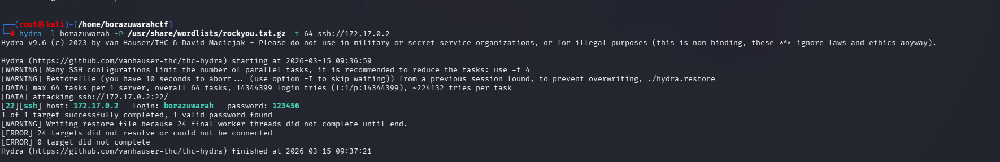

## 🖥️ Acceso al servidor
Se accede al servidor utilizando el comando **ssh borazuwarah@172.17.0.2**

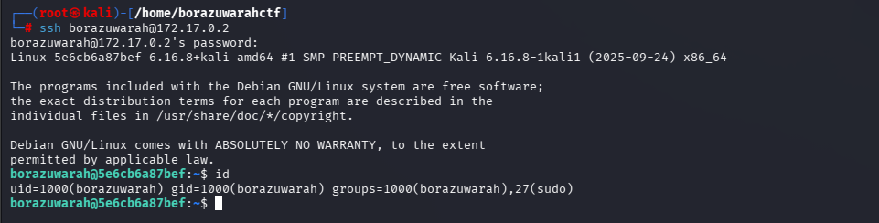

## 🔓 Escalada de privilegios

Una vez con acceso al usuario, se utiliza el comando **sudo -l** para ver los binarios con permisos sudo que tenga este usuario acceso.

En este caso se muestra que se puede ejecutar cualquier comando con sudo sin necesidad de contraseña (solo pedirá la de borazuwarah). Se ejecuta sudo su para acceder a root

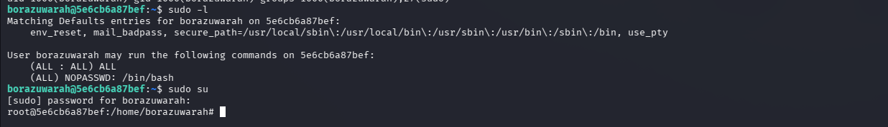

## 🧪 Post-Laboratorio
Una vez finalizada la máquina, en la terminal donde se tiene desplegada la máquina vulnerable se utilizará la combinación de teclas **Control + C** para eliminarla.

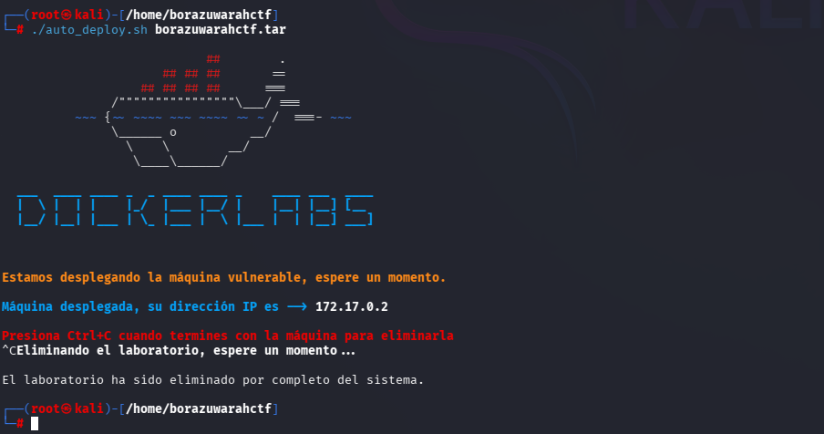

##   ¡Hola! Me llamo Saúl Ruiz 
### Estudiante en Ciberseguridad

Soy estudiante de Administración de Sistemas Informáticos en Red con pasión por la ciberseguridad y el mundo de la informática. Desde pequeño disfruto explorando tecnología y aprendiendo de manera autónoma. Además, combino mis estudios con la creación de contenido y recursos educativos sobre informática a través de mi proyecto personal <b>[@PlaSysX](https://linktr.ee/PlaSysx)</b>

Si quieres aprender informática, mejorar tus habilidades, descubrir trucos y soluciones prácticas, y formar parte de nuestra comunidad, puedes seguirnos en PlaSysX.

 

