
<h1>BreakMySSH</h1>
  

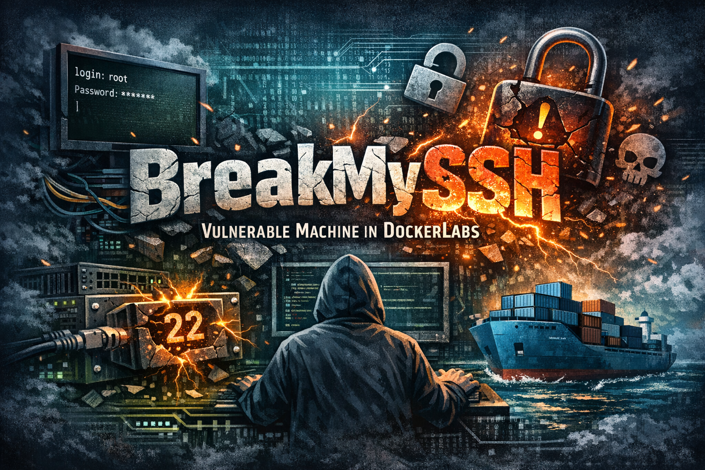

## ❓ ¿Qué es BreakMySSH?

BreakMySSH es una máquina vulnerable centrada en la enumeración básica de servicios y el uso de técnicas de fuerza bruta para obtener acceso inicial. A través del análisis de los puertos expuestos principalmente SSH y HTTP el atacante puede identificar pistas mínimas en el servicio web y, posteriormente, apoyarse en un diccionario invertido para descubrir credenciales válidas.

> [!NOTE]
>
>Puede descargar la máquina a través del **[enlace mega](https://mega.nz/file/hfE3lbwZ#ExAcF54AyOHeJqgH2R4cDIAGc5IVlJnI5Rs-Us2QMpM)**

## 🔝 Despliegue BreakMySSH

Al descargar la máquina, es necesario descompromirlo para poder encontrar los archivos necesarios para poder desplegarla, para ello, utilizaremos el comando.

**unzip breakmyssh.zip.**

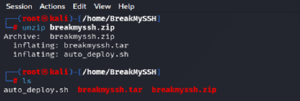

Obtendremos dos ficheros:
- **Auto_deploy.sh:** Script Bash para desplegar nuestra máquina localmente.
- **breakmyssh.tar:** Máquina vulnerable contenizada.

Para desplegar el servicio será necesario carle permisos de ejecución a auto_deploy.sh, ya que por defecto tiene permisos 644. Para ello, usaremos el comando:

 **chmod +x auto_deploy.sh**

 Una vez ejecutado, se utilizará el comando **./auto_deploy.sh breakmyssh.tar** para lanzar la máquina

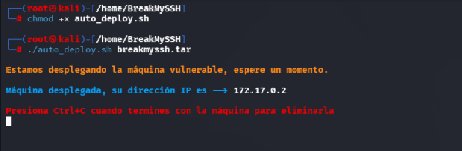

## 🔎 Fase de Descubrimiento 
Ahora, se abrirá una nueva terminal para empezar a realizar el descubrimiento del sistema. Cómo sabemos la dirección IP de la máquina vulnerable **(172.17.0.2)**, comenzaremos realizando un escaneo de red nmap. 
En esta ocación, se usará el comando **nmap -sC -sV --min-rate 5000 172.17.0.2**

| Argumento | Significado |
|---|---|
| -sC | Ejecuta los scripts para comprobaciones comunes |
| -sV | Detección de versiones de servicios |
| --min-rate 5000 | Envía al  5000 paquetes por segundo (aumenta velocidad; puede causar pérdida o detección) |
| 172.17.0.2 | Dirección IP del objetivo a escanear |

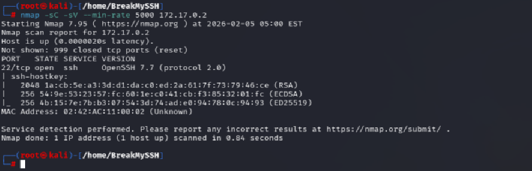

> [!NOTE]
>
>Se ha realizado un escaneo agresivo debido a que se está realizando en un entorno controlado y no es importante el ser detectado. Si se busca hacer el mínimo ruido posible será necesario utilizar el argumento **-sS** se usa para no ser detectado fácilmente, porque no completa la conexión TCP. Además, **no se usará --min-rate.**

En este caso, se ha encontrado un servicio activo:
- **SSH (Puerto: 21):** Conexión remota

A continuación, se dispone a iniciar metaexploit (msfconsole) para realizar una enumeración de usuarios. Para ello, dentro de metaexploit se ejecutará el comando search ssh_enum.

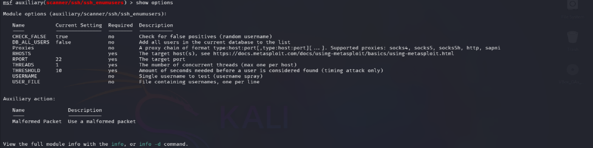

En este caso se usará la primera opción (0). Mediante el comando **use 0**. Posteriormente es necesario ver las opciones configurables mediante el comando **show options**

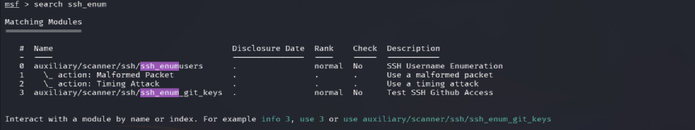

Se establece la dirección ip víctima (RHOST) utilizando el comando **set rhost 172.17.0.2** y un fichero de diccionario de usuarios (USER_FILE), en este caso he utilizado xato net de seclist: **set user_file /usr/share/wordlists/seclists/Usernames/xato-net-10-million-usernames.txt**

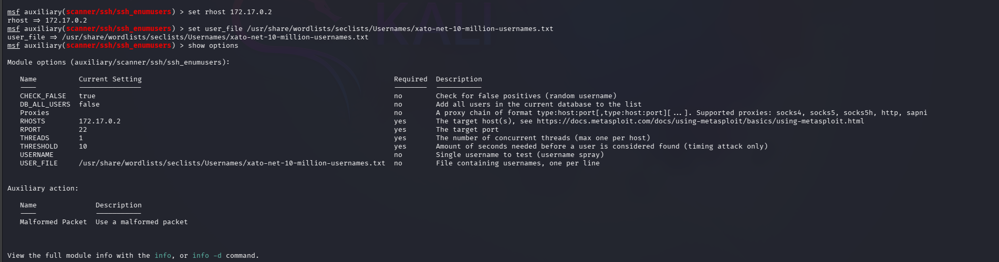

Por último, se lanza el script utilizando el comando **exploit**. Se encuntra el usuario **lovely**

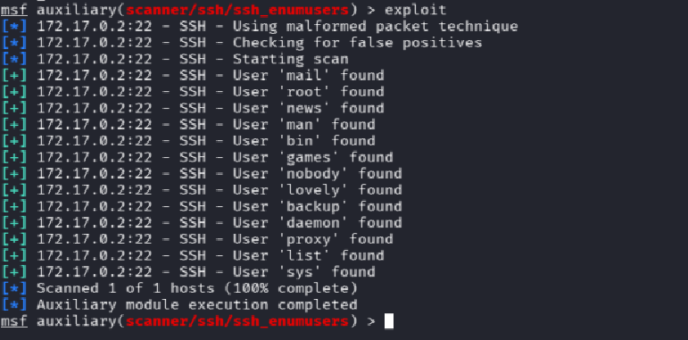

Finalmente, se procede a realizar el ataque de fuerza bruta usando hydra:
**hydra -l lovely -P /usr/share/wordlists/rockyou.txt.gz ssh://172.17.0.2 -t 64**

| Argumento | Significado |
|---|---|
| hydra | Herramienta de ataque de fuerza bruta. |
| -l lovely | Especifica un usuario. |
| -P /usr/share/wordlists/Rockyou.txt.gz| Archivo con diccionario de contraseñas. |
| ssh://172.17.0.2| Protocolo y dirección IP del objetivo. |
| -t 64 | Número de hilos utilizados (velocidad). |

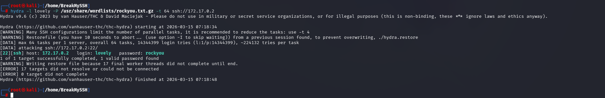

Se ha encontrado las credenciales:
  - Usuario: lovely
  - Contraseña rockyou

## 🖥️ Acceso al servidor
Se accede al servidor utilizando el comando **ssh lovely@172.17.0.2**

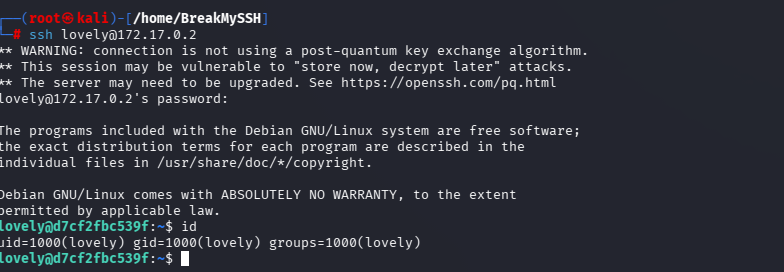

## 🔓 Escalada de privilegios

Tras un rato analizando los diferentes directorios, se encuentra un fichero oculto .hash en /opt

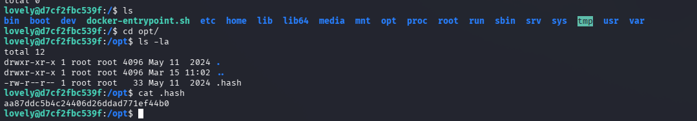

Una vez obtenido, procedo a guardar ese fichero en mi terminal para utilizar hashid obtener el tipo de hash y descifrar el contenido de esta con john

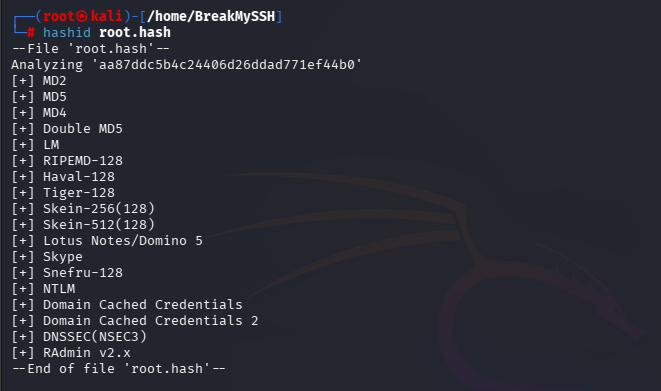

Posteriormente utilziaremos el comando **john --wordlist=/usr/share/wordlists/john.lst --format=Raw-MD5 root.hash**

| Argumento | Significado |
|---|---|
| john | Herramienta de cracking de contraseñas. |
| --wordlist=/usr/share/wordlists/john.lst | Usa el diccionario de palabras ubicado en esa ruta para probar contraseñas. |
| --format=Raw-MD5 | Indica a John the Ripper que el hash está en formato MD5 sin sal (Raw-MD5). |
| root.hash | Archivo que contiene el hash que se quiere descifrar. |

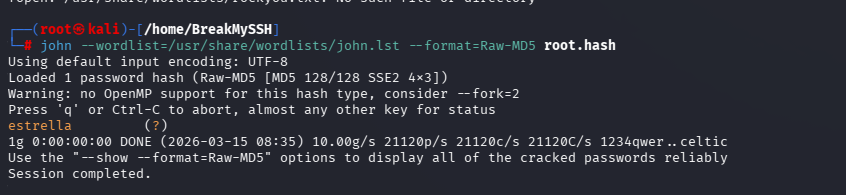

Ya tendremos acceso a root utilizando la contraseña **estrella**

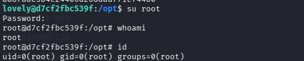

## 🧪 Post-Laboratorio
Una vez finalizada la máquina, en la terminal donde se tiene desplegada la máquina vulnerable se utilizará la combinación de teclas **Control + C** para eliminarla.

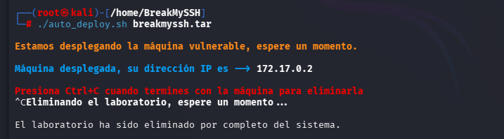

##   ¡Hola! Me llamo Saúl Ruiz 
### Estudiante en Ciberseguridad

Soy estudiante de Administración de Sistemas Informáticos en Red con pasión por la ciberseguridad y el mundo de la informática. Desde pequeño disfruto explorando tecnología y aprendiendo de manera autónoma. Además, combino mis estudios con la creación de contenido y recursos educativos sobre informática a través de mi proyecto personal <b>[@PlaSysX](https://linktr.ee/PlaSysx)</b>

Si quieres aprender informática, mejorar tus habilidades, descubrir trucos y soluciones prácticas, y formar parte de nuestra comunidad, puedes seguirnos en PlaSysX.

 

