
<h1>ChocolateFire</h1>
  

## ❓ ¿Qué es ChocolateFire?

ChocolateFire es una máquina vulnerable enfocada en la explotación de servicios mal configurados en entornos Linux, combinando técnicas de reconocimiento, enumeración y escalada de privilegios. A lo largo del laboratorio se trabaja la identificación de servicios expuestos y el análisis de aplicaciones web vulnerables, aprovechando configuraciones inseguras y credenciales débiles para obtener acceso inicial al sistema. Posteriormente, la máquina permite profundizar en la enumeración interna y el abuso de permisos mal asignados, aplicando diferentes técnicas de escalada de privilegios hasta comprometer completamente el servidor. Se trata de un entorno ideal para practicar metodologías de pentesting en escenarios realistas relacionados con servicios de administración, autenticación y configuraciones inseguras en sistemas Linux.

> [!NOTE]
>
>Puede descargar la máquina a través del **[enlace mega](https://mega.nz/file/wWslhSQS#jmz3PksTmtOaitgKwS7dcgc8Vd7o6pECPViav9clzwA)**

## 🔝 Despliegue ChocolateFire

Al descargar la máquina, es necesario descompromirlo para poder encontrar los archivos necesarios para poder desplegarla, para ello, utilizaremos el comando.

**unzip chocolatefire.zip.**

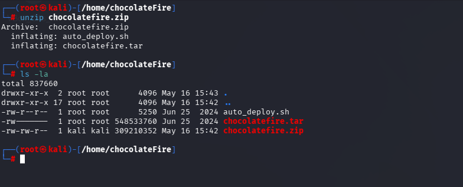

Obtendremos dos ficheros:
- **Auto_deploy.sh:** Script Bash para desplegar nuestra máquina localmente.
- **chocolatefire.tar:** Máquina vulnerable contenizada.

Para desplegar el servicio será necesario carle permisos de ejecución a auto_deploy.sh, ya que por defecto tiene permisos 644. Para ello, usaremos el comando:

 **chmod +x auto_deploy.sh**

 Una vez ejecutado, se utilizará el comando **./auto_deploy.sh anonymochocolatefireuspingu.tar** para lanzar la máquina

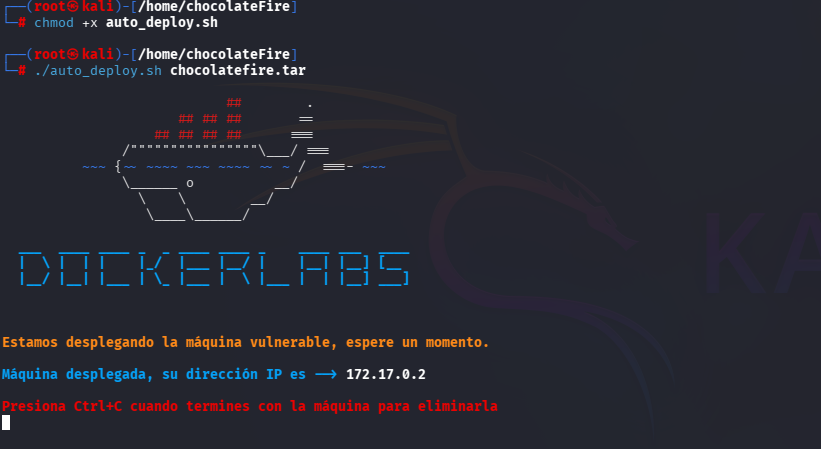

## 🔎 Fase de Descubrimiento 
Ahora, se abrirá una nueva terminal para empezar a realizar el descubrimiento del sistema. Cómo sabemos la dirección IP de la máquina vulnerable **(172.17.0.2)**, comenzaremos realizando un escaneo de red nmap. 
En esta ocación, se usará el comando **nmap -sC -sV -T5 172.17.0.2**

En este caso, he añadido -oN escaneo.txt para tener el escaneo guardado en un fichero sin necesidad repetirlo en un futuro.

| Argumento | Significado |
|---|---|
| -sC | Ejecuta los scripts para comprobaciones comunes |
| -sV | Detección de versiones de servicios |
| -T5 | Velocidad máxima |
| 172.17.0.2 | Dirección IP del objetivo a escanear |

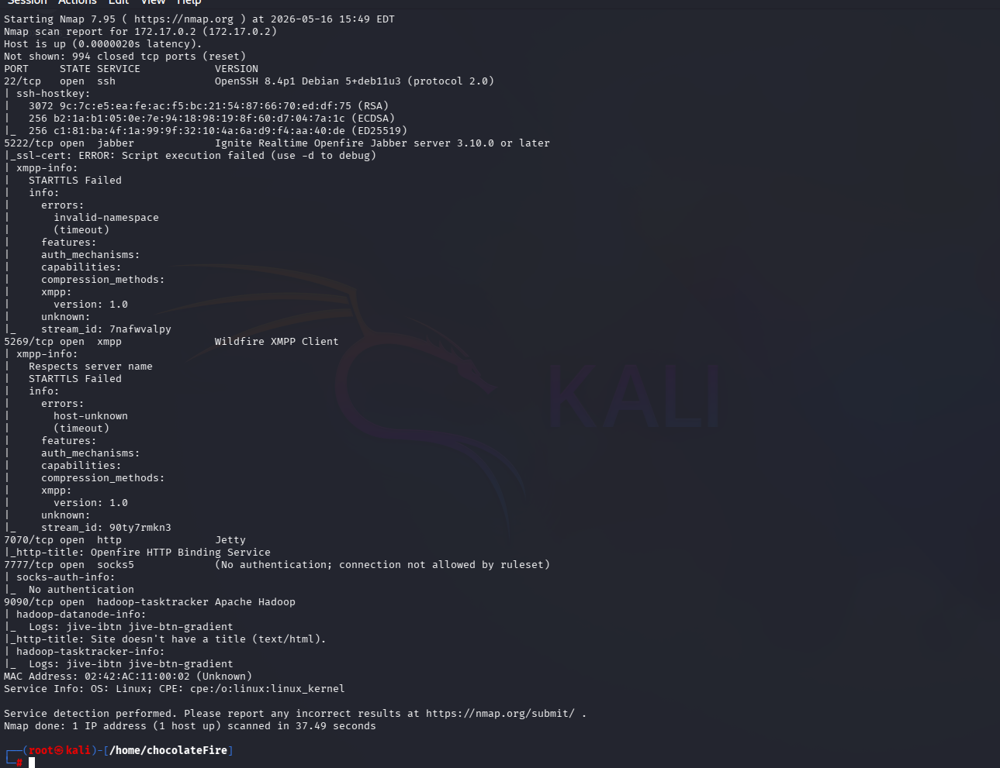

> [!NOTE]
>
>Se ha realizado un escaneo agresivo debido a que se está realizando en un entorno controlado y no es importante el ser detectado. Si se busca hacer el mínimo ruido posible será necesario utilizar el argumento **-sS** se usa para no ser detectado fácilmente, porque no completa la conexión TCP. Además, **no se usará -T5.**

En este caso, se ha encontrado un servicio activo:

- **SSH (puerto 22):** Servicio de acceso remoto seguro para administración del sistema.
- **XMPP / Openfire (puerto 5222):** Servicio de mensajería instantánea y presencia basado en el protocolo XMPP.
- **Jetty / Openfire HTTP Binding (puerto 7070):** Servidor web embebido utilizado por Openfire para comunicación HTTP.
- **SOCKS5 (puerto 7777):** Proxy de red sin autenticación, potencialmente utilizable para pivoting.
- **Apache Hadoop / interfaz web (puerto 9090):** Servicio web de gestión o panel asociado a almacenamiento distribuido.

A continuación, se dispone a visitar la página web por el puerto 9090 se encuentra un panel de login:

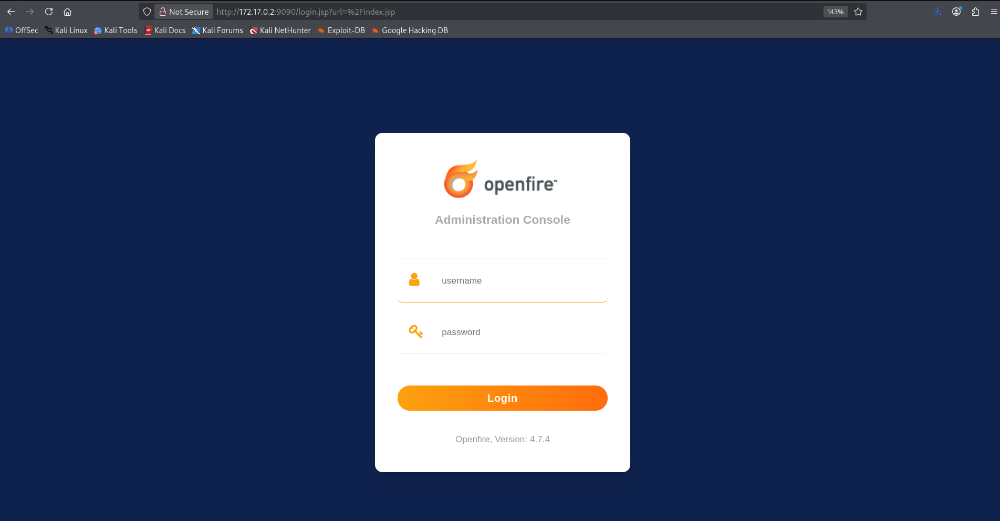

Para poder acceder al sistema busqué en internet las credenciales por defecto  del servicio y accedí al dashboard.

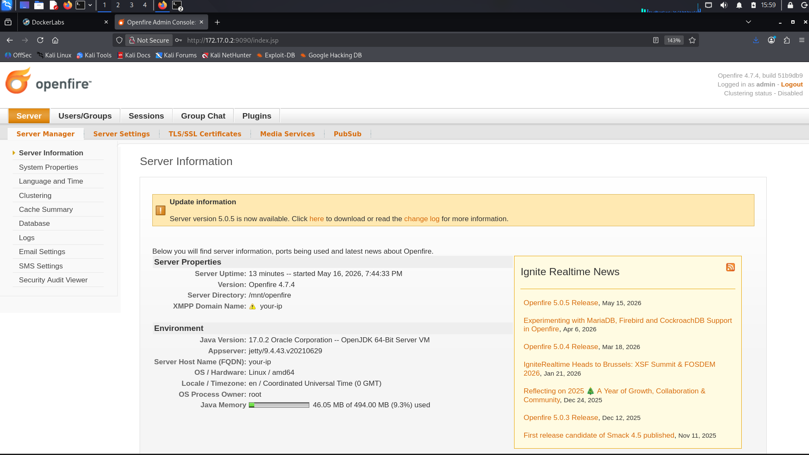

## 🖥️ Acceso al servidor

Durante la revisión del sistema, en la sección System Properties, se identificó el nombre de usuario chocolatitochingon dentro del valor asignado a la propiedad admin.authorizedJIDs

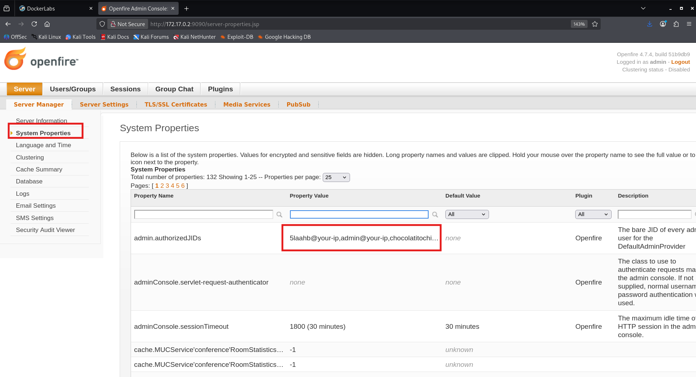

Este usuario al usarlo con hydra al servicio ssh encuentra la credencial **chocolate**.

| Argumento | Significado |
|---|---|
| hydra | Herramienta de ataque de fuerza bruta. |
| -l mario | Especifica un usuario. |
| -P /usr/share/wordlists/Rockyou.txt.gz| Archivo con diccionario de contraseñas. |
| ssh://172.18.0.2| Protocolo y dirección IP del objetivo. |
| -t 64 | Número de hilos utilizados (velocidad). |

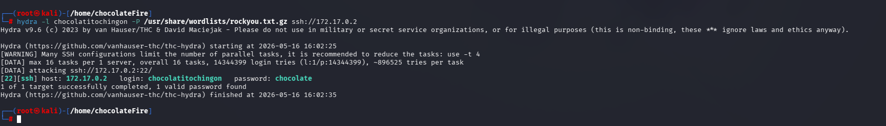

Se dispone a acceder al servidor mediante SSH:

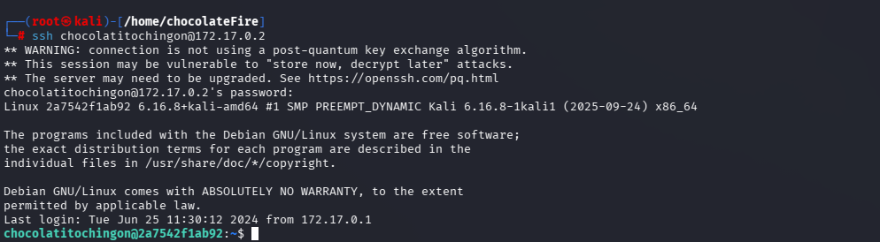

## 🔓 Escalada de privilegios

A continuación, se realiza **sudo -l** para obtener los binarios que se pueden ejecutar con permisos administrador.

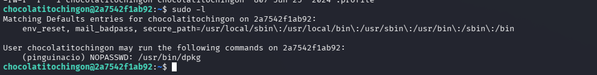

Se encuentra que el usuario pinguinacio puede ejecutar **dpkg**.

En [GTFobins](https://gtfobins.github.io/gtfobins/dpkg/#sudo) aparace cómo poder escalar privilegios sudo.

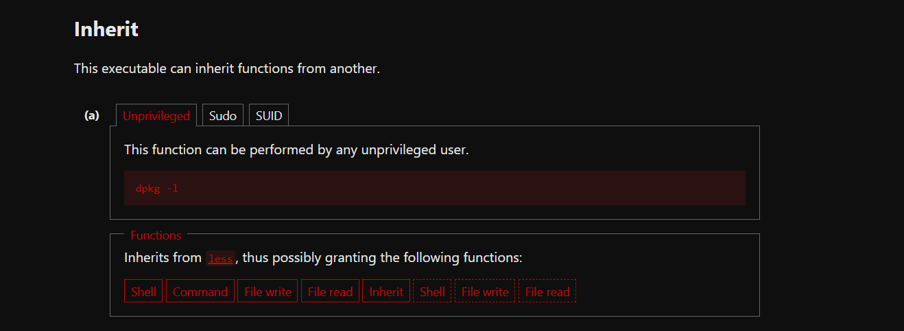

Se ejecuta **sudo -u pinguinacio /usr/bin/dpkg -l**. Dentro se utiliza "!" para poder escribir en la terminal para poder abrir una shell usando **!/bin/bash.**

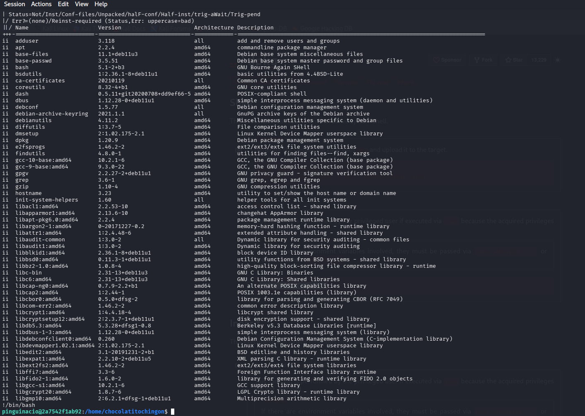

A continuación, se vuelve a ejecutar **sudo -l** para ver los binarios que puede ejecutar desde pinguinacio

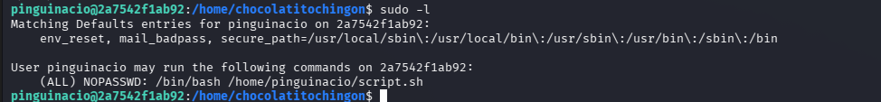

En este caso encontramos que con todos los usuarios puede ejecutar el fichero script.sh localizado en /home/pinguinacio sin necesidad de una contraseña.

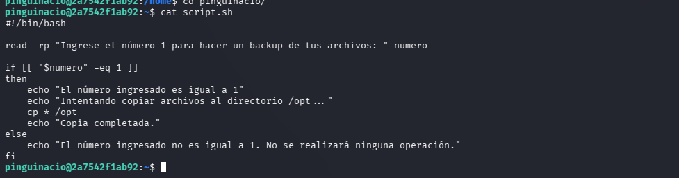

Es un script sencillo en Bash donde se pide al usuario introducir el número 1 para poder copiar archivos al directorio /opt.

Para ejecutarlo es necesario usar:

**sudo -u root /bin/bash /home/pinguinacio/script.sh**

El problema aparece porque el script no valida la entrada del usuario.
Dentro del read, el usuario puede introducir una cadena maliciosa como **a[$(/bin/bash >&2)]+1**. Bash ejecuta /bin/bash inmediatamente durante la expansión, antes de evaluar la comparación y aunque luego falle.

Para ejecutarlo es necesario utilizar **sudo -u root /bin/bash /home/pinguinacio/script.sh**

En el input se introducirá **a[$(/bin/bash >&2)]+1**

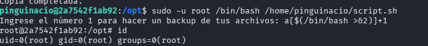

## 🧪 Post-Laboratorio
Una vez finalizada la máquina, en la terminal donde se tiene desplegada la máquina vulnerable se utilizará la combinación de teclas **Control + C** para eliminarla.

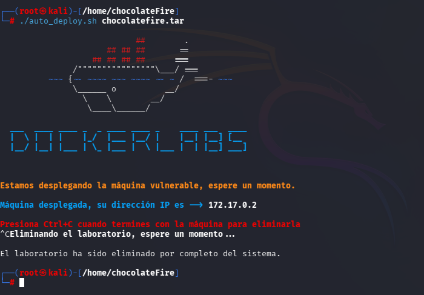

##   ¡Hola! Me llamo Saúl Ruiz 
### Estudiante en Ciberseguridad

Soy estudiante de Administración de Sistemas Informáticos en Red con pasión por la ciberseguridad y el mundo de la informática. Desde pequeño disfruto explorando tecnología y aprendiendo de manera autónoma. Además, combino mis estudios con la creación de contenido y recursos educativos sobre informática a través de mi proyecto personal <b>[@PlaSysX](https://linktr.ee/PlaSysx)</b>

Si quieres aprender informática, mejorar tus habilidades, descubrir trucos y soluciones prácticas, y formar parte de nuestra comunidad, puedes seguirnos en PlaSysX.

 

