
<h1>Dance-Samba</h1>
  

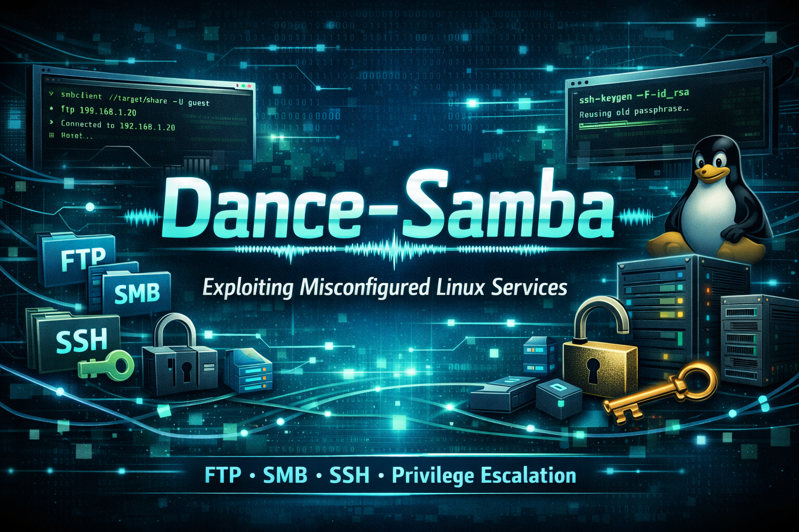

## ❓ ¿Qué es Dance-Samba?

Dance-Samba es una máquina vulnerable enfocada en la explotación de servicios mal configurados en entornos Linux, combinando técnicas de reconocimiento, enumeración y escalada de privilegios. A lo largo del laboratorio se identifican servicios expuestos como FTP, SMB y SSH, aprovechando recursos compartidos inseguros y credenciales débiles para obtener acceso inicial al sistema. Posteriormente, se realiza enumeración interna y abuso de configuraciones mal asignadas, incluyendo técnicas como SSH Key Injection y reutilización de credenciales, hasta lograr la escalada de privilegios y la toma completa del control del servidor, siendo un entorno ideal para practicar pentesting en escenarios realistas.

> [!NOTE]
>
>Puede descargar la máquina a través del **[enlace mega](https://mega.nz/file/JCtnnLAJ#yeVJuvp8zhHiM55IHvnFJZ62_cjR1vmH-miDBc30slY)**

## 🔝 Despliegue Dance-Samba

Al descargar la máquina, es necesario descompromirlo para poder encontrar los archivos necesarios para poder desplegarla, para ello, utilizaremos el comando.

**unzip dance-samba.zip.**

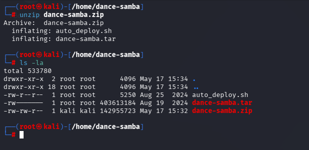

Obtendremos dos ficheros:
- **Auto_deploy.sh:** Script Bash para desplegar nuestra máquina localmente.
- **dance-samba.tar:** Máquina vulnerable contenizada.

Para desplegar el servicio será necesario carle permisos de ejecución a auto_deploy.sh, ya que por defecto tiene permisos 644. Para ello, usaremos el comando:

 **chmod +x auto_deploy.sh**

 Una vez ejecutado, se utilizará el comando **./auto_deploy.sh dance-samba.tar** para lanzar la máquina

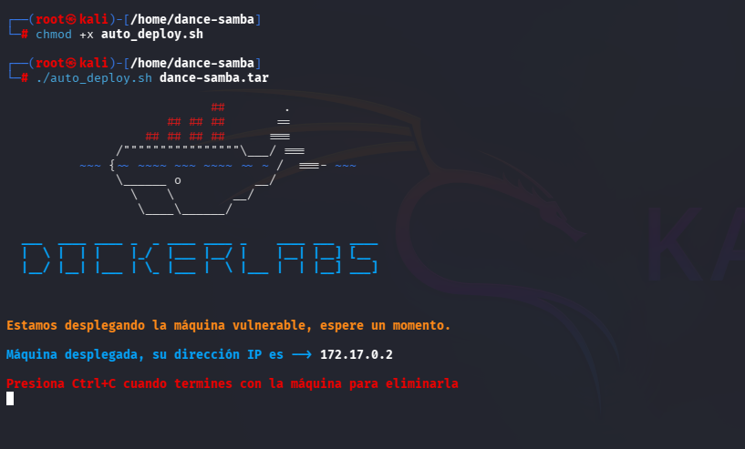

## 🔎 Fase de Descubrimiento 
Ahora, se abrirá una nueva terminal para empezar a realizar el descubrimiento del sistema. Cómo sabemos la dirección IP de la máquina vulnerable **(172.17.0.2)**, comenzaremos realizando un escaneo de red nmap. 
En esta ocación, se usará el comando **nmap -sC -sV -T5 172.17.0.2**

En este caso, he añadido -oN escaneo.txt para tener el escaneo guardado en un fichero sin necesidad repetirlo en un futuro.

| Argumento | Significado |
|---|---|
| -sC | Ejecuta los scripts para comprobaciones comunes |
| -sV | Detección de versiones de servicios |
| -T5 | Velocidad máxima |
| 172.17.0.2 | Dirección IP del objetivo a escanear |

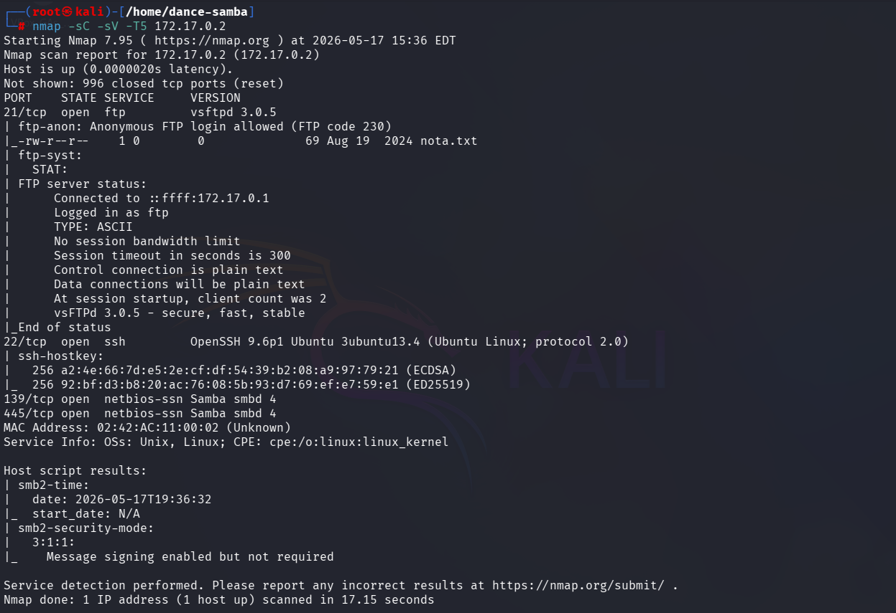

> [!NOTE]
>
>Se ha realizado un escaneo agresivo debido a que se está realizando en un entorno controlado y no es importante el ser detectado. Si se busca hacer el mínimo ruido posible será necesario utilizar el argumento **-sS** se usa para no ser detectado fácilmente, porque no completa la conexión TCP. Además, **no se usará -T5.**

En este caso, se ha encontrado un servicio activo:

- **FTP (puerto 21):** Servicio de transmisión de ficheros. Se encuentra acceso anónimo mediante ftp-anon.
- **SSH (puerto 22):** Servicio de acceso remoto seguro para administración del sistema.
- **Samba (puertos 139, 445):** Servicio que permite compartir recursos en red

A continuación, se accederá al servicio FTP utilizando una sesión anónima. Para ello, primero se iniciará el cliente FTP con el comando ftp y, posteriormente, se establecerá la conexión mediante open 172.17.0.2. Finalmente, se iniciará sesión utilizando el usuario **anonymous** y la contraseña **anonymous**.

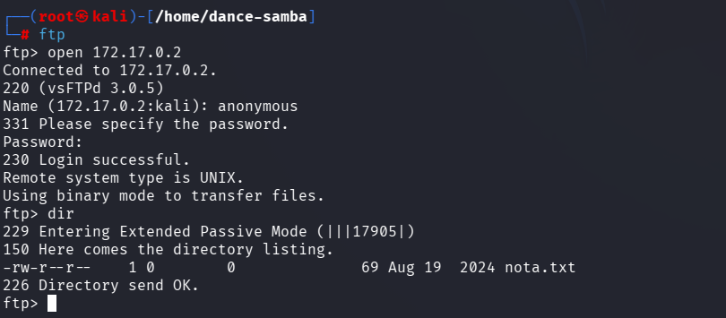

Se encuentre fichero nota.txt, se descarga utilizando **get nota.txt**

Al visualizar el contenido del fichero habla de Macarena y Donald.

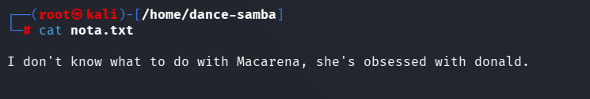

En este caso decido utilizar crackmapexec para poder encontrar la contraseña de estos posibles usuarios. Para ello crackmapexec permite realizar ataque de fuerza bruta utilizando **crackmapexec smb 172.17.0.2 -u Macarena -p /usr/share/metasploit-framework/data/wordlists/unix_passwords.txt**

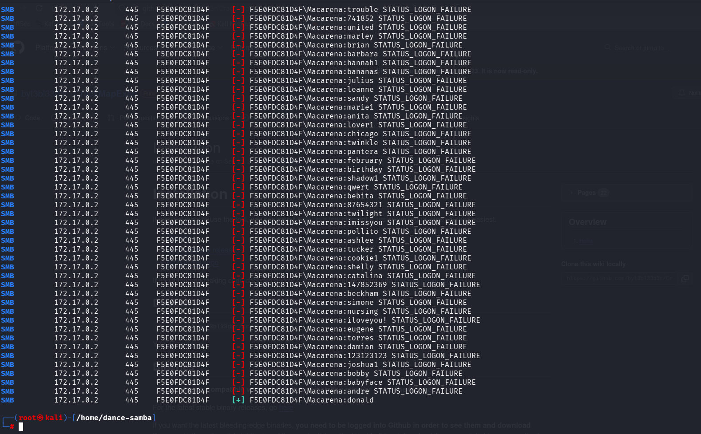

Si hacemos este mismo paso pero con donald encontramos su contraseña (admin)

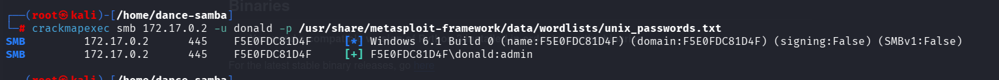

Actualmente se cuenta con:
- Macarena: donald
- Donald: admin

## 🖥️ Acceso al servidor

Se procede a listar los recursos de samba a través de smbcliente. Se comienza con macarena utilizando smbclient -L \\172.17.0.2 -U macarena 

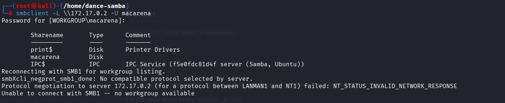

Entramos al contenido del directorio usando servicio samba utilizando **smbclient \\\\172.17.0.2\macarena -U macarena** para posteriormente descargar el fichero con get user.txt
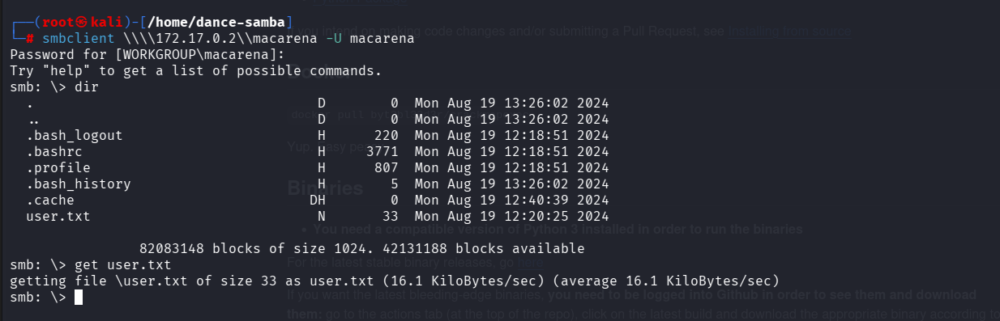

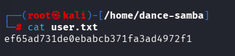

> [!NOTE]
>
> Este fichero no se ha vuelto a utilizar para las siguiente fases.

Para el acceso al servidor se realiza un ataque de **SSH Key Injection**, que permite autenticarse sin contraseña mediante el uso de claves SSH.

Primero, se genera un par de claves en la máquina local con **ssh-keygen -t rsa -b 4096 -f id_rsa**

Esto crea una clave privada (id_rsa) y una clave pública (id_rsa.pub).

Posteriormente, la clave pública se inyecta en el archivo authorized_keys del servidor víctima, lo que permite el acceso SSH sin necesidad de contraseña.

| Argumento | Significado |
|---|---|
| ssh-keygen | Herramienta para generar claves SSH. |
| -t rsa | Especifica el tipo de clave a generar (RSA). |
| -b 4096 | Define el tamaño de la clave en 4096 bits. |
| -f id_rsa | Nombre del archivo donde se guardará la clave privada. |

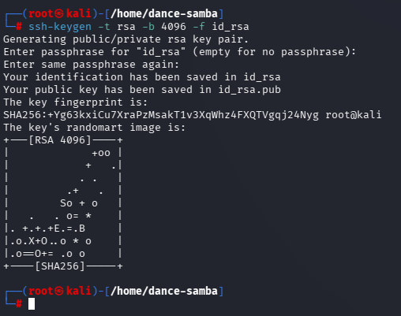

A continuación, en la máquina víctima se debe crear el directorio .ssh para almacenar la clave pública SSH y configurar el archivo authorized_keys, el cual permitirá la autenticación mediante clave pública.

Primero, se sube la clave pública generada anteriormente
**smb: \.ssh\> put id_rsa.pub**

Después, en la máquina víctima, se copia el contenido de la clave pública al archivo authorized_keys **cat id_rsa.pub > authorized_keys**

Por último, se sube el archivo authorized_keys al directorio .ssh: **smb: \.ssh\> put authorized_keys**

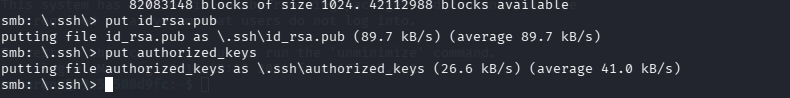

Ahora al realizar el acceso al sistema utilizando id_rsa se podrá acceder al sistema sin necesidad de autenticación

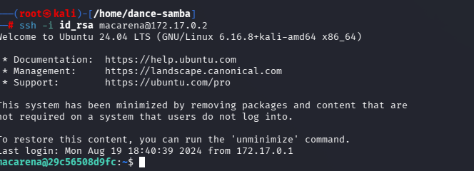

Para poder acceder al sistema busqué en internet las credenciales por defecto  del servicio y accedí al dashboard.

## 🔓 Escalada de privilegios

Durante la exploración de los directorios, se encuentra un archivo hash en /home/secret con el siguiente hash: **MMZVM522LBFHUWSXJYYWG3KWO5MVQTT2MQZDS6K2IE6T2===**

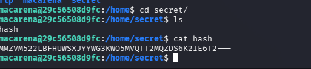

Cuando se utiliza **[Cyberchef](https://cyberchef.io/)** utilizando base64 se detecta que si vuelve a enviar el output en base32 aparece la contraseña **supersecurepassword**

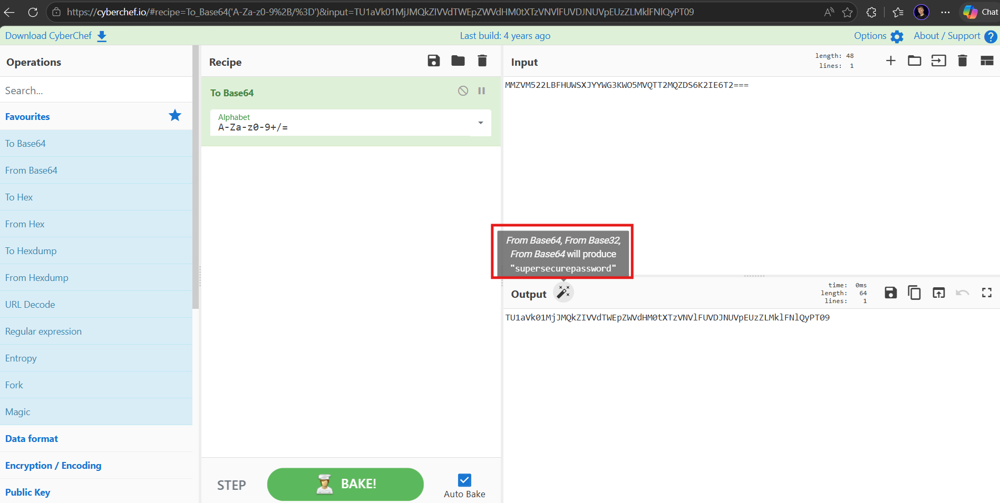

A continuación, se realiza **sudo -l** para obtener los binarios que se pueden ejecutar con permisos administrador utilizando la credencia obtenida

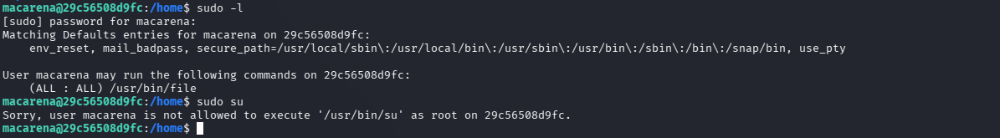

Se detecta una mala configuración de privilegios, ya que cualquier usuario puede ejecutar el comando file con permisos de sudo.

Aprovechando esta situación, se ejecuta el siguiente comando:

**sudo /usr/bin/file -f /opt/password.txt**

Esto permite leer el contenido del fichero /opt/password.txt, el cual no es accesible directamente mediante cat debido a restricciones de permisos.

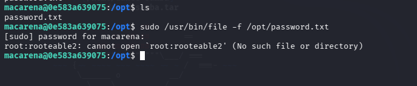

Se encuentra el usuario root contraseña rooteable. Se procede acceder a él usando **su root**
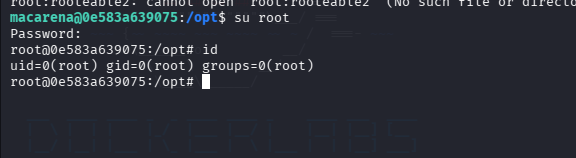

## 🧪 Post-Laboratorio
Una vez finalizada la máquina, en la terminal donde se tiene desplegada la máquina vulnerable se utilizará la combinación de teclas **Control + C** para eliminarla.

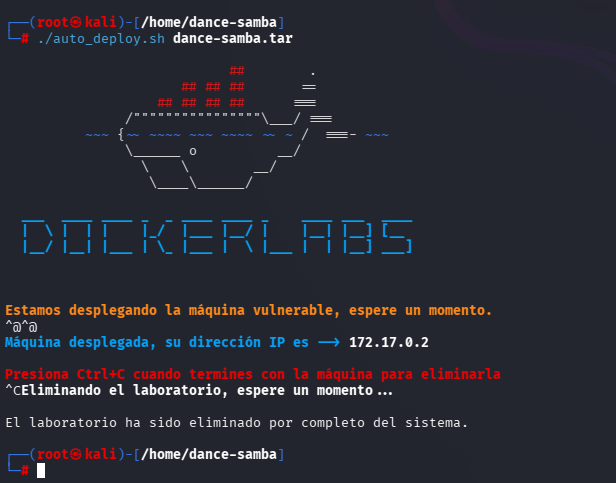

##   ¡Hola! Me llamo Saúl Ruiz 
### Analista de Ciberseguridad | Seguridad Ofensiva y Pentesting

Soy Analista de Ciberseguridad y Técnico Superior en Administración de Sistemas Informáticos en Red. Actualmente desarrollo mi carrera en entornos SOC, participando en tareas de análisis, monitorización e investigación de eventos de seguridad.

Mi interés principal se orienta hacia la seguridad ofensiva, el pentesting y el análisis técnico, áreas en las que sigo formándome de manera constante para crecer profesionalmente dentro del sector.

A través de mi proyecto personal <b>[@PlaSysX](https://linktr.ee/PlaSysx)</b>, comparto contenido relacionado con informática, ciberseguridad y aprendizaje práctico, con el objetivo de aportar valor a quienes también quieren seguir creciendo en el mundo tecnológico.

 

