
<h1>Domain</h1>
  

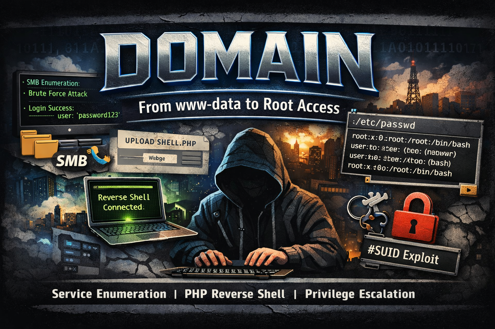

## ❓ ¿Qué es Domain?

Domain es una máquina vulnerable orientada a la explotación de un entorno Linux con servicios web y Samba expuestos. Durante el laboratorio se realiza reconocimiento de servicios, enumeración de usuarios mediante SMB, comprobación de accesos sin contraseña y fuerza bruta controlada para obtener credenciales válidas sobre recursos compartidos. Posteriormente, se aprovecha el acceso al directorio web para subir una reverse shell en PHP, obteniendo acceso inicial al sistema como www-data. Finalmente, se realiza tratamiento de la TTY, enumeración interna y escalada de privilegios mediante el abuso de un binario con permisos SUID para modificar /etc/passwd y comprometer completamente la máquina como root.

> [!NOTE]
>
> Puede descargar la máquina a través del **[enlace Mega](https://mega.nz/file/4GMGGYpa#-aSLPKJxpmrvHGYi4jqLYaEVXEdGRkdJQLxPCfRI9t8)**.

## 🔝 Despliegue de Domain

Al descargar la máquina, es necesario descomprimir el archivo para obtener los ficheros necesarios para desplegarla. Para ello, se utiliza el siguiente comando:

**unzip backend.zip**

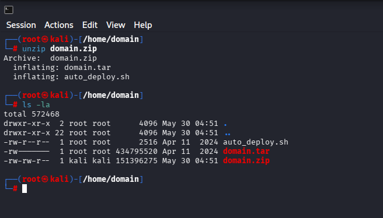

Tras descomprimir el archivo, se obtienen dos ficheros principales:

* **Auto_deploy.sh:** script Bash utilizado para desplegar la máquina localmente.
* **domain.tar:** máquina vulnerable contenizada.

Para desplegar el servicio, es necesario conceder permisos de ejecución al script **auto_deploy.sh**, ya que por defecto cuenta con permisos **644**. Para ello, se ejecuta el siguiente comando:

**chmod +x auto_deploy.sh**

Una vez asignados los permisos, se lanza la máquina utilizando el comando:

**./auto_deploy.sh domain.tar**

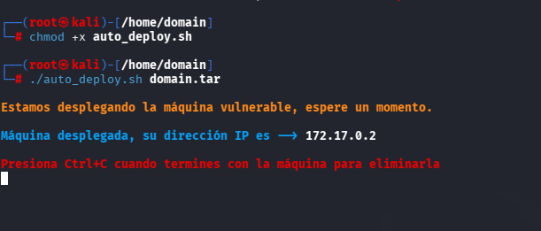

## 🔎 Fase de descubrimiento

Una vez desplegada la máquina, se abre una nueva terminal para comenzar la fase de descubrimiento. Como se conoce la dirección IP de la máquina vulnerable, **172.17.0.2**, se realiza un escaneo de red con Nmap:

**nmap -sC -sV -T5 172.17.0.2 -oN escaneo.txt**

En este caso, se añade el parámetro **-oN escaneo.txt** para guardar el resultado del escaneo en un fichero y poder consultarlo posteriormente sin necesidad de repetirlo.

| Argumento       | Significado                                                       |
| --------------- | ----------------------------------------------------------------- |
| -sC             | Ejecuta scripts por defecto para realizar comprobaciones comunes. |
| -sV             | Detecta versiones de los servicios identificados.                 |
| -T5             | Establece una velocidad de escaneo alta.                          |
| -oN escaneo.txt | Guarda el resultado del escaneo en formato normal.                |
| 172.17.0.2      | Dirección IP del objetivo.                                        |

> [!NOTE]
>
> Se ha realizado un escaneo agresivo porque el laboratorio se ejecuta en un entorno controlado, donde no es relevante reducir el ruido generado. En un entorno real, si se quisiera minimizar la detección, sería recomendable evitar **-T5** y valorar el uso de técnicas menos ruidosas, como **-sS**.

Durante el escaneo se identifican los siguientes servicios activos:

* **HTTP (puerto 80):** servicio web.
* **Samba (puertos 139 y 445):** servicio de compartición de ficheros.

A continuación, se accede al servicio web desde el navegador, donde se visualiza una página introductoria relacionada con Samba.

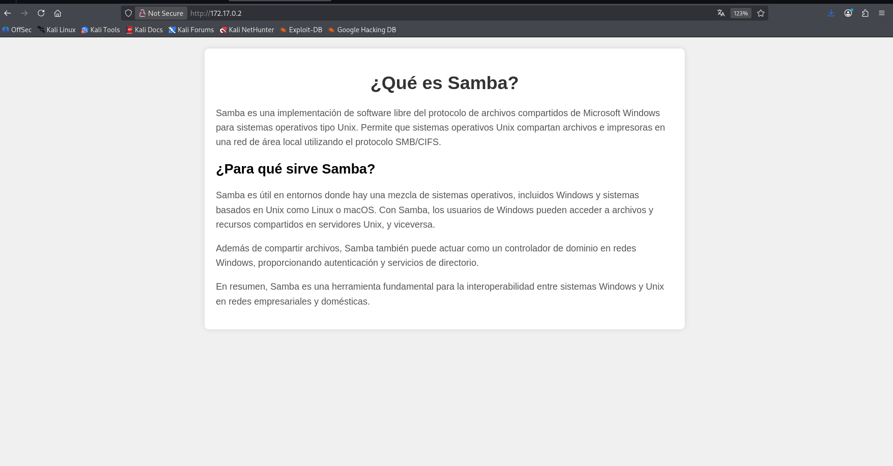

Para continuar con la enumeración, se inicia Metasploit mediante el siguiente comando:

**service postgresql start && msfconsole**

Con este comando se arranca el servicio PostgreSQL y posteriormente se abre Metasploit. PostgreSQL permite almacenar la información obtenida durante el análisis dentro de la base de datos de Metasploit.

Se utiliza el módulo **smb_enumusers** para enumerar usuarios del servicio Samba.

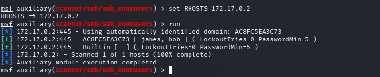

Al contrastar los resultados con la información obtenida mediante **enum4linux**, ejecutando **enum4linux 172.17.0.2**, se observa que aparecen los mismos usuarios.

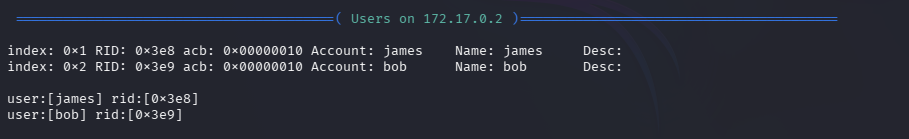

Usuarios enumerados:

1. james
2. bob

## 🖥️ Acceso al servidor

Antes de realizar un ataque de fuerza bruta, se comprueba si es posible acceder mediante **null session** con CrackMapExec. Una null session consiste en intentar autenticarse sin proporcionar contraseña.

Para ello, se utiliza el siguiente comando:

**crackmapexec smb 172.17.0.2 -u usuario -p ''**

Se realiza el mismo procedimiento con los usuarios identificados y se detecta acceso con el usuario **john**.

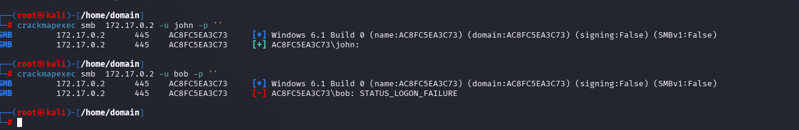

Con **smbclient** se pueden listar los recursos compartidos del servidor. Para ello, se utiliza el siguiente comando:

**smbclient -L //172.17.0.2/ -U john -N**

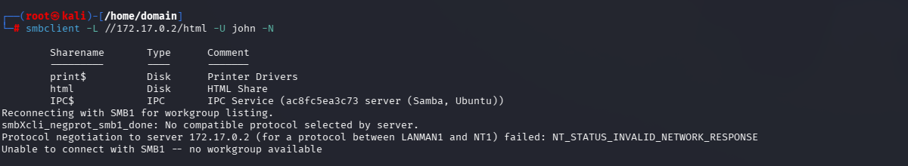

Durante la enumeración se identifica el recurso compartido **html**, aunque al intentar acceder con el usuario **john** se obtiene un mensaje de acceso denegado.

Como todavía no se conoce la contraseña del usuario **bob**, se realiza un ataque de fuerza bruta controlado con CrackMapExec utilizando el diccionario **rockyou.txt**:

**crackmapexec smb 172.17.0.2 -u bob -p /usr/share/wordlists/rockyou.txt**

Tras el proceso, se identifica la contraseña **star** para el usuario **bob**.

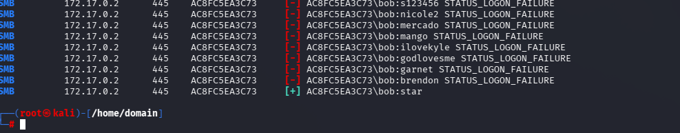

Con estas credenciales, se accede al recurso compartido **html** mediante **smbclient**:

**smbclient //172.17.0.2/html -U bob**

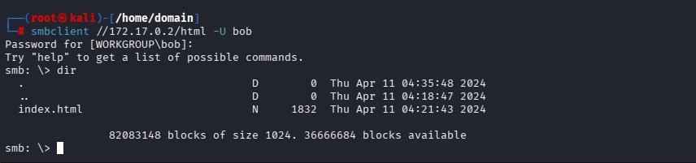

A continuación, se comprueba si el servidor web interpreta código PHP. Para ello, se crea un fichero **info.php** con la función **phpinfo()**, que permite mostrar información sobre la configuración de PHP del servidor.

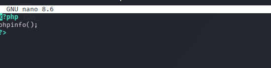

Una vez creado el fichero, se sube al servidor mediante el comando:

**put info.php**

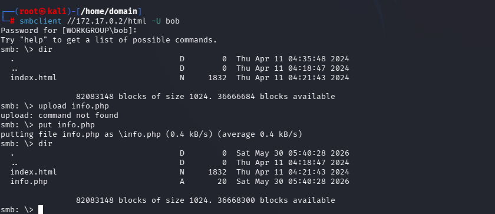

Después de subirlo, se accede desde el navegador a la siguiente URL:

**[http://172.17.0.2/info.php](http://172.17.0.2/info.php)**

Si el servidor interpreta PHP correctamente, se mostrará la información de configuración de PHP.

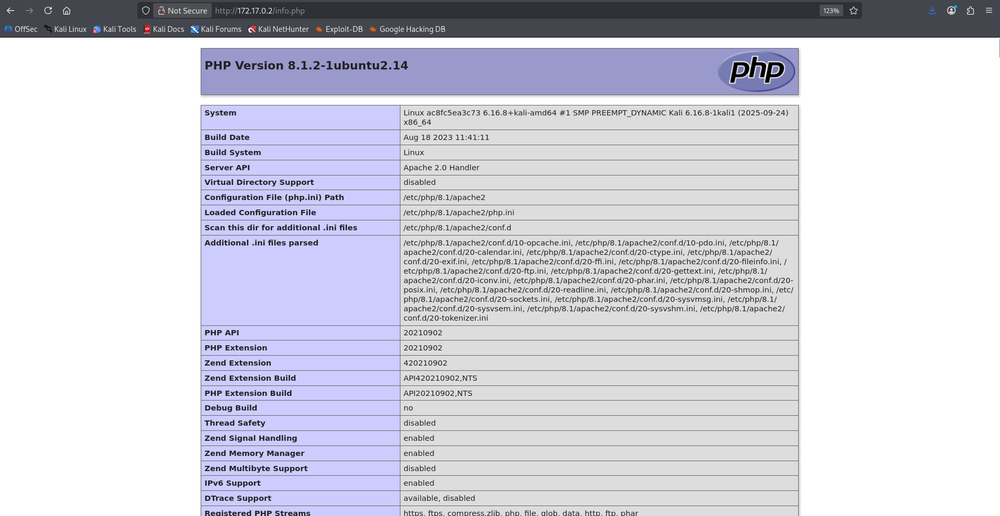

Como el servidor cuenta con soporte para PHP, es posible generar una reverse shell. Para ello, se utiliza la web [RevShells](https://www.revshells.com/), seleccionando la plantilla de PentestMonkey e indicando la IP de la máquina atacante y el puerto **4444**.

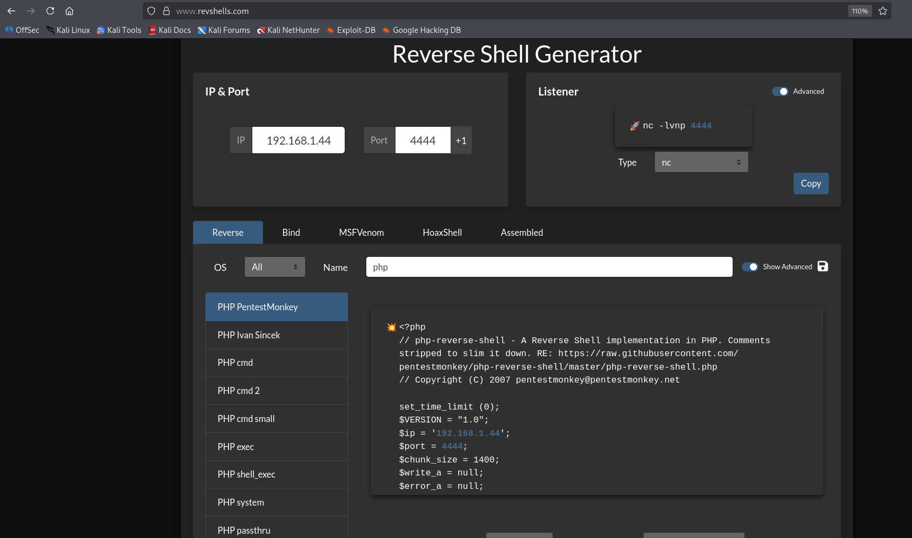

El código generado se guarda en un fichero llamado **revshell.php**, que posteriormente se sube al servidor utilizando el comando:

**put revshell.php**

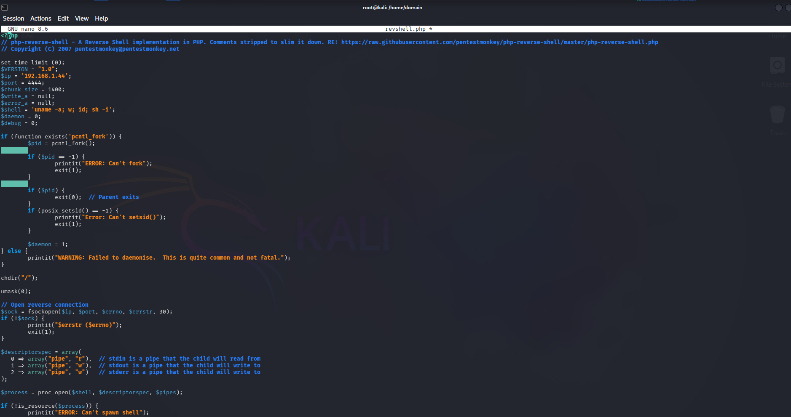

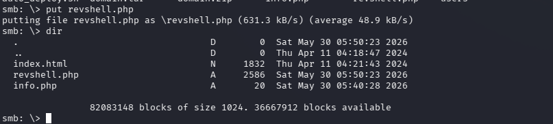

En la máquina atacante, se inicia Netcat en modo escucha por el puerto **4444** con el siguiente comando:

**nc -lvnp 4444**

La opción **-l** activa el modo escucha, **-v** muestra información detallada de la conexión, **-n** evita la resolución DNS y **-p** permite indicar el puerto local utilizado.

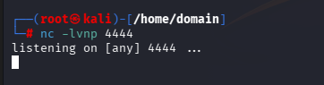

Una vez configurada la escucha, se accede desde el navegador al fichero **revshell.php**:

**[http://172.17.0.2/revshell.php](http://172.17.0.2/revshell.php)**

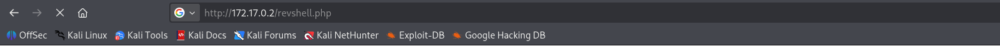

Si el navegador se queda cargando indefinidamente, es una buena señal, ya que normalmente indica que la reverse shell se ha ejecutado correctamente y mantiene una conexión abierta con la máquina atacante.

Finalmente, se obtiene acceso al sistema como el usuario **www-data**.

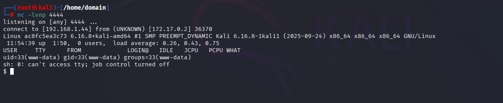

## 🔓 Tratamiento de la TTY

Al obtener acceso mediante una reverse shell, la terminal suele tener funcionalidades limitadas. Para mejorar la interacción con el sistema, se realiza un tratamiento de la TTY y se obtiene una shell más estable.

1. Se ejecuta el siguiente comando para iniciar una nueva sesión de shell dentro de un pseudo-terminal:

   **script /dev/null -c bash**

2. Se suspende la shell con **Ctrl + Z**.

3. En la terminal local, se ejecuta el siguiente comando para mejorar el comportamiento de la shell:

   **stty raw -echo; fg**

Este comando permite evitar problemas como la duplicación de caracteres en la entrada y mejora la interacción con la terminal.

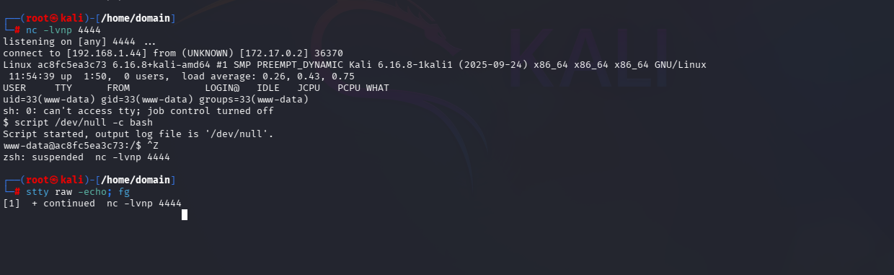

4. Una vez recuperada la shell, se resetea la terminal indicando el tipo **xterm**.

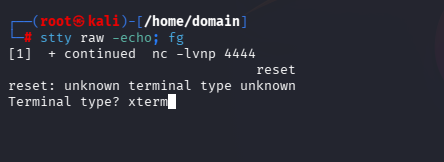

5. Se exporta la variable **TERM** para habilitar funcionalidades de terminal:

   **export TERM=xterm**

6. Se establece Bash como shell por defecto:

   **export SHELL=bash**

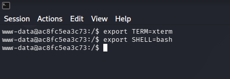

## 🔓 Escalada de privilegios

Como el sistema no tiene instalado **sudo**, se realiza una búsqueda de binarios con permisos **SUID**. Para ello, se ejecuta el siguiente comando:

**find / -perm -4000 2>/dev/null**

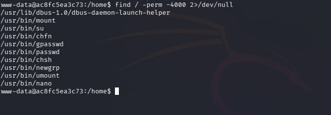

Durante la enumeración se detecta que el binario **nano** cuenta con permisos SUID. Esto permite editar ficheros con privilegios elevados.

En este caso, se aprovecha esta configuración para editar el fichero **/etc/passwd**:

**/usr/bin/nano /etc/passwd**

El objetivo es eliminar la **x** de la segunda columna correspondiente al usuario **root**. Al hacerlo, se elimina la referencia a la contraseña cifrada en **/etc/shadow**, permitiendo cambiar al usuario **root** sin necesidad de contraseña.

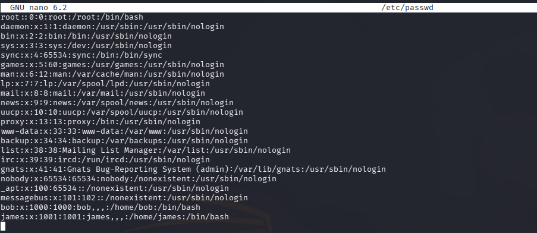

Por último, se cambia al usuario **root** con el siguiente comando:

**su root**

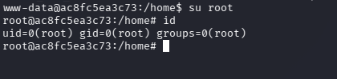

Con esto, se consigue comprometer completamente la máquina como usuario **root**.

## 🧪 Post-Laboratorio
Una vez finalizada la máquina, en la terminal donde se tiene desplegada la máquina vulnerable se utilizará la combinación de teclas **Control + C** para eliminarla.

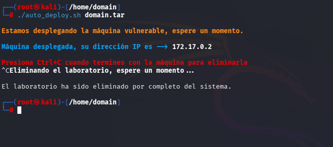

##   ¡Hola! Me llamo Saúl Ruiz 
### Analista de Ciberseguridad | Seguridad Ofensiva y Pentesting

Soy Analista de Ciberseguridad y Técnico Superior en Administración de Sistemas Informáticos en Red. Actualmente desarrollo mi carrera en entornos SOC, participando en tareas de análisis, monitorización e investigación de eventos de seguridad.

Mi interés principal se orienta hacia la seguridad ofensiva, el pentesting y el análisis técnico, áreas en las que sigo formándome de manera constante para crecer profesionalmente dentro del sector.

A través de mi proyecto personal <b>[@PlaSysX](https://linktr.ee/PlaSysx)</b>, comparto contenido relacionado con informática, ciberseguridad y aprendizaje práctico, con el objetivo de aportar valor a quienes también quieren seguir creciendo en el mundo tecnológico.

 

