
<h1>FindYourStyle</h1>
  

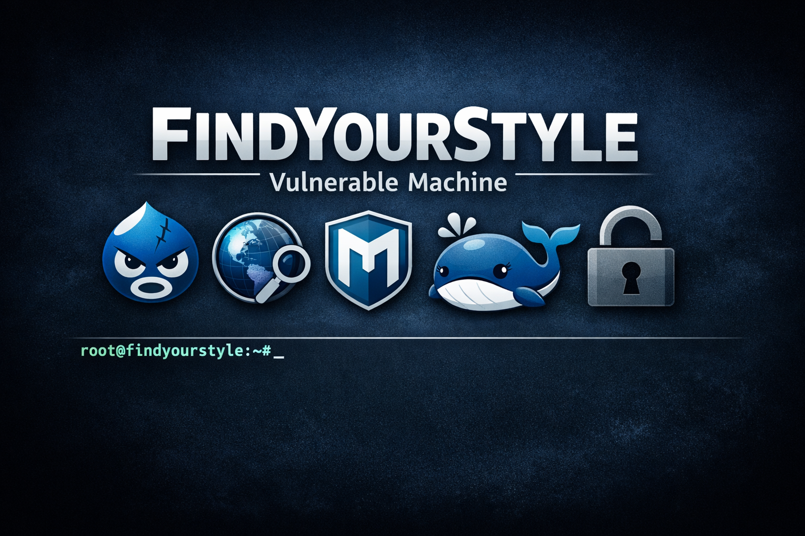

## ❓ ¿Qué es FindYourStyle?

FindYourStyle es una máquina vulnerable orientada a la explotación de un entorno Linux con un servicio web basado en Drupal expuesto. Durante el laboratorio se realiza el despliegue de la máquina en un entorno local controlado, seguido de una fase de reconocimiento con Nmap para identificar el servicio HTTP y detectar una instalación de Drupal 8. Posteriormente, se aprovecha la vulnerabilidad Drupalgeddon2 mediante Metasploit para conseguir ejecución remota de comandos y obtener acceso inicial al sistema como www-data. Finalmente, se realiza enumeración interna, tratamiento de la shell, obtención de credenciales desde el fichero settings.php, cambio al usuario ballenita y escalada de privilegios mediante el abuso de permisos sudo sobre binarios como ls y grep para leer información sensible en /root y comprometer completamente la máquina como root.

> [!NOTE]
>
> Puede descargar la máquina a través del **[enlace Mega](https://mega.nz/file/qEVWUKqR#3CheB213YMSaj-VUXSu1LOj2hlI7AwD-lQUbrtR_9W0)**.

## 🔝 Despliegue de FindYourStyle

Al descargar la máquina, es necesario descomprimir el archivo para obtener los ficheros necesarios para desplegarla. Para ello, se utiliza el siguiente comando:

**unzip findyourstyle.zip**

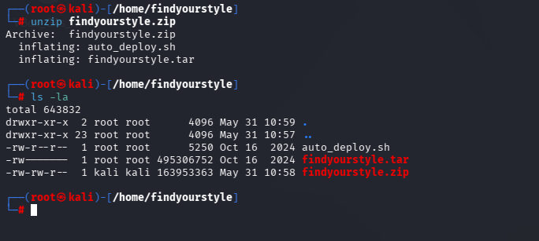

Tras descomprimir el archivo, se obtienen dos ficheros principales:

* **Auto_deploy.sh:** script Bash utilizado para desplegar la máquina localmente.
* **findyourstyle.tar:** máquina vulnerable contenizada.

Para desplegar el servicio, es necesario conceder permisos de ejecución al script **auto_deploy.sh**, ya que por defecto cuenta con permisos **644**. Para ello, se ejecuta el siguiente comando:

**chmod +x auto_deploy.sh**

Una vez asignados los permisos, se lanza la máquina utilizando el comando:

**./auto_deploy.sh findyourstyle.tar**

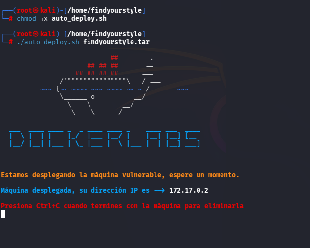

## 🔎 Fase de descubrimiento

Una vez desplegada la máquina, se abre una nueva terminal para comenzar la fase de descubrimiento. Como se conoce la dirección IP de la máquina vulnerable, **172.17.0.2**, se realiza un escaneo de red con Nmap:

**nmap -sC -sV -T5 172.17.0.2**

| Argumento       | Significado                                                       |
| --------------- | ----------------------------------------------------------------- |
| -sC             | Ejecuta scripts por defecto para realizar comprobaciones comunes. |
| -sV             | Detecta versiones de los servicios identificados.                 |
| -T5             | Establece una velocidad de escaneo alta.                          |
| 172.17.0.2      | Dirección IP del objetivo.                                        |

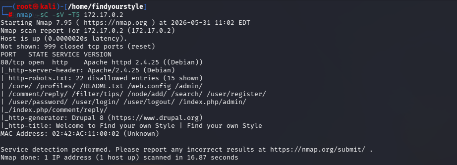

> [!NOTE]
>
> Se ha realizado un escaneo agresivo porque el laboratorio se ejecuta en un entorno controlado, donde no es relevante reducir el ruido generado. En un entorno real, si se quisiera minimizar la detección, sería recomendable evitar **-T5** y valorar el uso de técnicas menos ruidosas, como **-sS**.

Durante el escaneo se identifican los siguientes servicios activos:

* **HTTP (puerto 80):** servicio web. Se identifica fichero robots.txt a través del script http-robots.txt y se identifica que es un drupal 8 gracias al script http-generator

A continuación, se accede al servicio web desde el navegador, donde se visualiza una web drupal.

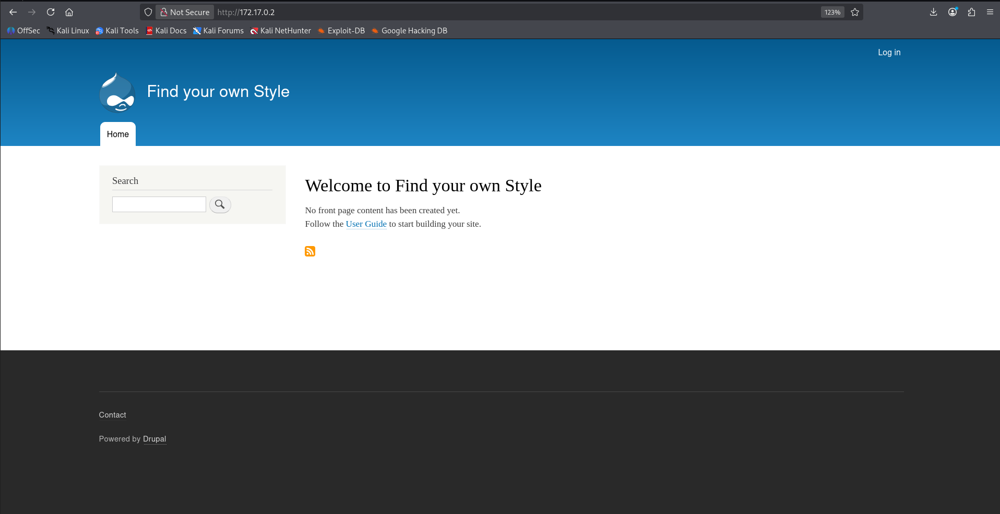

## 🖥️ Acceso al servidor

Tras enumerar el servidor, se procede a revisar si en searchsploit existe algún exploit para la versión drupal que de la victima utilizando el comando **searchsploit drupal 8**

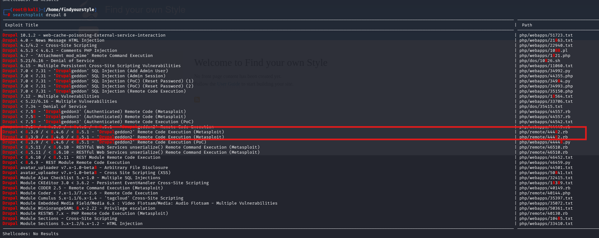

Se encuentra un módulo en metasploit que explota la vulnerabilidad "Drupalgeddon2" que permite realizar una ejecución de código remota (REC)

El módulo en metasploit es **unix/webapp/drupal_drupalgeddon2**. Con show options se mostrará las opciones que se deberán configurar, en nuestro caso únicamente es necesario establecer la dirección IP de la víctima con **set RHOSTS 172.17.0.2**. 

Por último, se ejecuta el exploit con **run**

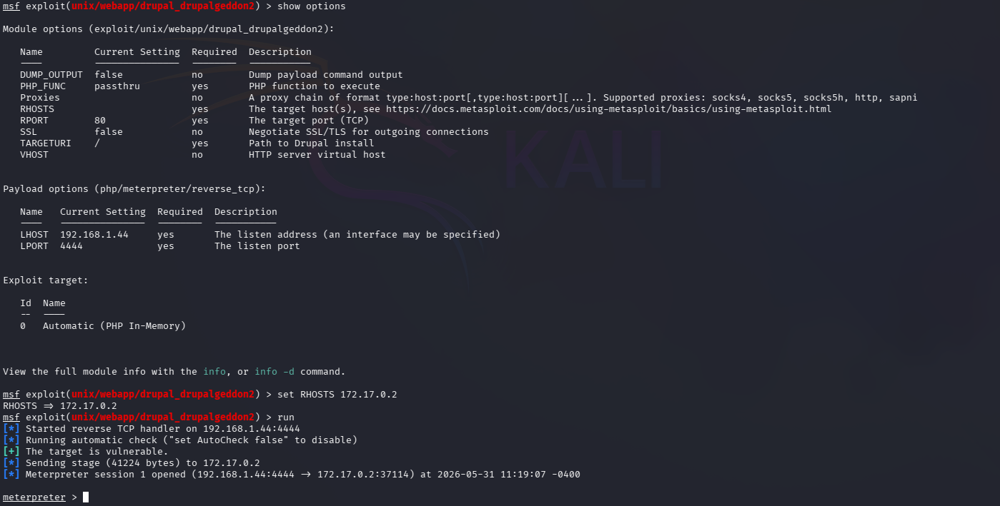

Ya se tiene login con el usuario www-data

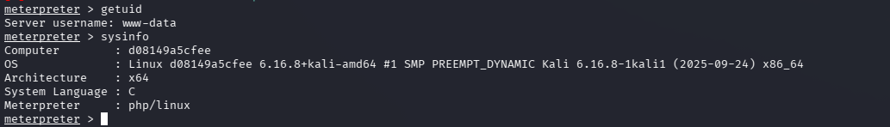

## 🔓 Escalada de privilegios

Podemos leer el fichero /etc/passwd para enumerar los usuarios internos

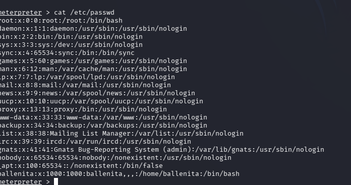

El usuario es **ballenita**

A continuación, entramos a la terminal del usuario introduciendo el comando **shell**, para que podamos trabajar más agusto usaremos el comando **script /dev/null -c bash**

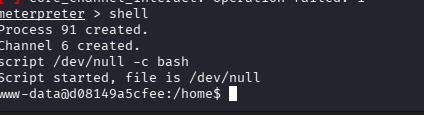

Como no se permite utilizar el comando **sudo -l**, se realiza una búsqueda de binarios con permisos **SUID**. Para ello, se ejecuta el siguiente comando:

**find / -perm -4000 2>/dev/null**

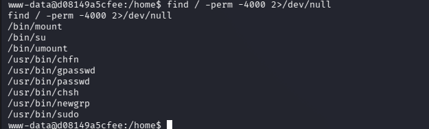

Se encuentra el binario **su**, encargado de poder cambiar de usuario, para lograrlo, se necesita credenciales. Se inspecciona el fichero settings.php localizado en /var/wwwhtml/sites/default para ver las credenciales del usuario ballenita. En este caso he utilizado **cat settings.php | grep -n "ballenita"**, las credenciales se encuentra en la línea 81 y 82

Contraseña: ballenitafeliz

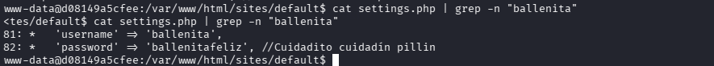

Si se entra al fichero, se localiza toda la información sobre la base de datos

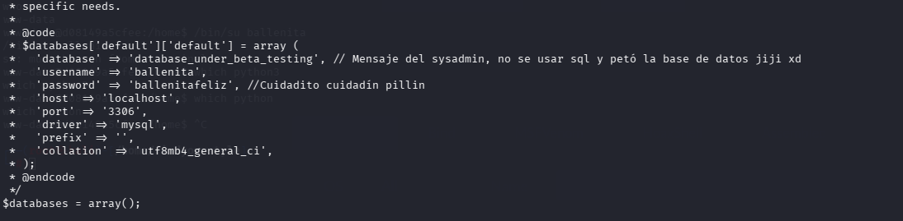

Se procede a cambiar de usuario usando **/bin/su ballenitafeliz**

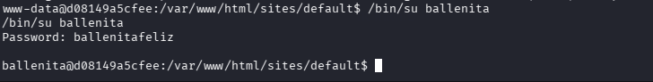

Ya somos usuarios ballenita, procedemos a escalar a root. Al ejecutar sudo -l para encontrar binarios que permite ejecutar se encuentra que se puede ejecutar los binarios /bin/ls para realizar listados en directorios y /bin/grep para realizar filtrados

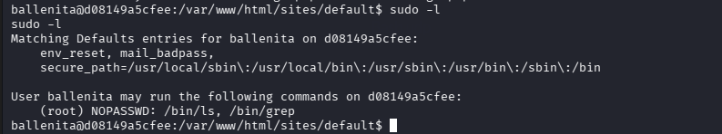

Se lista con **sudo** el directorio /root para encontrar el fichero **secretitomaximo.txt**, para ver su contenido, se utiliza **sudo grep '' /root/secretitomaximo.txt**

- Contenido: nobodycanfindthispasswordrootrocks

Se procede a acceder al usuario root con **su root** e introduciendo la contraseña nobodycanfindthispasswordrootrocks.

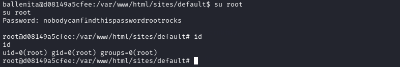

## 🧪 Post-Laboratorio
Una vez finalizada la máquina, en la terminal donde se tiene desplegada la máquina vulnerable se utilizará la combinación de teclas **Control + C** para eliminarla.

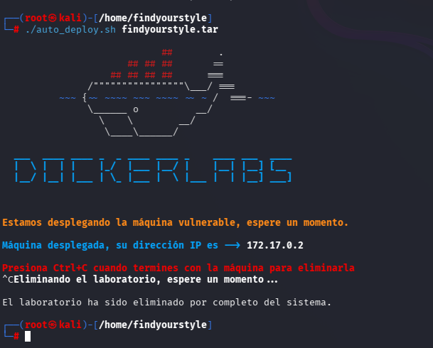

##   ¡Hola! Me llamo Saúl Ruiz 
### Analista de Ciberseguridad | Seguridad Ofensiva y Pentesting

Soy Analista de Ciberseguridad y Técnico Superior en Administración de Sistemas Informáticos en Red. Actualmente desarrollo mi carrera en entornos SOC, participando en tareas de análisis, monitorización e investigación de eventos de seguridad.

Mi interés principal se orienta hacia la seguridad ofensiva, el pentesting y el análisis técnico, áreas en las que sigo formándome de manera constante para crecer profesionalmente dentro del sector.

A través de mi proyecto personal <b>[@PlaSysX](https://linktr.ee/PlaSysx)</b>, comparto contenido relacionado con informática, ciberseguridad y aprendizaje práctico, con el objetivo de aportar valor a quienes también quieren seguir creciendo en el mundo tecnológico.

 

