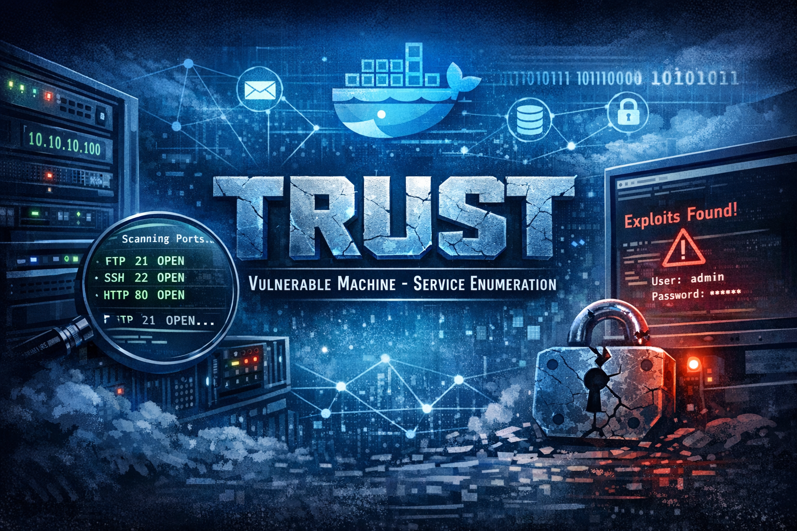
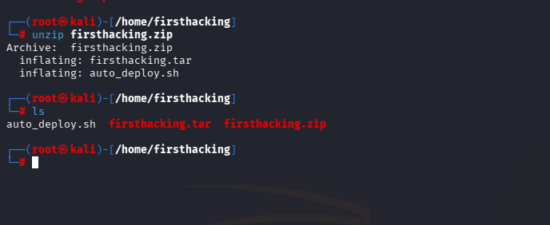
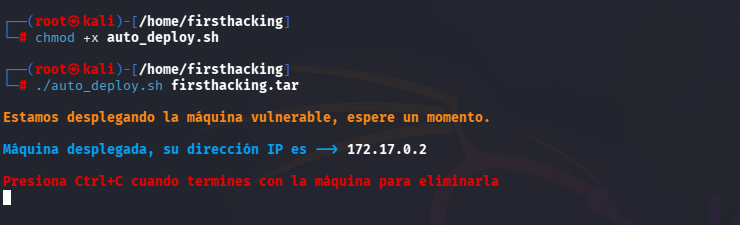
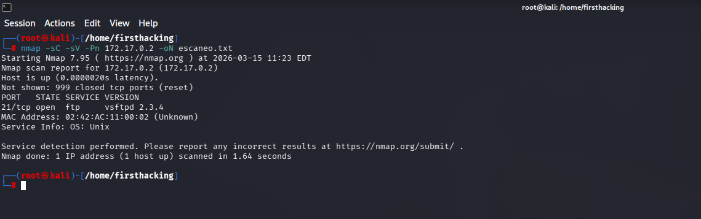
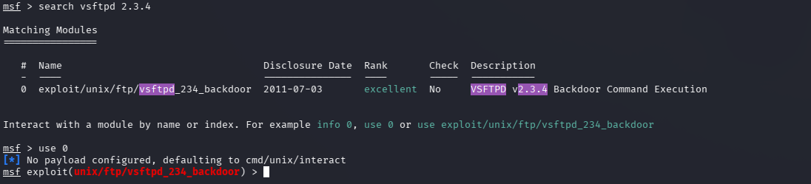
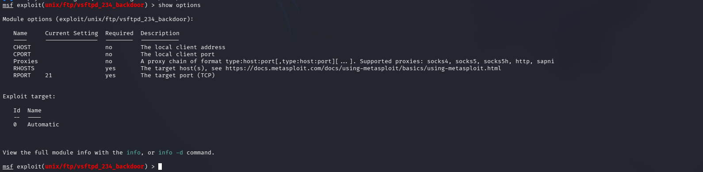
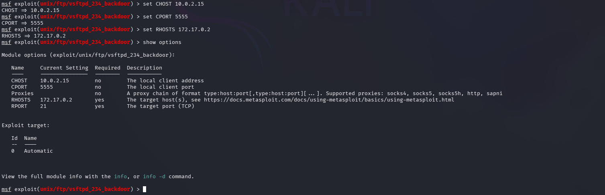
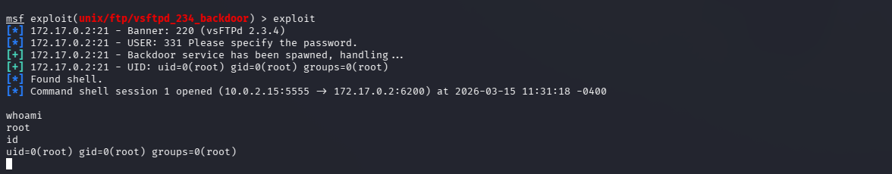
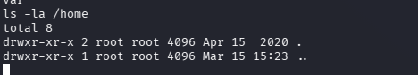
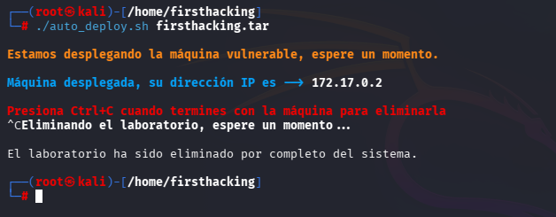

<h1>FirstHacking</h1>
  

## ❓ ¿Qué es FirstHacking?

FirstHacking es una máquina vulnerable orientada a practicar reconocimiento básico de servicios y explotación inicial de un servicio FTP vulnerable, permitiendo obtener acceso directo al sistema mediante Metasploit y privilegios root en un entorno controlado.

> [!NOTE]
>
>Puede descargar la máquina a través del **[enlace mega](https://mega.nz/file/oCd2VC5D#QfiRoFmZrZ-FjTuyRX9bLw7638fjluwp6jNth7JjXTw)**

## 🔝 Despliegue FirstHacking

Al descargar la máquina, es necesario descompromirlo para poder encontrar los archivos necesarios para poder desplegarla, para ello, utilizaremos el comando.

**unzip firsthacking.zip.**

Obtendremos dos ficheros:
- **Auto_deploy.sh:** Script Bash para desplegar nuestra máquina localmente.
- **firsthacking.tar:** Máquina vulnerable contenizada.

Para desplegar el servicio será necesario carle permisos de ejecución a auto_deploy.sh, ya que por defecto tiene permisos 644. Para ello, usaremos el comando:

 **chmod +x auto_deploy.sh**

 Una vez ejecutado, se utilizará el comando **./auto_deploy.sh firsthacking.tar** para lanzar la máquina

## 🔎 Fase de Descubrimiento 
Ahora, se abrirá una nueva terminal para empezar a realizar el descubrimiento del sistema. Cómo sabemos la dirección IP de la máquina vulnerable **(172.17.0.2)**, comenzaremos realizando un escaneo de red nmap. 
En esta ocación, se usará el comando **nmap -sC -sV --min-rate 5000 172.17.0.2**

En este caso, he añadido -oN escaneo.txt para tener el escaneo guardado en un fichero sin necesidad repetirlo en un futuro.

| Argumento | Significado |
|---|---|
| -sC | Ejecuta los scripts para comprobaciones comunes |
| -sV | Detección de versiones de servicios |
| --min-rate 5000 | Envía al  5000 paquetes por segundo (aumenta velocidad; puede causar pérdida o detección) |
| 172.18.0.2 | Dirección IP del objetivo a escanear |

> [!NOTE]
>
>Se ha realizado un escaneo agresivo debido a que se está realizando en un entorno controlado y no es importante el ser detectado. Si se busca hacer el mínimo ruido posible será necesario utilizar el argumento **-sS** se usa para no ser detectado fácilmente, porque no completa la conexión TCP. Además, **no se usará --min-rate.**

En este caso, se ha encontrado un servicio activo:
- **FTP (Puerto: 21):** Protocolo de Transferencias de Archivos.

Se procede a entrar a metaexploit a través de **msfconsole**

Para poder establecer los parámetros de ataque se usará show options

En nuestro caso se establecerá Nuestra dirección IP (CHOST) y nuestro puerto de escucha (CPORT), debe ser uno que no se use y la dirección IP de la máquina víctima (RHOSTS). Esto lo haremos con **set**

## 🖥️ Acceso al servidor
Se ejecuta el comando **exploit** o **run** para poder realizar el ataque.

Como ya se tiene acceso root y en /home no hay otros usuarios, no es necesario realizar más búsqueda de credenciales.

## 🧪 Post-Laboratorio
Una vez finalizada la máquina, en la terminal donde se tiene desplegada la máquina vulnerable se utilizará la combinación de teclas **Control + C** para eliminarla.

##   ¡Hola! Me llamo Saúl Ruiz 
### Estudiante en Ciberseguridad

Soy estudiante de Administración de Sistemas Informáticos en Red con pasión por la ciberseguridad y el mundo de la informática. Desde pequeño disfruto explorando tecnología y aprendiendo de manera autónoma. Además, combino mis estudios con la creación de contenido y recursos educativos sobre informática a través de mi proyecto personal <b>[@PlaSysX](https://linktr.ee/PlaSysx)</b>

Si quieres aprender informática, mejorar tus habilidades, descubrir trucos y soluciones prácticas, y formar parte de nuestra comunidad, puedes seguirnos en PlaSysX.

 

