
<h1>HedgeHog</h1>
  

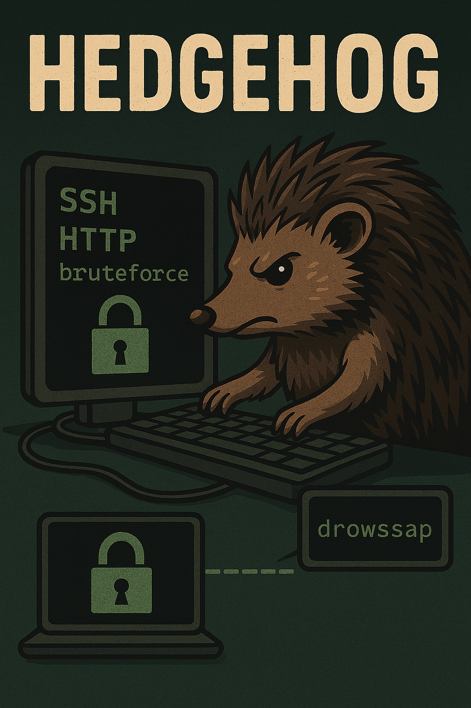

## ❓ ¿Qué es HedgeHog?

HedgeHog es una máquina vulnerable centrada en la enumeración básica de servicios y el uso de técnicas de fuerza bruta para obtener acceso inicial. A través del análisis de los puertos expuestos principalmente SSH y HTTP el atacante puede identificar pistas mínimas en el servicio web y, posteriormente, apoyarse en un diccionario invertido para descubrir credenciales válidas.

> [!NOTE]
>
>Puede descargar la máquina a través del **[enlace mega](https://mega.nz/file/ic9VwYZJ#Hr1BjW2axoSRmUYbxhldmTNiYtBV9TQU83JDJPpoYww)**

## 🔝 Despliegue HedgeHog

Al descargar la máquina, es necesario descompromirlo para poder encontrar los archivos necesarios para poder desplegarla, para ello, utilizaremos el comando.

**unzip hedgehog.zip.**

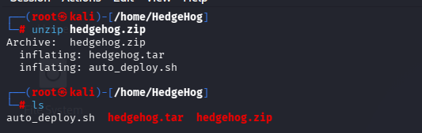

Obtendremos dos ficheros:
- **Auto_deploy.sh:** Script Bash para desplegar nuestra máquina localmente.
- **hedgehog.tar:** Máquina vulnerable contenizada.

Para desplegar el servicio será necesario carle permisos de ejecución a auto_deploy.sh, ya que por defecto tiene permisos 644. Para ello, usaremos el comando:

 **chmod +x auto_deploy.sh**

 Una vez ejecutado, se utilizará el comando **./auto_deploy.sh hedgehog.tar** para lanzar la máquina

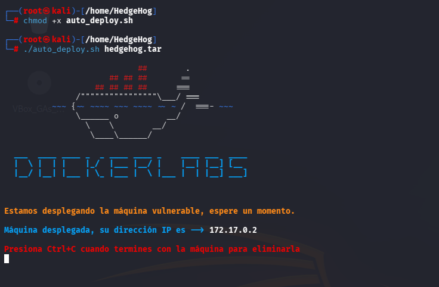

## 🔎 Fase de Descubrimiento 
Ahora, se abrirá una nueva terminal para empezar a realizar el descubrimiento del sistema. Cómo sabemos la dirección IP de la máquina vulnerable **(172.17.0.2)**, comenzaremos realizando un escaneo de red nmap. 
En esta ocación, se usará el comando **nmap -sC -sV --min-rate 5000 172.17.0.2**

| Argumento | Significado |
|---|---|
| -sC | Ejecuta los scripts para comprobaciones comunes |
| -sV | Detección de versiones de servicios |
| --min-rate 5000 | Envía al  5000 paquetes por segundo (aumenta velocidad; puede causar pérdida o detección) |
| 172.17.0.2 | Dirección IP del objetivo a escanear |

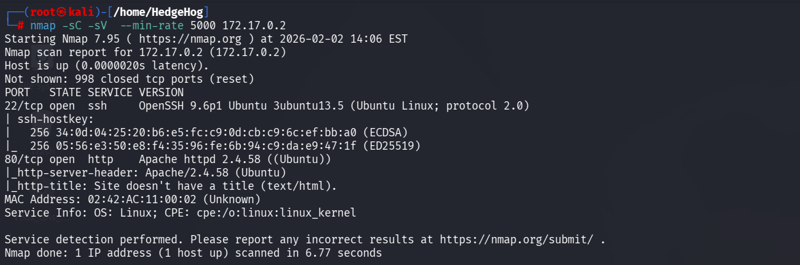
> [!NOTE]
>
>Se ha realizado un escaneo agresivo debido a que se está realizando en un entorno controlado y no es importante el ser detectado. Si se busca hacer el mínimo ruido posible será necesario utilizar el argumento **-sS** se usa para no ser detectado fácilmente, porque no completa la conexión TCP. Además, **no se usará --min-rate.**

En este caso, se ha encontrado dos servicios activos:
- **SSH (Puerto: 21):** Conexión remota
- **HTTP (Puerto 80):** Servidor Web.

A continuación, se procede a visitar el sitio web utilizando el protocolo http, que se encuentra una página con la palabra "tails"

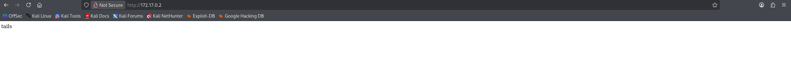

A partir de esta pista, se emplea el comando tac, el cual cumple la misma función que cat pero mostrando el contenido del archivo desde la última línea hasta la primera.

Al no encontrarse más información relevante tras este análisis, se decide proceder con un ataque de fuerza bruta utilizando el diccionario rockyou invertido. Esta decisión se toma debido al gran tamaño del diccionario, ya que invertirlo permite optimizar el proceso y reducir el tiempo de ejecución.

Se emplea el comando **tac rockyou.txt > rockyou_invertido.txt**. Esto guardará la salida del comando tac en el archivo rockyou_invertido.txt

> [!NOTE]
>
>El fichero rockyou no debe tener el formato **txt.gz**. En el correcto se debe descomprimir utilizando **gunzip**.

Posteriormente, al preparar el diccionario rockyou invertido para el ataque de fuerza bruta, es necesario eliminar los espacios adicionales generados durante el proceso de inversión. Para ello, se emplea el comando:

**sed -i 's/ //g' rockyou_invertido.txt**

Este comando permite limpiar el diccionario, garantizando su correcto uso durante el ataque.

Finalmente, se procede a realizar el ataque de fuerza bruta usando hydra:
**hydra -l tails -P rockyou_invertido.txt ssh://172.17.0.2 -t 64**

| Argumento | Significado |
|---|---|
| hydra | Herramienta de ataque de fuerza bruta. |
| -l tails | Especifica un usuario. |
| -P rockyou_invertido.txt| Archivo con diccionario de contraseñasinvertido. |
| ssh://172.17.0.2| Protocolo y dirección IP del objetivo. |
| -t 64 | Número de hilos utilizados (velocidad). |

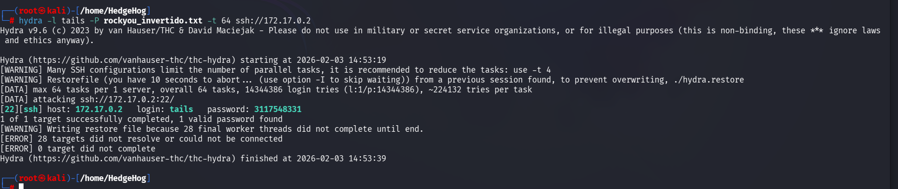

Se ha encontrado las credenciales:
  - Usuario: tails
  - Contraseña 3117548331
## 🖥️ Acceso al servidor
Se accede al servidor utilizando el comando ssh tails@172.17.0.2

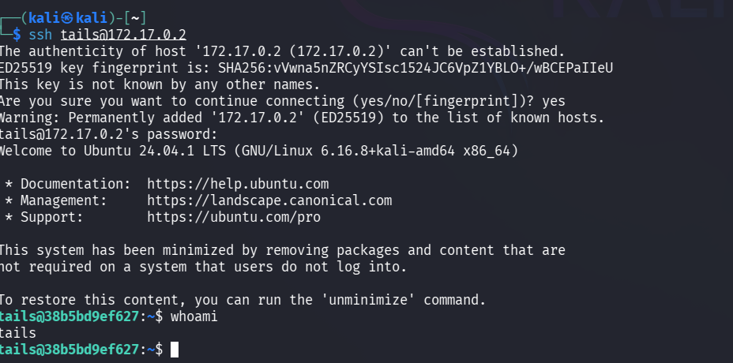

## 🔓 Escalada de privilegios

Con **sudo -l** se podrá ver los binarios que puede ejecutar el usuario.

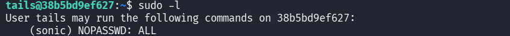

Para cambiar de usuario es necesario utilizar el comando **sudo -u sonic /bin/bash**

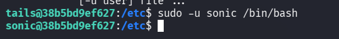

Únicamente se deberá escalar a root utilizando el comando **sudo su**.

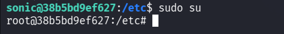

Con acceso a root o al usuario sonic, se puede conocer al contraseña de éste último entrando en su home y haciendo cat al archivo contraseña que se encuentra en Documentos

## 🧪 Post-Laboratorio
Una vez finalizada la máquina, en la terminal donde se tiene desplegada la máquina vulnerable se utilizará la combinación de teclas **Control + C** para eliminarla.

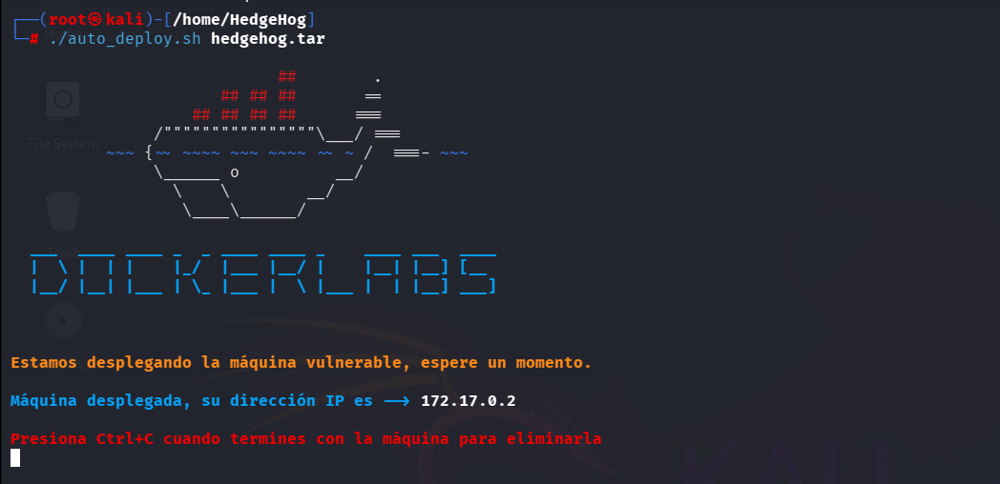

##   ¡Hola! Me llamo Saúl Ruiz 
### Estudiante en Ciberseguridad

Soy estudiante de Administración de Sistemas Informáticos en Red con pasión por la ciberseguridad y el mundo de la informática. Desde pequeño disfruto explorando tecnología y aprendiendo de manera autónoma. Además, combino mis estudios con la creación de contenido y recursos educativos sobre informática a través de mi proyecto personal <b>[@PlaSysX](https://linktr.ee/PlaSysx)</b>

Si quieres aprender informática, mejorar tus habilidades, descubrir trucos y soluciones prácticas, y formar parte de nuestra comunidad, puedes seguirnos en PlaSysX.

 

