
<h1>Trust</h1>
  

## ❓ ¿Qué es Trust?

Trust es una máquina vulnerable orientada a practicar enumeración web básica, fuerza bruta sobre SSH y escalada de privilegios mediante binarios sudo mal configurados. Permite trabajar reconocimiento de servicios, descubrimiento de rutas ocultas con Gobuster y explotación de permisos inseguros usando GTFOBins. 

> [!NOTE]
>
>Puede descargar la máquina a través del **[enlace mega](https://mega.nz/file/wD9BgLDR#784mjg4xwoolyyKMqdGLk1_YntbJLItJ7RFRx9A69ZE)**

## 🔝 Despliegue Trust

Al descargar la máquina, es necesario descompromirlo para poder encontrar los archivos necesarios para poder desplegarla, para ello, utilizaremos el comando.

**unzip trust.zip.**

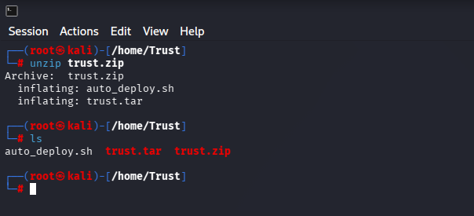

Obtendremos dos ficheros:
- **Auto_deploy.sh:** Script Bash para desplegar nuestra máquina localmente.
- **trust.tar:** Máquina vulnerable contenizada.

Para desplegar el servicio será necesario carle permisos de ejecución a auto_deploy.sh, ya que por defecto tiene permisos 644. Para ello, usaremos el comando:

 **chmod +x auto_deploy.sh**

 Una vez ejecutado, se utilizará el comando **./auto_deploy.sh borazuwarahctf.tar** para lanzar la máquina

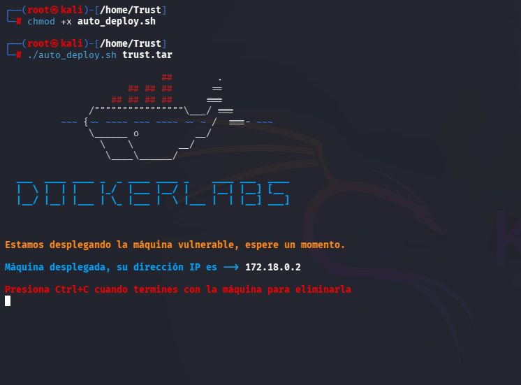

## 🔎 Fase de Descubrimiento 
Ahora, se abrirá una nueva terminal para empezar a realizar el descubrimiento del sistema. Cómo sabemos la dirección IP de la máquina vulnerable **(172.18.0.2)**, comenzaremos realizando un escaneo de red nmap. 
En esta ocación, se usará el comando **nmap -sC -sV --min-rate 5000 172.18.0.2**

En este caso, he añadido -oN escaneo.txt para tener el escaneo guardado en un fichero sin necesidad repetirlo en un futuro.

| Argumento | Significado |
|---|---|
| -sC | Ejecuta los scripts para comprobaciones comunes |
| -sV | Detección de versiones de servicios |
| --min-rate 5000 | Envía al  5000 paquetes por segundo (aumenta velocidad; puede causar pérdida o detección) |
| 172.18.0.2 | Dirección IP del objetivo a escanear |

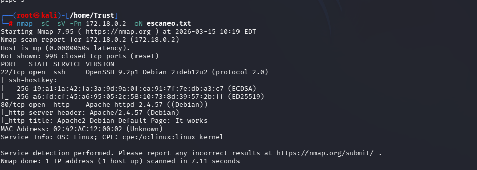

> [!NOTE]
>
>Se ha realizado un escaneo agresivo debido a que se está realizando en un entorno controlado y no es importante el ser detectado. Si se busca hacer el mínimo ruido posible será necesario utilizar el argumento **-sS** se usa para no ser detectado fácilmente, porque no completa la conexión TCP. Además, **no se usará --min-rate.**

En este caso, se ha encontrado un servicio activo:
- **SSH (Puerto: 22):** Conexión remota.
- **HTTP (Puerto 80):** Servidor web.

A continuación, se dispone a visitar la página web, se encuentra la página inicial de apache en Debian:

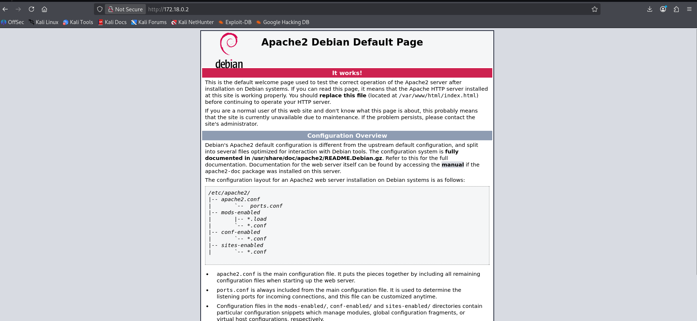

Nos disponemos a enumerar directorios al servidor apache con gobuster, con el comando gobuster dir -u http://172.18.0.2 -w /usr/share/wordlists/dirbuster/directory-list-lowercase-2.3-medium.txt -x .php,.html,.txt -r.

> [!NOTE]
>
>Se utiliza **-x .php,.html,.txt -r** ya que en anteriores búsquedas no aparece información relevante, se expande la enumeración a los ficheros .php, .html y .txt, siguiendo las redirecciones que aparece. 

| Argumento | Significado |
|---|---|
| gobuster | Herramienta de enumeración de directorios y archivos web. |
| dir | Modo de búsqueda de directorios en servidores web. |
| -u http://172.18.0.2 | URL objetivo sobre la que se realizará la enumeración. |
| -w /usr/share/wordlists/dirbuster/directory-list-lowercase-2.3-medium.txt | Wordlist utilizada para probar rutas y directorios. |
| -x .php,.html,.txt | Extensiones de archivo que también se intentarán descubrir. |
| -r | Sigue redirecciones automáticamente durante la enumeración. |

Ahora, se visitará el directorio secret.php.

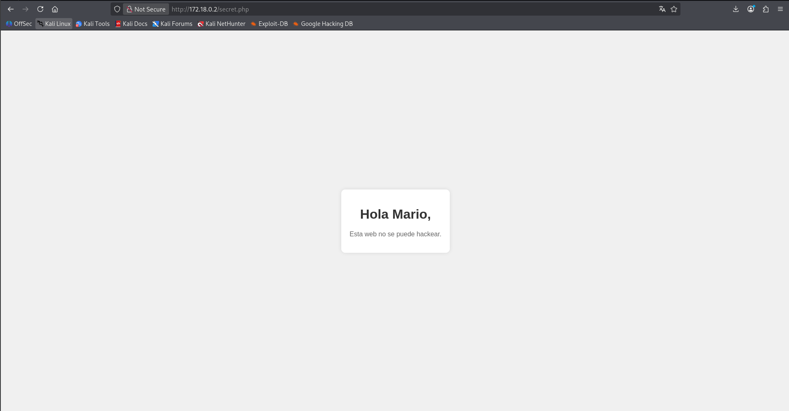

Tras revisar el código fuente, no se encuentra información relevante, únicamente el nombre mario. Puede ser un usuario en el sistema. Se procede a realizar ataque de fuerza bruta por hydra.

| Argumento | Significado |
|---|---|
| hydra | Herramienta de ataque de fuerza bruta. |
| -l mario | Especifica un usuario. |
| -P /usr/share/wordlists/Rockyou.txt.gz| Archivo con diccionario de contraseñas. |
| ssh://172.18.0.2| Protocolo y dirección IP del objetivo. |
| -t 64 | Número de hilos utilizados (velocidad). |

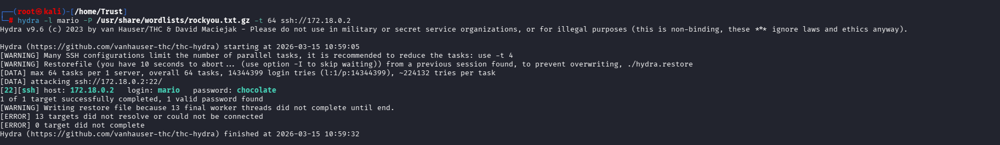

Se ha encontrado las credenciales:
  - Usuario: mario.
  - Contraseña chocolate.
  

## 🖥️ Acceso al servidor
Se accede al servidor utilizando el comando **ssh mario@172.18.0.2**

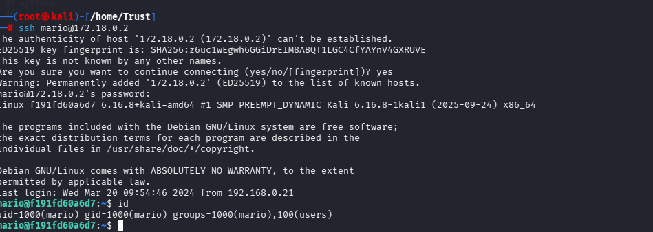

## 🔓 Escalada de privilegios

Una vez con acceso al usuario, se utiliza el comando **sudo -l** para ver los binarios con permisos sudo que tenga este usuario acceso.

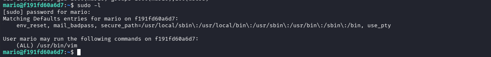

En este caso se muestra que se puede ejecutar el binario vim comando con sudo sin necesidad de contraseña (solo pedirá la de mario). Se consulta a [GTFobins](https://int0x33.github.io/gtfobins/vim/#sudo)

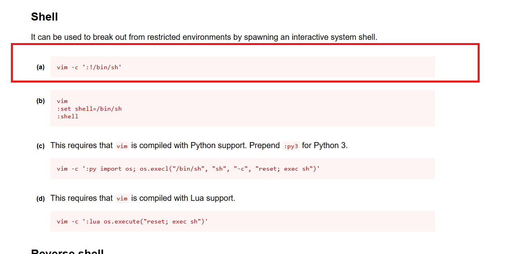

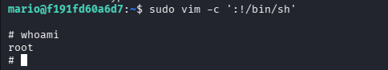

## 🧪 Post-Laboratorio
Una vez finalizada la máquina, en la terminal donde se tiene desplegada la máquina vulnerable se utilizará la combinación de teclas **Control + C** para eliminarla.

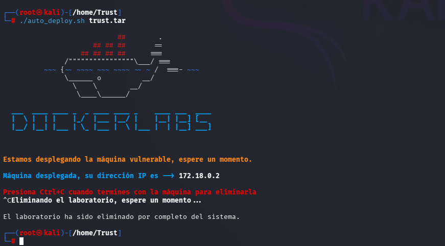

##   ¡Hola! Me llamo Saúl Ruiz 
### Estudiante en Ciberseguridad

Soy estudiante de Administración de Sistemas Informáticos en Red con pasión por la ciberseguridad y el mundo de la informática. Desde pequeño disfruto explorando tecnología y aprendiendo de manera autónoma. Además, combino mis estudios con la creación de contenido y recursos educativos sobre informática a través de mi proyecto personal <b>[@PlaSysX](https://linktr.ee/PlaSysx)</b>

Si quieres aprender informática, mejorar tus habilidades, descubrir trucos y soluciones prácticas, y formar parte de nuestra comunidad, puedes seguirnos en PlaSysX.

 

