
<h1>Vulnerame</h1>
  

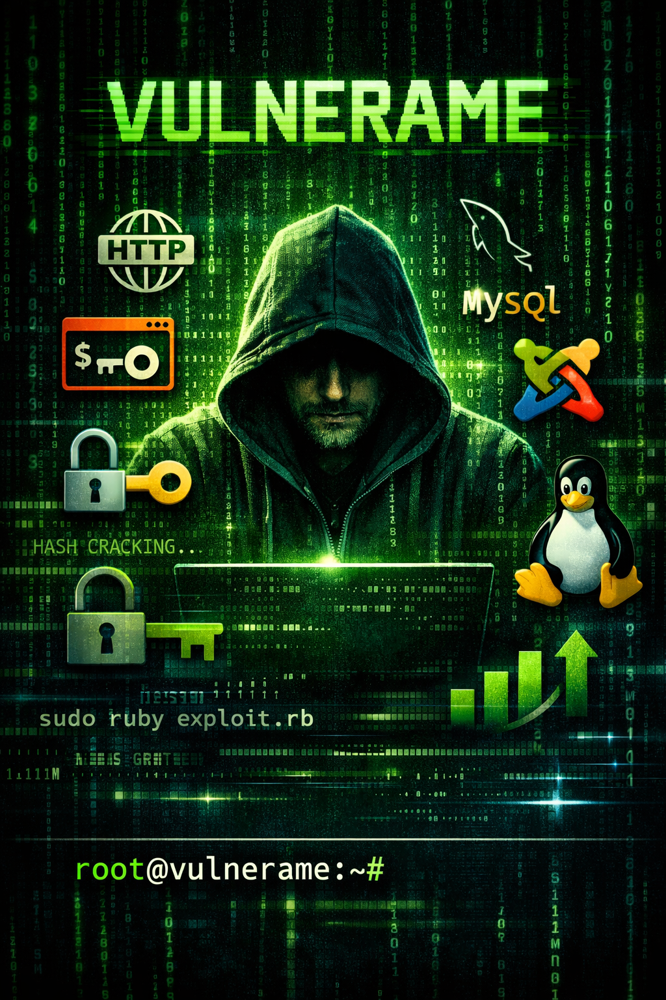

## ❓ ¿Qué es Vulnerame?

Vulnerame es una máquina vulnerable orientada a la explotación de servicios mal configurados en entornos Linux, en la que se combinan técnicas de reconocimiento, enumeración y escalada de privilegios. Durante el laboratorio se identifican servicios expuestos como HTTP, SSH y MySQL, lo que permite realizar una enumeración exhaustiva del sistema y descubrir una instalación de Joomla vulnerable. A partir de la enumeración de su versión se explota una vulnerabilidad de information disclosure que permite la obtención de credenciales, las cuales se utilizan para acceder a la base de datos MySQL y extraer hashes de usuarios. Posteriormente, mediante técnicas de cracking con herramientas como John the Ripper, se obtienen contraseñas en texto claro, permitiendo el acceso al panel de administración de Joomla. Desde ahí se aprovecha la edición de plantillas PHP para obtener una reverse shell y acceso inicial al sistema como www-data, seguido del tratamiento de la TTY para mejorar la estabilidad de la terminal. Finalmente, se realiza escalada de privilegios mediante la enumeración de usuarios, fuerza bruta contra SSH y abuso de permisos sudo sobre un script en Ruby, logrando así acceso como root y el control total del sistema.

> [!NOTE]
>
>Puede descargar la máquina a través del **[enlace mega](https://mega.nz/file/ZWU0wKDY#VWg3Z95iFP-e05IBtisDdI42IybgVwysLd69T8lqB5M)**

## 🔝 Despliegue Vulnerame

Al descargar la máquina, es necesario descompromirlo para poder encontrar los archivos necesarios para poder desplegarla, para ello, utilizaremos el comando.

**unzip vulnerame.zip.**

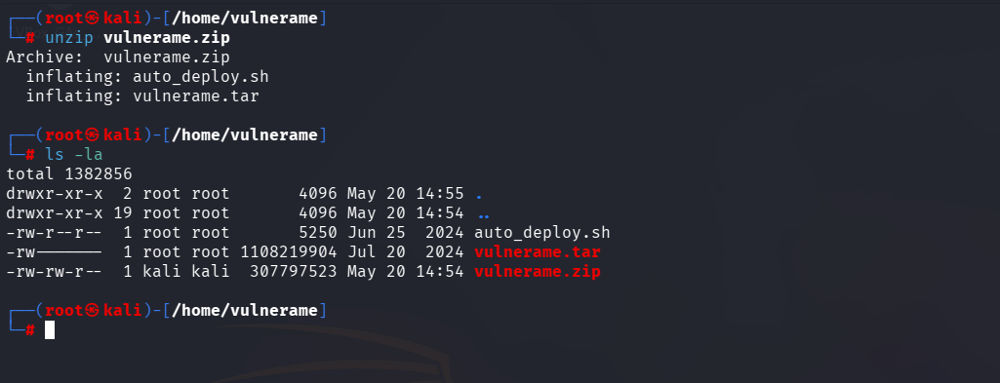

Obtendremos dos ficheros:
- **Auto_deploy.sh:** Script Bash para desplegar nuestra máquina localmente.
- **vulnerame.tar:** Máquina vulnerable contenizada.

Para desplegar el servicio será necesario carle permisos de ejecución a auto_deploy.sh, ya que por defecto tiene permisos 644. Para ello, usaremos el comando:

 **chmod +x auto_deploy.sh**

 Una vez ejecutado, se utilizará el comando **./auto_deploy.sh vulnerame.tar** para lanzar la máquina

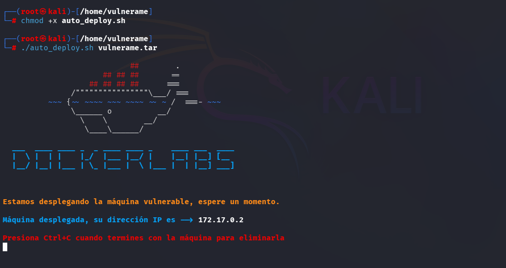

## 🔎 Fase de Descubrimiento 
Ahora, se abrirá una nueva terminal para empezar a realizar el descubrimiento del sistema. Cómo sabemos la dirección IP de la máquina vulnerable **(172.17.0.2)**, comenzaremos realizando un escaneo de red nmap. 
En esta ocación, se usará el comando **nmap -sC -sV -T5 172.17.0.2**

| Argumento | Significado |
|---|---|
| -sC | Ejecuta los scripts para comprobaciones comunes |
| -sV | Detección de versiones de servicios |
| -T5 | Velocidad máxima |
| 172.17.0.2 | Dirección IP del objetivo a escanear |

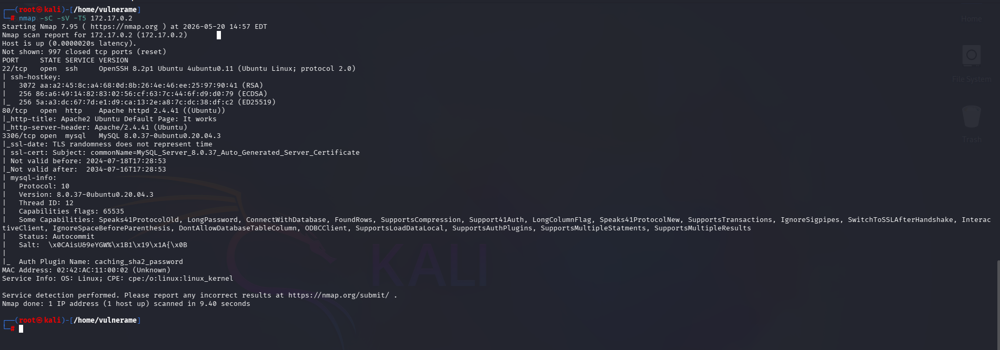

> [!NOTE]
>
>Se ha realizado un escaneo agresivo debido a que se está realizando en un entorno controlado y no es importante el ser detectado. Si se busca hacer el mínimo ruido posible será necesario utilizar el argumento **-sS** se usa para no ser detectado fácilmente, porque no completa la conexión TCP. Además, **no se usará -T5.**

En este caso, se ha encontrado un servicio activo:

- **SSH (puerto 22):** Servicio de conexión remota.
- **HTTP (puerto 80):** Servidor web cuyo titulo es Apache2 de Ubuntu.
- **MySQQL (puerto 3306):** Servicio de base de datos ubuntu.

A continuación, se procede a acceder al servicio http a través del navegador confirmando la visualización del panel de instalación de apache2 en ubuntu

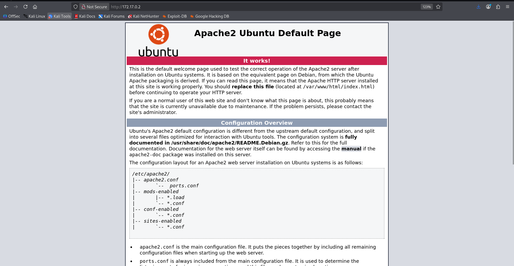

Cómo no se encuentra información relevante, se utiliza Gobuster para poder realizar una enumeración de directorios a través de fuerza bruta. Para ello, se utiliza el comando **gobuster dir -u http://172.17.0.2 -w /usr/share/seclists/Discovery/Web-Content/Dirbuster-2007_directory-list-2.3-big.txt**

| Argumento | Significado |
|---|---|
| dir | Modo de enumeración de directorios y archivos web |
| -u http://172.17.0.2 | URL del objetivo a escanear |
| -w /usr/share/seclists/Discovery/Web-Content/Dirbuster-2007_directory-list-2.3-big.txt | Diccionario de palabras utilizado para descubrir directorios y archivos |
| http://172.17.0.2 | Dirección IP objetivo |

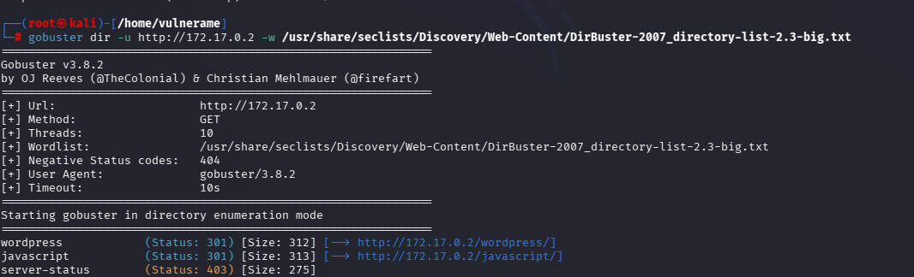

Se encuentra:
- Wordpress.
- Javascript

Si se navega al directorio javascript, el servidor responde con un error 403 Forbidden

En cambio, el directorio WordPress muestra una instalación de Joomla

Durante las pruebas de enumeración se encuentra un archivo llamado robots.txt
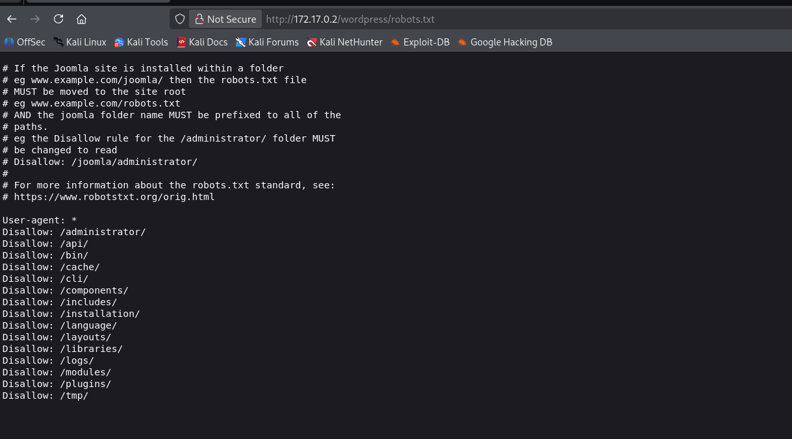

En la ruta /administrator se encuentra el panel de inicio de sesión de Joomla.

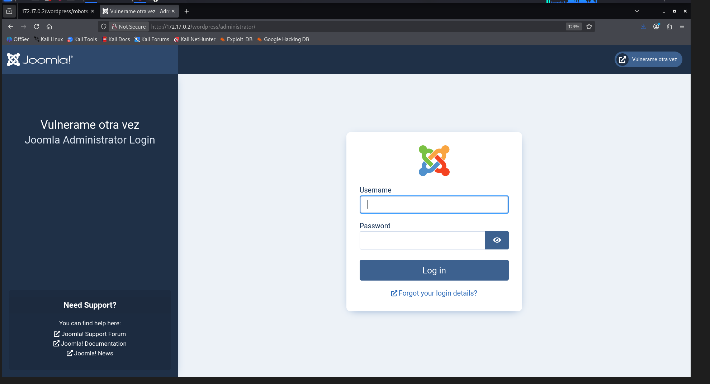

Joomla dispone de un fichero llamado joomla.xml que permite enumerar información sobre la versión utilizada.
Accediendo a http://172.17.0.2/wordpress/administrator/manifests/files/joomla.xml se identifica la versión **4.0.3**.

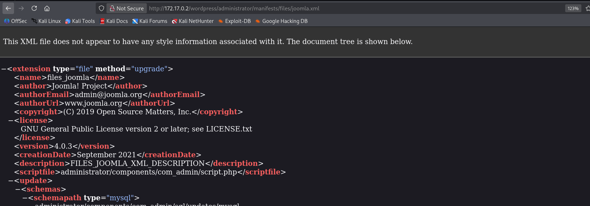

Buscando información sobre posibles vulnerabilidades para esta versión de Joomla, se encuentra la vulnerabilidad [CVE-2023-23752](https://nvd.nist.gov/vuln/detail/CVE-2023-23752)

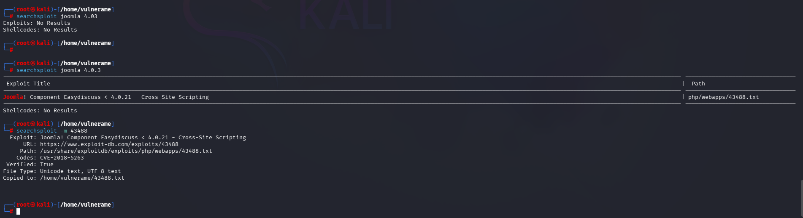

Se procede a ejecutar el código python utilizando el comando **python poc.py -u http//172.17.0.2/wordpress**.
El exploit devuelve las credenciales de dos usuarios:

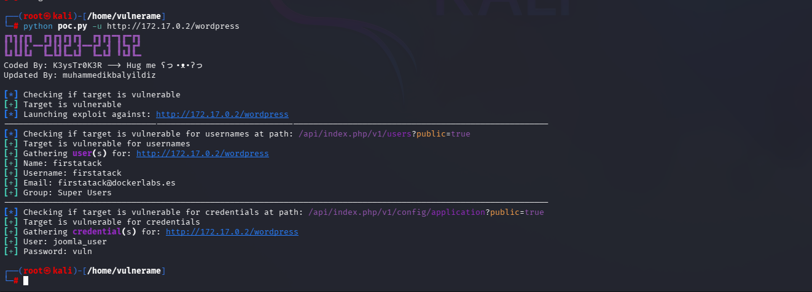

1. firstatack: firstatack
2. joomla_user: vuln

Al intentar iniciar sesión en la base de datos con el usuario joomla_user, se produce un error relacionado con el certificado.

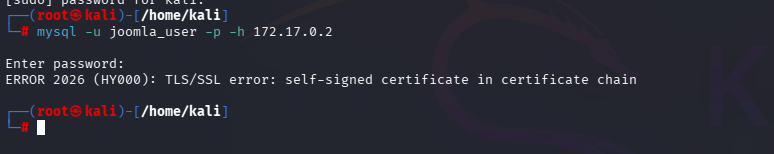

Para solventarlo, se utiliza el atributo **--skip-ssl**:

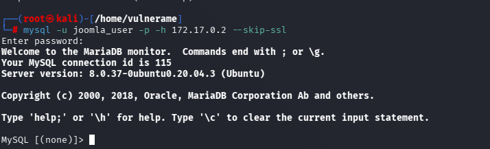

Una vez dentro de la base de datos, resulta interesante enumerar las tablas disponibles y posteriormente listar los usuarios registrados. En Joomla, los usuarios se almacenan en la tabla ffsnq_users, se listan mediante el comando **SELECT * FRP, ffsqn_users;**

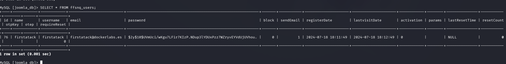

Posteriormente, se utiliza la herramienta hashID para identificar el formato del hash encontrado ($2y$10$UVmUci/wKgu7LFir7KIzP.NDup3lYDUxPzz7WZryvEYVdUjUVhou.).

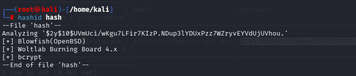

En este caso puede ser Blowfish (suele ser porque el prefijo es $2), Woltlabh, bcrypt

Se utiliza la herramienta john para poder crackear la contraseña usando el comando **john -w=/usr/share/wordlists/rockyou.txt --format=bcrypt hash_firstatatack.**

| Argumento | Significado |
|---|---|
| john | Herramienta utilizada para el crackeo de contraseñas y hashes |
| -w=/usr/share/wordlists/rockyou.txt | Diccionario de palabras utilizado para intentar descifrar el hash |
| --format=bcrypt | Especifica el formato del hash a crackear, en este caso bcrypt |
| hash_firstatatack | Archivo que contiene el hash del usuario objetivo |

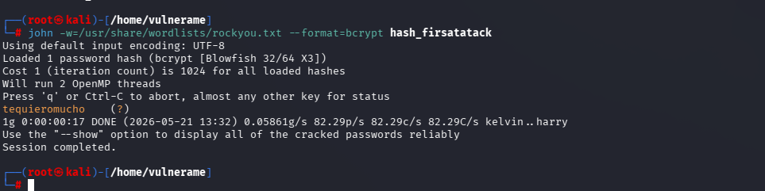

La contraseña del usuario firstattack es **tequieromucho**

Con las credenciales obtenidas, se procede a iniciar sesión en Joomla con el usuario firstattack

## 🖥️ Acceso al servidor

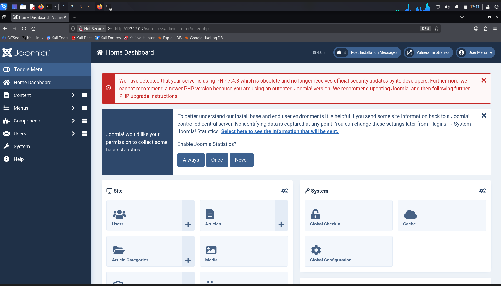

Debido a que Joomla utiliza PHP, se busca la ubicación donde se almacenan los archivos de las plantillas (se encuentra en System > Site Templates) con el objetivo de establecer una reverse shell.

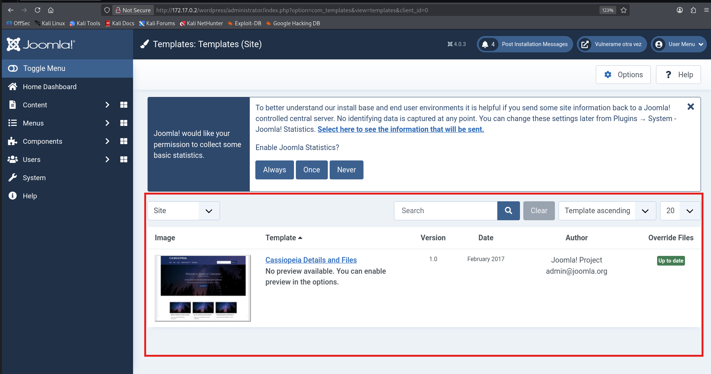

Al acceder a esta sección, se entra al editor de plantillas.
A continuación, se copia el código de una reverse shell en PHP obtenido desde [revshells.com](revshells.com)

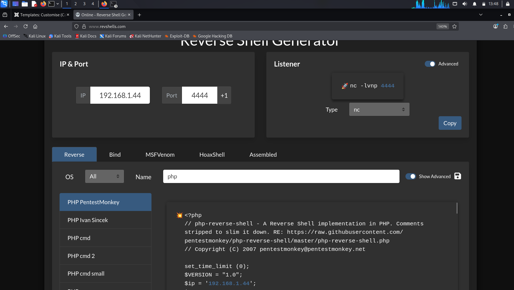

Ese código se pegará en el fichero index.php.

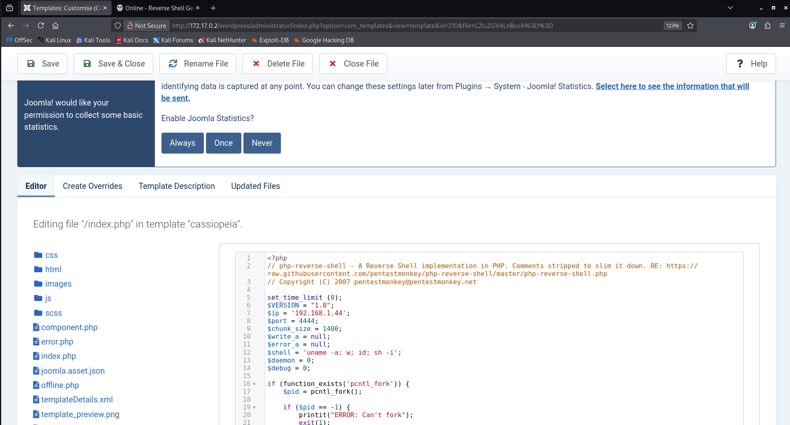

Posteriormente, se inicia un listener con Netcat mediante el comando **nc -lvnp 4444**

Al volver a acceder a http://172.17.0.2/wordpress la página permanecerá cargando, ya que el servidor estará intentando establecer la conexión inversa hacia el listener en ejecución.

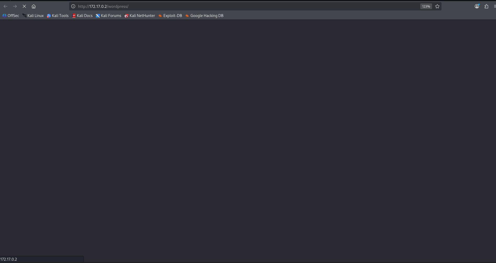

Así tendremos acceso al sistema.

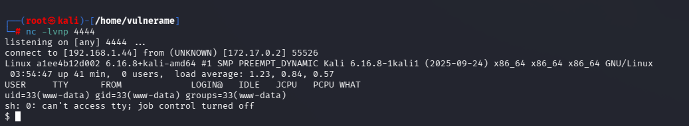

## 🔓 Tratamiento TTY

Al entrar a una reverse shell con esta metodología, la terminal tendrá escasas funcionalidades. Para ello, se realiza una serie de ejecuciones para volver a tener una terminal bash.

1. Se ejecuta **script /dev/null -c bash** para iniciar una nueva sesión de shell dentro de un pseudo-terminal
2. Se suspende la terminal utilizando **Control + Z**
3. Se ejecuta **stty raw -echo; fg** para mejorar el comportamiento de la shell, evitando problemas de duplicación de carácteres en el input.

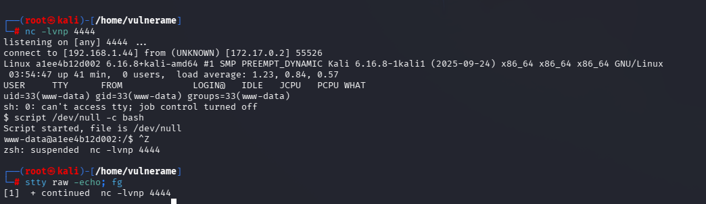

4. Una vez recuperada la terminal anterior se resetea la terminal XTERM

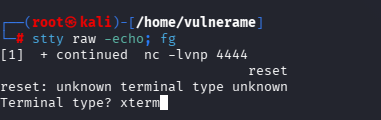

5. **export TERM=xterm** para habilitar las funciones de la terminal
6. **export SHELL=bash** para establecer Bash como shell por defecto

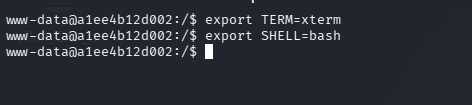

## 🔓 Escalada de privilegios

Se enumera los usuarios listando el archivo **/etc/passwd**

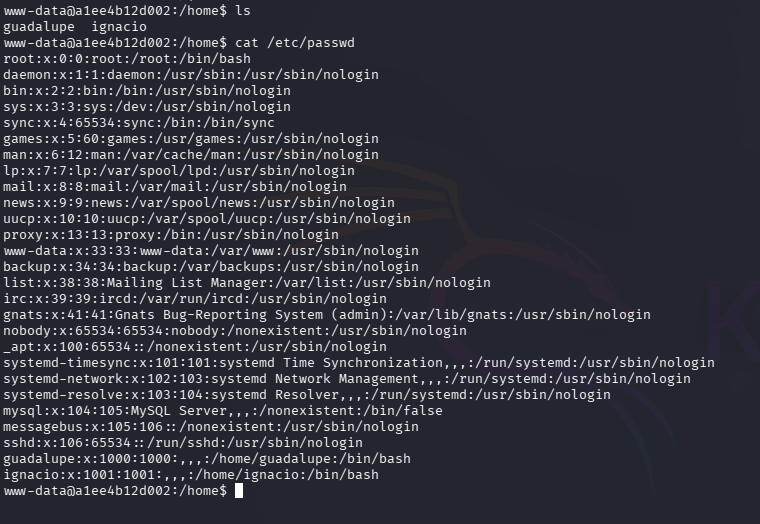

Se enumeran usuarios:
1. root
2. ignacio
3. guadalupe

Como no se encuentra ningún vector de ataque desde el usuario www-data, se procede a utilizar el servicio ssh para realizar fuerza bruta. Para ello, se crea en un fichero con los usuarios enumerados para utilizarlo como un diccionario:

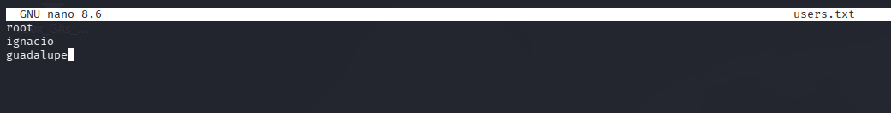

Una vez preparado, se ejecuta a realizar un ataque de fuerza bruta en el servicio SSH a través de Hydra

Se obtiene las credenciales del usuario Ignacio

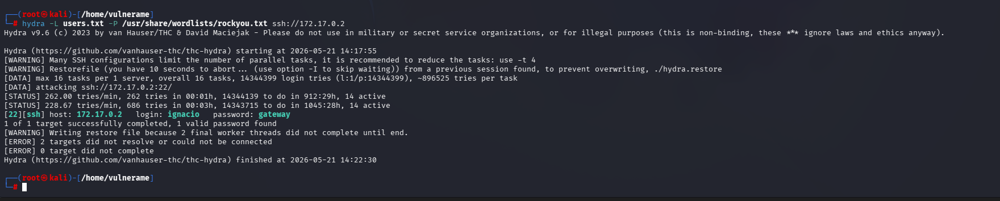

A continuación, se accede por SSH

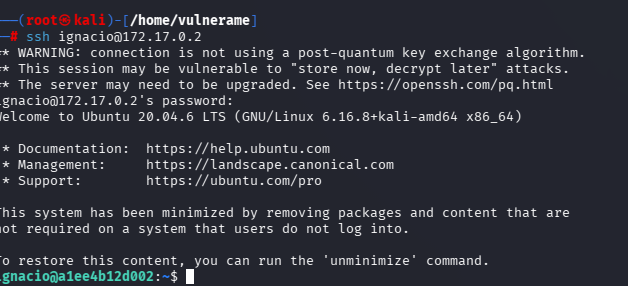

Se procede a elevar priviligeos con este usuario, al ejecutar **sudo -l** para mostrar los binarios ejecutables con privilegios sudo

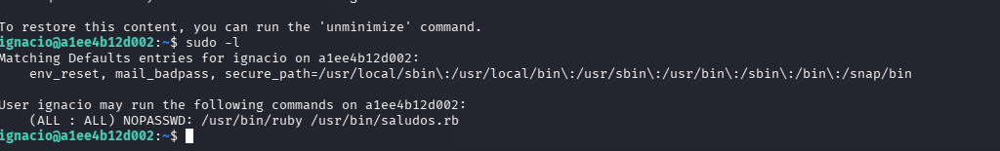

Se encuentra se puede ejecutar el archivo /usr/bin/saludo.rb a través de ruby. Si se ejecuta usando **sudo /usr/bin/ruby** encontramos el siguiente output.

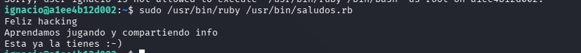

Dado que se trata de un script en Ruby, basta con modificar su contenido para incluir la ejecución de una shell mediante **exec "/bin/bash"**

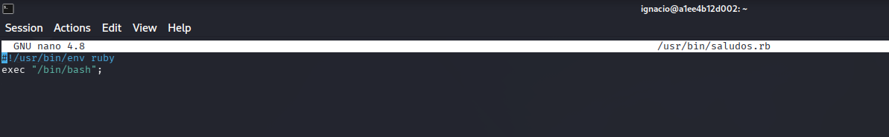

Al volver a ejecutar el binario con sudo, se obtiene una shell con privilegios de root.
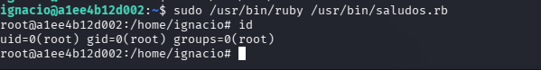

## 🧪 Post-Laboratorio
Una vez finalizada la máquina, en la terminal donde se tiene desplegada la máquina vulnerable se utilizará la combinación de teclas **Control + C** para eliminarla.

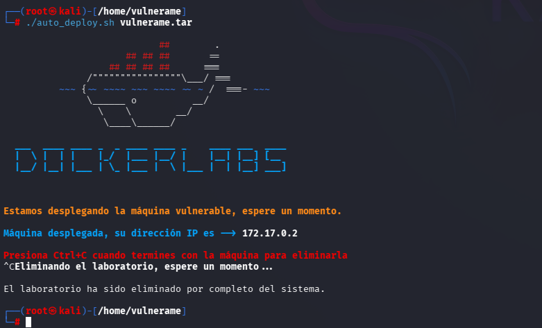

##   ¡Hola! Me llamo Saúl Ruiz 
### Analista de Ciberseguridad | Seguridad Ofensiva y Pentesting

Soy Analista de Ciberseguridad y Técnico Superior en Administración de Sistemas Informáticos en Red. Actualmente desarrollo mi carrera en entornos SOC, participando en tareas de análisis, monitorización e investigación de eventos de seguridad.

Mi interés principal se orienta hacia la seguridad ofensiva, el pentesting y el análisis técnico, áreas en las que sigo formándome de manera constante para crecer profesionalmente dentro del sector.

A través de mi proyecto personal <b>[@PlaSysX](https://linktr.ee/PlaSysx)</b>, comparto contenido relacionado con informática, ciberseguridad y aprendizaje práctico, con el objetivo de aportar valor a quienes también quieren seguir creciendo en el mundo tecnológico.

 

