
<h1>WalkingCMS</h1>
  

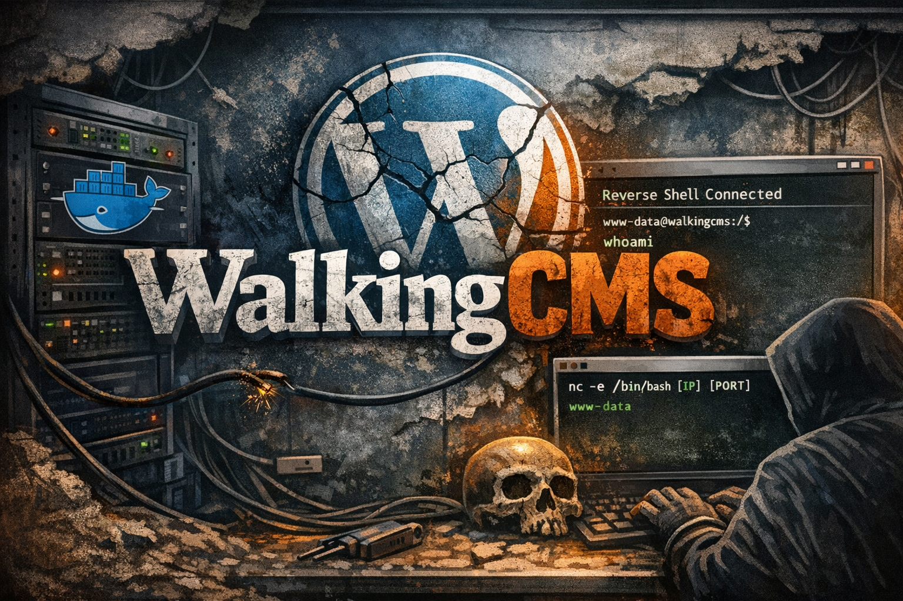

## ❓ ¿Qué es WalkingCMS?

WalkingCMS es una máquina vulnerable orientada a la explotación de entornos WordPress, donde se practican técnicas de enumeración web, fuerza bruta sobre credenciales CMS y obtención de acceso remoto mediante modificación de archivos del tema. Permite trabajar reconocimiento de servicios con Nmap, descubrimiento de rutas mediante Gobuster, explotación de credenciales con WPScan y escalada de privilegios a través de binarios SUID inseguros apoyándose en GTFOBins.

> [!NOTE]
>
>Puede descargar la máquina a través del **[enlace mega](https://mega.nz/file/hSF1GYpA#s7jKfPy1ZXVXpxFhyezWyo1zCUmDrp7eYjvzuNNL398)**

## 🔝 Despliegue WalkingCMS

Al descargar la máquina, es necesario descompromirlo para poder encontrar los archivos necesarios para poder desplegarla, para ello, utilizaremos el comando.

**unzip walkingcms.zip.**

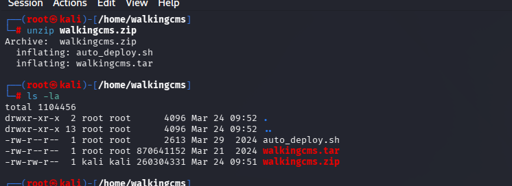

Obtendremos dos ficheros:
- **Auto_deploy.sh:** Script Bash para desplegar nuestra máquina localmente.
- **walkingcms.tar:** Máquina vulnerable contenizada.

Para desplegar el servicio será necesario carle permisos de ejecución a auto_deploy.sh, ya que por defecto tiene permisos 644. Para ello, usaremos el comando:

 **chmod +x auto_deploy.sh**

 Una vez ejecutado, se utilizará el comando **./auto_deploy.sh borazuwarahctf.tar** para lanzar la máquina

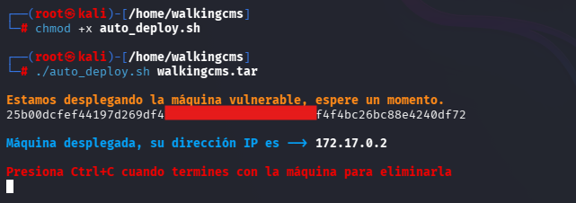

## 🔎 Fase de Descubrimiento 
Ahora, se abrirá una nueva terminal para empezar a realizar el descubrimiento del sistema. Cómo sabemos la dirección IP de la máquina vulnerable **(172.17.0.2)**, comenzaremos realizando un escaneo de red nmap. 
En esta ocación, se usará el comando **nmap -sC -sV -T5 172.17.0.2**

En este caso, he añadido -oN escaneo.txt para tener el escaneo guardado en un fichero sin necesidad repetirlo en un futuro.

| Argumento | Significado |
|---|---|
| -sC | Ejecuta los scripts para comprobaciones comunes |
| -sV | Detección de versiones de servicios |
| -T5 | Velocidad máxima |
| 172.18.0.2 | Dirección IP del objetivo a escanear |

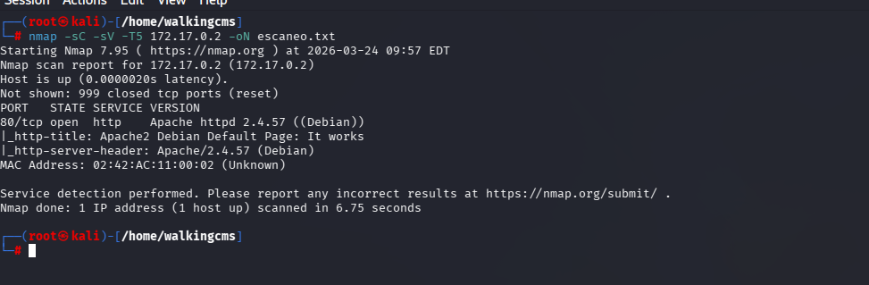

> [!NOTE]
>
>Se ha realizado un escaneo agresivo debido a que se está realizando en un entorno controlado y no es importante el ser detectado. Si se busca hacer el mínimo ruido posible será necesario utilizar el argumento **-sS** se usa para no ser detectado fácilmente, porque no completa la conexión TCP. Además, **no se usará -T5.**

En este caso, se ha encontrado un servicio activo:
- **HTTP (Puerto 80):** Servidor web.

A continuación, se dispone a visitar la página web, se encuentra la página inicial de apache en Debian:

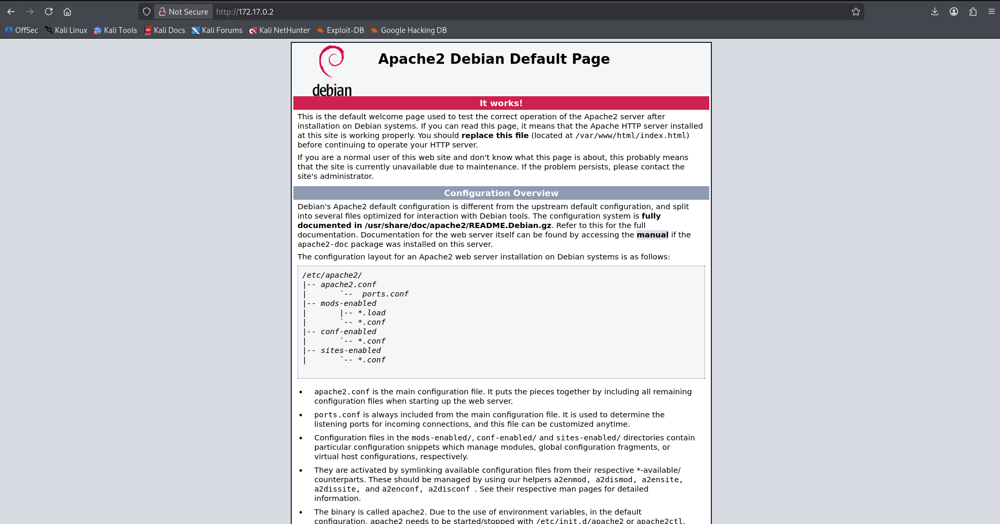

Nos disponemos a enumerar directorios al servidor apache con gobuster, con el comando gobuster **dir -u http://172.17.0.2 -w /usr/share/wordlists/dirbuster/directory-list-lowercase-2.3-big.txt**

| Argumento | Significado |
|---|---|
| gobuster | Herramienta de enumeración de directorios y archivos web. |
| dir | Modo de búsqueda de directorios en servidores web. |
| -u http://172.18.0.2 | URL objetivo sobre la que se realizará la enumeración. |
| -w /usr/share/wordlists/dirbuster/directory-list-lowercase-2.3-medium.txt | Wordlist utilizada para probar rutas y directorios. |

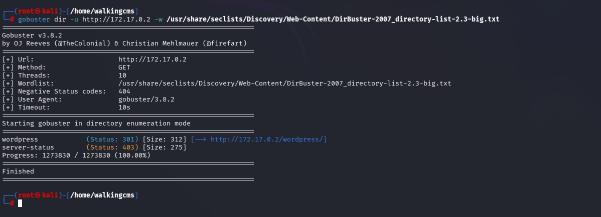

Ahora, se visitará el directorio wordpress

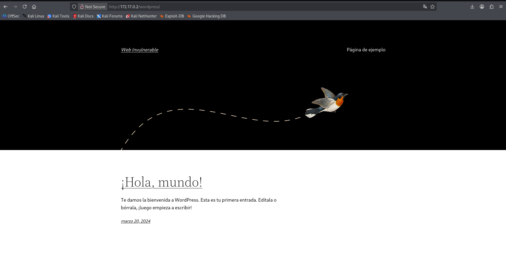

Tras revisar el código fuente, no se encuentra información relevante, únicamente el nombre mario. Se decide utilizar wpscan para poder obtener acceso al wordpress a través de fuerza bruta. **wpscan --url http://172.17.0.2/wordpress -passwords /usr/share/seclists/Passwords/Common-Credentials/xato-net-10-million-passwords-100000.txt**

| Argumento | Significado |
|---|---|
| wpscan | Herramienta especializada en auditoría de seguridad para instalaciones de WordPress. |
| --url http://172.17.0.2/wordpress | Indica la URL objetivo que se va a analizar. En este caso, un sitio WordPress en una IP local. |
| -passwords /usr/share/seclists/Passwords/Common-Credentials/xato-net-10-million-passwords-100000.txt | Especifica el diccionario de contraseñas que se usará para probar accesos por fuerza bruta. |

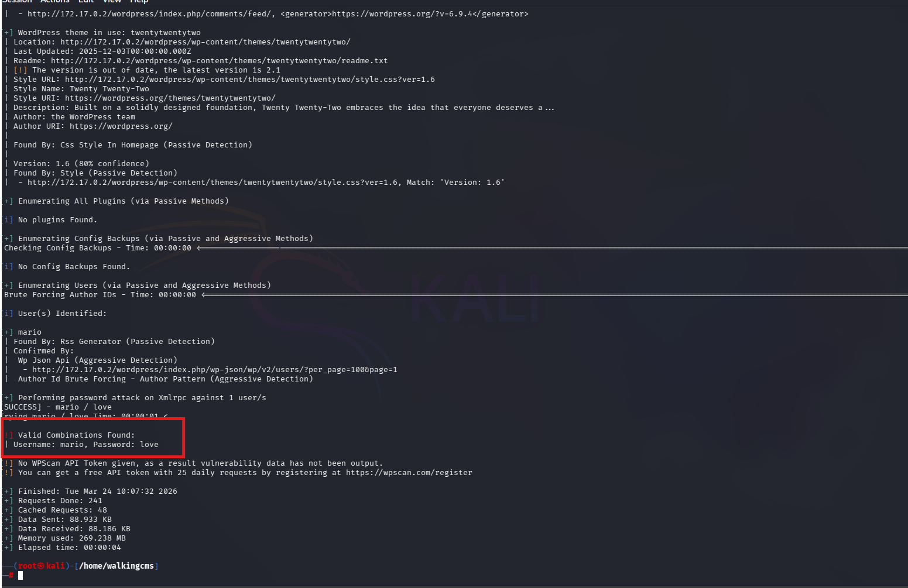

Se ha encontrado las credenciales:
  - Usuario: mario.
  - Contraseña love
  

## 🖥️ Acceso al servidor
Se accede al través del login panel de /wp-admin

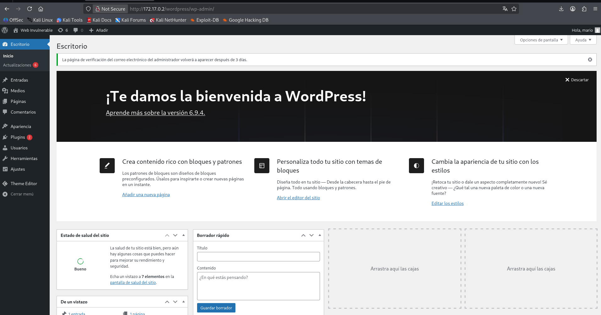

En la imagen anterior se puede observar que el plugin **Theme Editor** está instalado en el sitio WordPress. A través de esta funcionalidad se llevará a cabo una **reverse shell**, editando el archivo `hidden-404.php` para insertar código malicioso.

El objetivo es aprovechar que este archivo se ejecuta cuando se produce un error **404 (Not Found)**, de modo que cada vez que se acceda a una ruta inexistente, el código insertado permita establecer una conexión remota con la máquina atacante y ejecutar comandos en el sistema objetivo.

Para realizar la modificación, se selecciona un tema que no esté actualmente en uso, en este caso **Twenty Twenty-Five**, con el fin de evitar afectar al tema activo del sitio.

Antes de entrar al editor de plugin, se usará [revshells](https://www.revshells.com/) para generar una reverse Shell

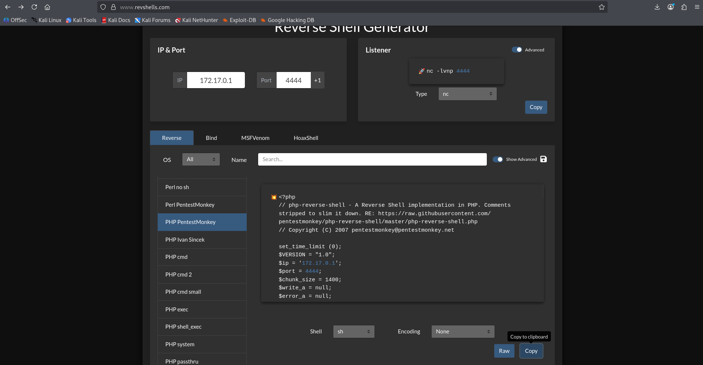

Dentro de los archivos del tema, se localiza un fichero PHP destinado a la gestión de errores, como `hidden-404.php` (en este caso) o `404.php`. En este archivo se inserta dentro del bloque PHP generado anteriormente

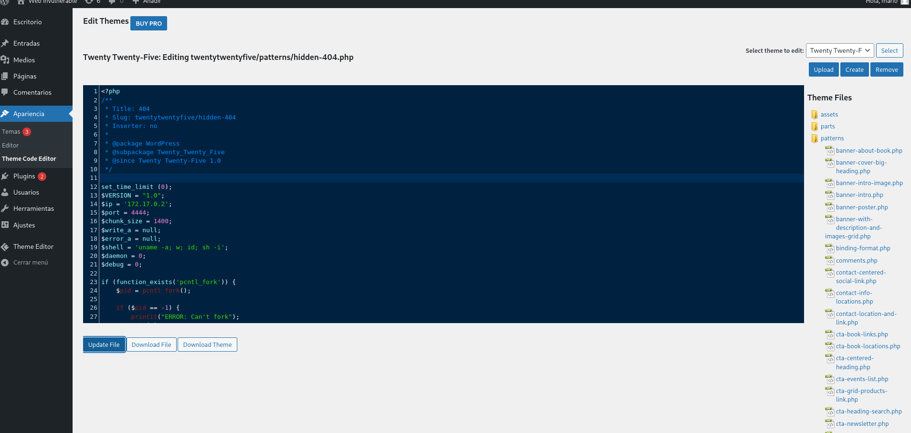

Además, con netcat se abrirá un listener a través del comando **nc -lvp 4444**

Por último,  entrar al navegador a la dirección en este **caso /wordpress/wp-content/twentytwentyfive/patterns/hidden-404.php** se quedará todo el tiempo en bucle

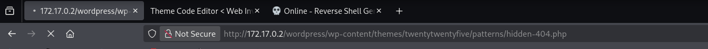

Se tendrá acceso al sistema.

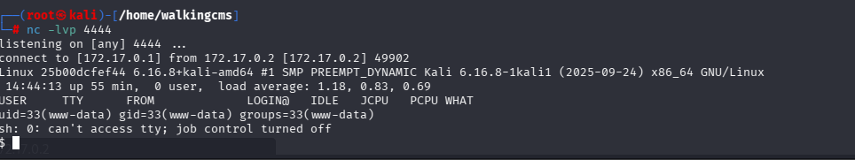

## 💻 Tratamiento de la shell a TTY

A continuación, se mostrarán los pasos para poder utilizar una shell bash.

1. Suspender la shell actual con **control + Z**

2. Configurar la terminal local y recuperar la shell

    **stty raw -echo; fg**

3. Definir variables de entorno en la shell remota:
 
    **export TERM=xterm**

    **export SHELL=/bin/bash**

4. Forzar una shell interactiva completa con**script /dev/null -c bash**

Con este proceso se obtiene una TTY estable que permite usar comandos de la shell

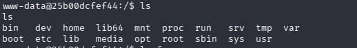

## 🔓 Escalada de privilegios

A continuación, se realiza **find** para encontrar ficheros con permisos SUID 4000. Ya que no se tiene sudo instalado

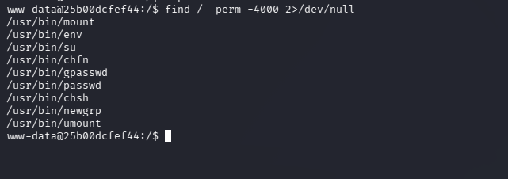

En este caso se muestra que se puede ejecutar el binario vim comando con sudo sin necesidad de contraseña (solo pedirá la de mario). Se consulta a **[GTFobins](https://int0x33.github.io/gtfobins/env/#suid)**

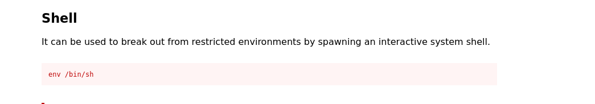

Se ejecuta el comando obtenido por GTFobins mediante SUID para obtener acceso al usuario root.

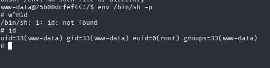

## 🧪 Post-Laboratorio
Una vez finalizada la máquina, en la terminal donde se tiene desplegada la máquina vulnerable se utilizará la combinación de teclas **Control + C** para eliminarla.

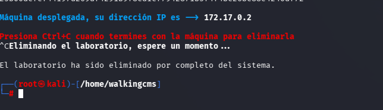

##   ¡Hola! Me llamo Saúl Ruiz 
### Estudiante en Ciberseguridad

Soy estudiante de Administración de Sistemas Informáticos en Red con pasión por la ciberseguridad y el mundo de la informática. Desde pequeño disfruto explorando tecnología y aprendiendo de manera autónoma. Además, combino mis estudios con la creación de contenido y recursos educativos sobre informática a través de mi proyecto personal <b>[@PlaSysX](https://linktr.ee/PlaSysx)</b>

Si quieres aprender informática, mejorar tus habilidades, descubrir trucos y soluciones prácticas, y formar parte de nuestra comunidad, puedes seguirnos en PlaSysX.

 

