
<h1>Cap</h1>
  

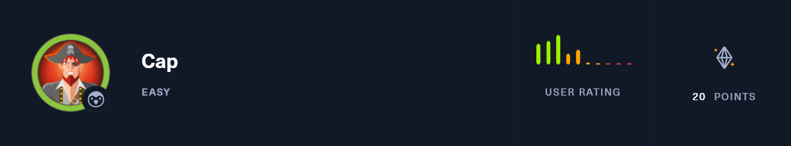

## ❓ ¿Qué es Cap?

Cap es una máquina Linux enfocada en enumeración de servicios, explotación de un fallo IDOR y análisis de tráfico de red para obtener credenciales. Permite practicar acceso inicial mediante servicios remotos y escalada de privilegios abusando de capacidades especiales en binarios del sistema.

## 🔝 Despliegue Cap

Tras descargar el archivo ovpn que ofrece la plataforma, es necesario en terminal ejecutar el comando **sudo openvpn archivo vpn**

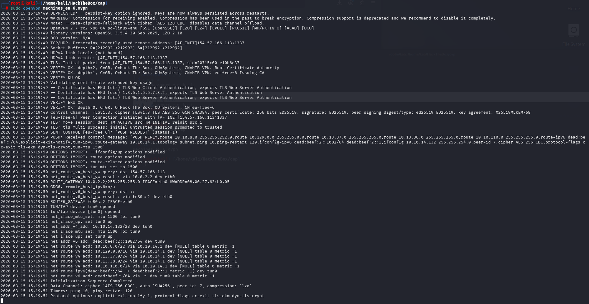

Además, es necesario comprobar conectividad entre nuestra máquina kali y el objetivo

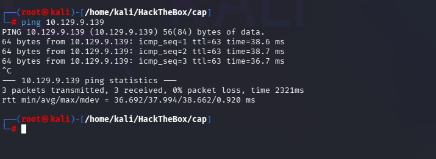

## 🔎 Fase de Descubrimiento 
Ahora, se abrirá una nueva terminal para empezar a realizar el descubrimiento del sistema. Cómo sabemos la dirección IP de la máquina vulnerable **(10.129.9.139)**, comenzaremos realizando un escaneo de red nmap. 
En esta ocación, se usará el comando **nmap -sC -sV --min-rate 5000 10.129.9.139 -oN escaneo.txt**

| Argumento | Significado |
|---|---|
| -sC | Ejecuta los scripts para comprobaciones comunes |
| -sV | Detección de versiones de servicios |
| --min-rate 5000 | Envía al  5000 paquetes por segundo (aumenta velocidad; puede causar pérdida o detección) |
| 10.129.9.139| Dirección IP del objetivo a escanear |
| -oN escaneo.txt | Guarda la salida en el fichero escaneo.txt |

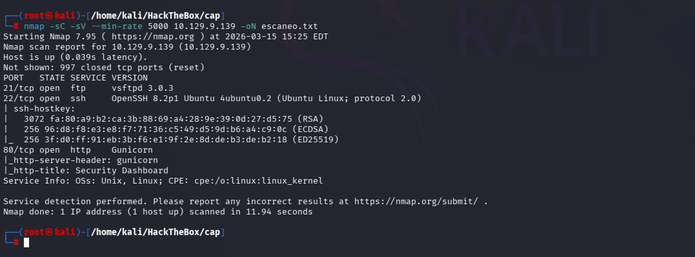

> [!NOTE]
>
>Se ha realizado un escaneo agresivo debido a que se está realizando en un entorno controlado y no es importante el ser detectado. Si se busca hacer el mínimo ruido posible será necesario utilizar el argumento **-sS** se usa para no ser detectado fácilmente, porque no completa la conexión TCP. Además, **no se usará --min-rate.** 

En este caso, se ha encontrado los siguientes servicios TCP:
- **FTP (Puerto:21):** Intercambio de ficheros
- **SSH (Puerto: 22):** Conexión remota.
- **HTTP (Puerto 80):** Servidor web.

Con esta información permite responder a la pregunta **¿Cúantos puertos TCP hay abiertos?**
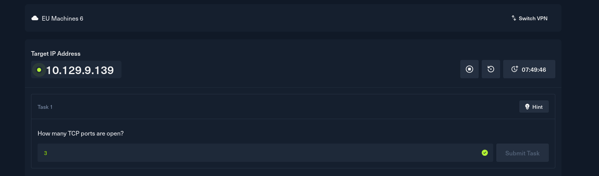

A continuación, se dispone a visitar la página web, se encuentra lo siguiente:
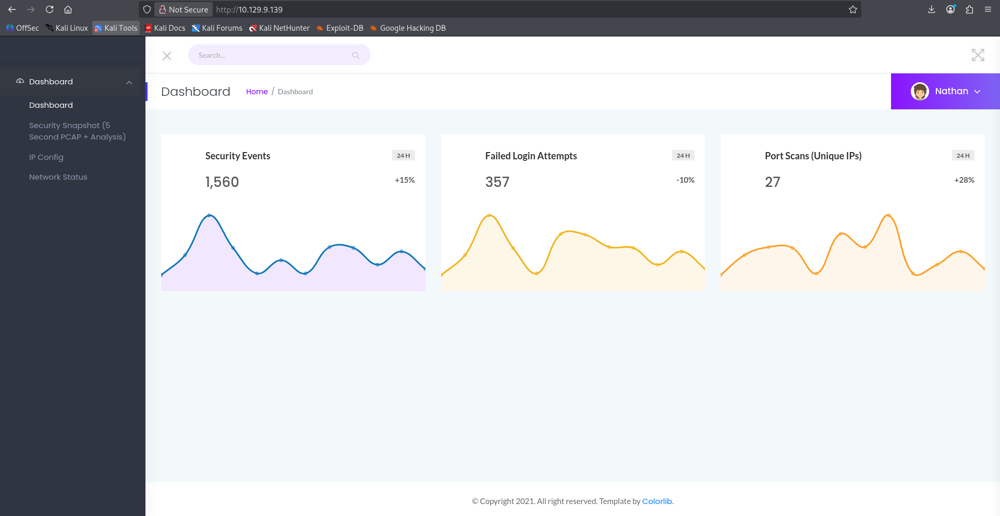

Vemos que estamos logueados con la cuenta de nathan.

A continuación, al entrrara a Security Snapshot, dirige a la carpeta `/data/id` dónde el id incrementa cada veaz que refresque la página.

Con esta información se puede responder a la segunda pregunta: **Después de ejecutar un "Security Snapshot", el navegador se redirige a una ruta del formato /[algo]/[id], donde [id] representa el número de identificación del escaneo. ¿Cuál es el [algo]?**

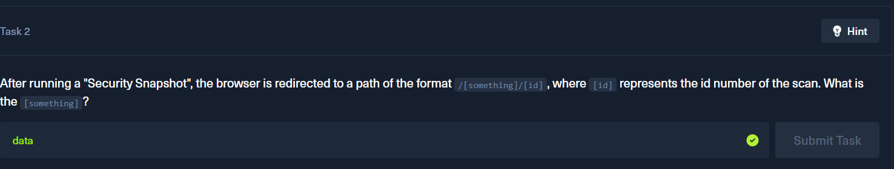

Además, podemos responder la tercera pregunta: **¿Puedes acceder a los escaneos de otros usuarios?**

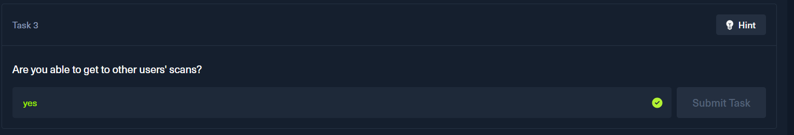

Se ha identificado una vulnerabilidad de tipo **IDOR (Insecure Direct Object Reference)** en la ruta **data/[id]**, ya que modificando manualmente el identificador es posible acceder a escaneos almacenados sin autorización.  

Los snapshots con ID **3** y **1** corresponden a datos creados por mi usuario, mientras que el ID **0** pertenece a otro usuario, lo que demuestra que **sí es posible acceder a los escaneos de otros usuarios** manipulando el ID.  

A continuación, se muestran los resultados:

Snapshots creados por mi usuario:  

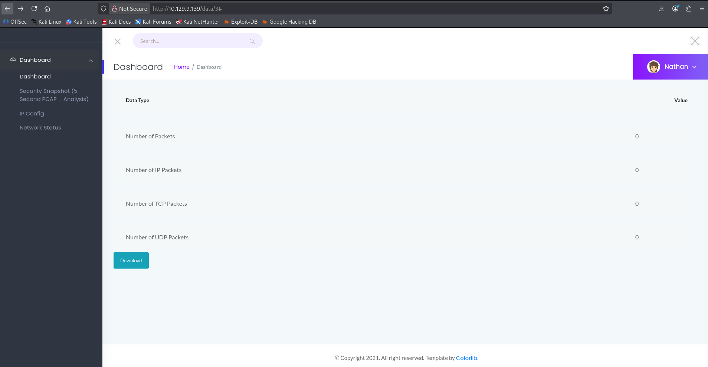  
  

Datos de otro usuario:  

Con esta información se puede responder a la cuarta pregunta:**¿Cuál es el ID del archivo PCAP que contiene datos sensibles?**

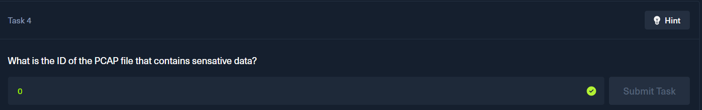

Tras obtener el ID 0 (del usuario desconocido), se procede a descargar el fichero .pcap, dónde se abrirá con wireshark para analizar dichos paquetes.

En él se encuentra peticiones FTP con las siguientes credenciales:

- Usuario: nathan
- Contraseña: Buck3tH4TF0RM3!

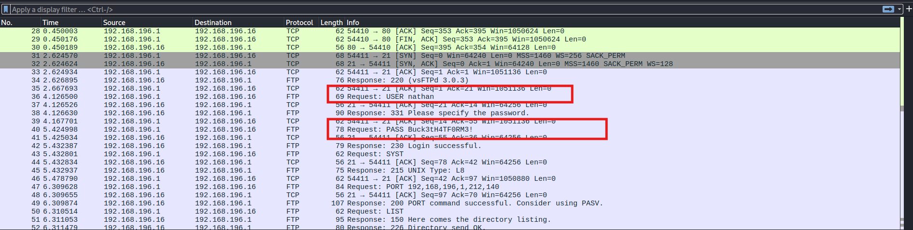

Gracias a esta información, se puede responder a la quinta:

**¿En qué protocolo de la capa de aplicación del archivo PCAP se pueden encontrar los datos sensibles?**

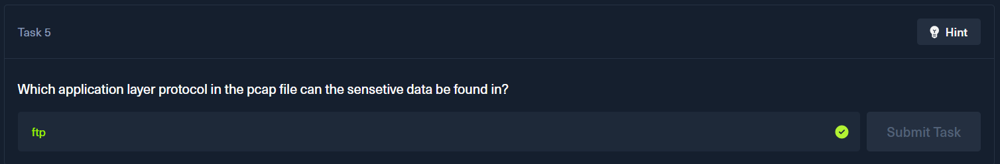

## 🖥️ Acceso al servidor
Cómo se tiene las credenciales del usuario nathan, se puede acceder al sistema mediante FTP. Dónde encontramos un archivo (**dir**) llamado **user.txt**, que será la flag.

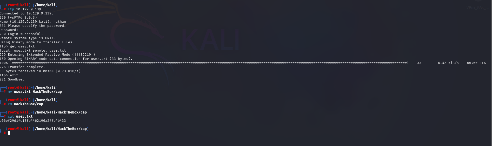

También se puede acceder al servicio SSH. Es recomentable intentar acceder a todos los servicios con las credenciales obtenidas preivamente.

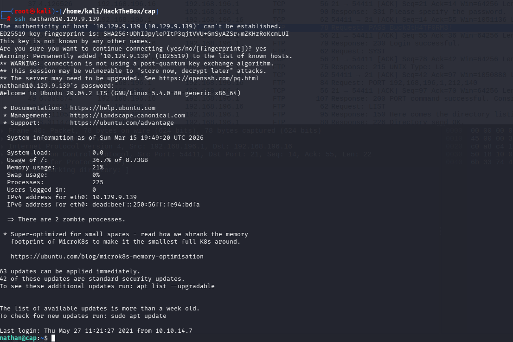

Con esta información se puede responder a la pregunta **Hemos conseguido averiguar la contraseña FTP de Nathan. ¿En qué otros servicios funciona esta contraseña?**.

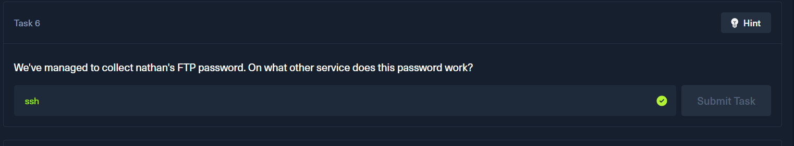

## 🔓 Escalada de privilegios

Como no tengo sudo (**sudo -l** no muestra nada), utilizo **getcap -r /**:

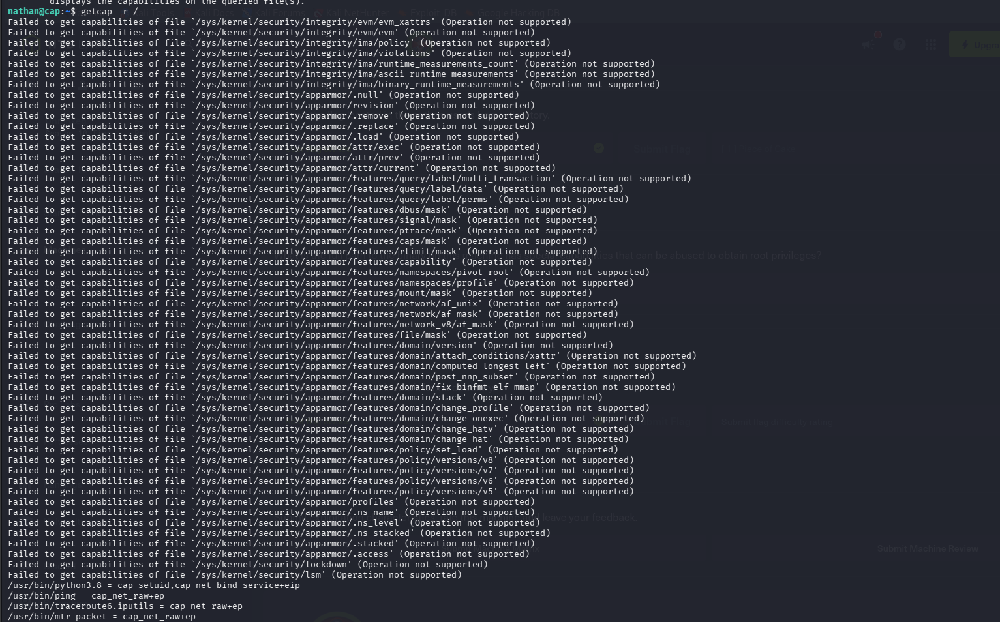

En la imagen anterior se muestra que **Python (/usr/bin/python3.8) tiene capacidades especiales** (**cap_setuid, cap_net_bind_service+eip**).  
Esto significa que podemos ejecutar Python con **permisos ampliados**, lo que podría permitirnos **escalar privilegios** incluso sin sudo.

Con esta información se puede responder la octava pregunta: **¿Cuál es la ruta completa al archivo binario de este equipo que tiene capacidades especiales que pueden ser objeto de abuso para obtener privilegios de root?**

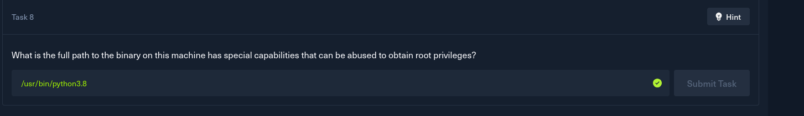

Para ganar acceso root, se ejecuta el binario python3.8 para abrir una terminal de Python, desde donde se importa el módulo os, se establece el identificador de usuario a 0 (root) mediante os.setuid(0) y posteriormente se abre una shell bash con privilegios elevados.

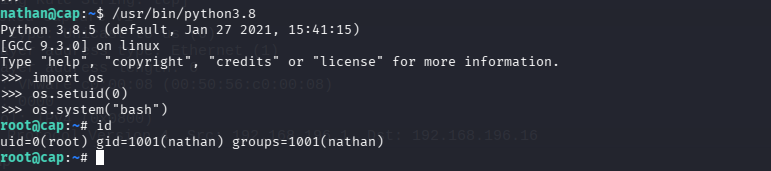

La flag está localizada en **/root/root.txt**

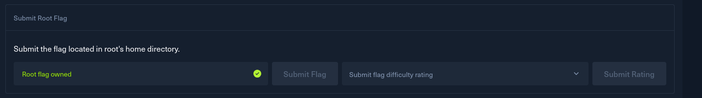

##   ¡Hola! Me llamo Saúl Ruiz 
### Estudiante en Ciberseguridad

Soy estudiante de Administración de Sistemas Informáticos en Red con pasión por la ciberseguridad y el mundo de la informática. Desde pequeño disfruto explorando tecnología y aprendiendo de manera autónoma. Además, combino mis estudios con la creación de contenido y recursos educativos sobre informática a través de mi proyecto personal <b>[@PlaSysX](https://linktr.ee/PlaSysx)</b>

Si quieres aprender informática, mejorar tus habilidades, descubrir trucos y soluciones prácticas, y formar parte de nuestra comunidad, puedes seguirnos en PlaSysX.

 

