
<h1>Orion</h1>
  

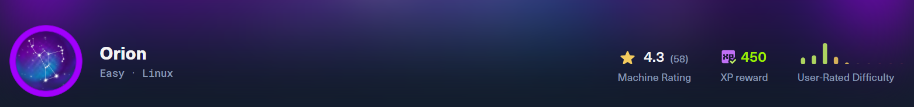

## ❓ ¿Qué es Orion?

Orion es una máquina Linux enfocada en enumeración web, explotación de una vulnerabilidad pre-auth RCE en Craft CMS y abuso de objetos PHP/Yii para obtener ejecución remota de código. Permite practicar el manejo de tokens CSRF con Burp Suite, acceso inicial mediante Metasploit, extracción de credenciales desde ficheros de configuración, cracking de hashes bcrypt y escalada de privilegios abusando de un servicio Telnet vulnerable en local.

## 🔝 Despliegue Orion

Tras descargar el archivo **.ovpn** que ofrece la plataforma, es necesario iniciar la conexión VPN desde la terminal ejecutando:

**sudo openvpn archivo.ovpn**

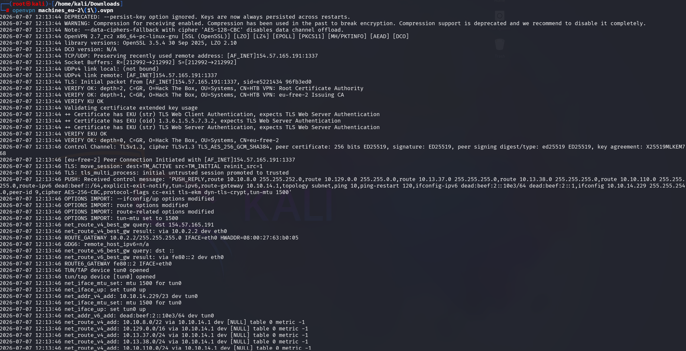

Una vez levantada la VPN, comprobamos que existe conectividad entre nuestra máquina Kali y la máquina objetivo.

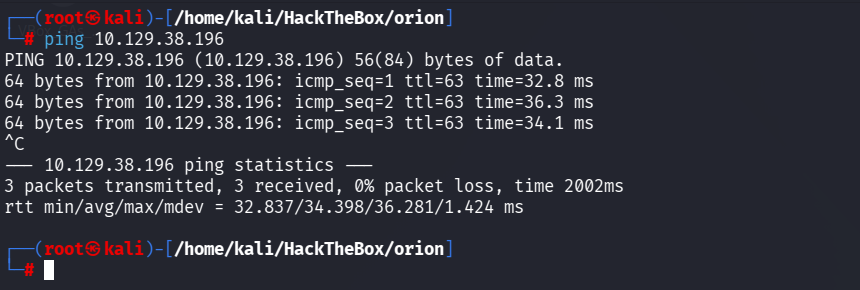

## 🔎 Fase de descubrimiento

Conociendo la dirección IP de la máquina vulnerable, **10.129.38.196**, comenzamos realizando un escaneo inicial con **nmap** para identificar los servicios expuestos.

El comando utilizado es el siguiente:

**nmap -sC -sV -T5 10.129.38.196**

| Argumento | Significado |
|---|---|
| **nmap** | Herramienta utilizada para realizar el escaneo de puertos y servicios |
| **-sC** | Ejecuta scripts por defecto para realizar comprobaciones comunes |
| **-sV** | Detecta las versiones de los servicios identificados |
| **-T5** | Establece una velocidad de escaneo muy alta |
| **10.129.38.196** | Dirección IP del objetivo a escanear |

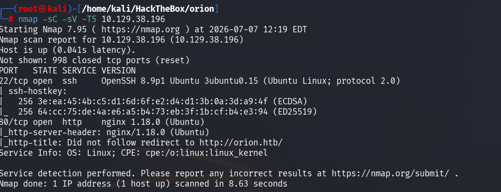

> [!NOTE]
>
> Se ha utilizado un escaneo agresivo porque estamos trabajando en un entorno controlado de Hack The Box, donde no nos preocupa generar ruido ni ser detectados.
>
> En un entorno real, sería recomendable utilizar una aproximación más sigilosa, por ejemplo evitando **-T5** y usando técnicas como **-sS**, que realiza un escaneo SYN sin completar totalmente la conexión TCP.

En este caso, se identifican los siguientes servicios TCP expuestos:

- **SSH - Puerto 22:** servicio de administración remota.
- **HTTP - Puerto 80:** servidor web.

Al visitar la web por dirección IP, observamos que redirige al dominio **http://orion.htb**.

Por tanto, es necesario añadir una entrada en el fichero **/etc/hosts** para asociar dicho dominio con la IP de la máquina víctima.

Esto también puede deducirse gracias al script **http-title** ejecutado por **nmap**.

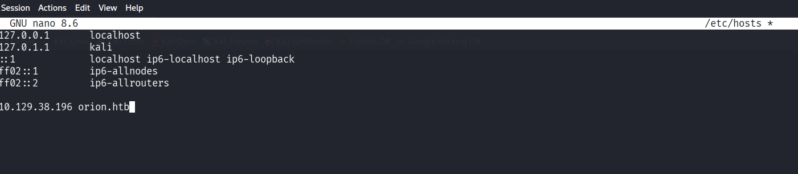

Una vez añadido el dominio, ya podemos acceder correctamente a la página web.

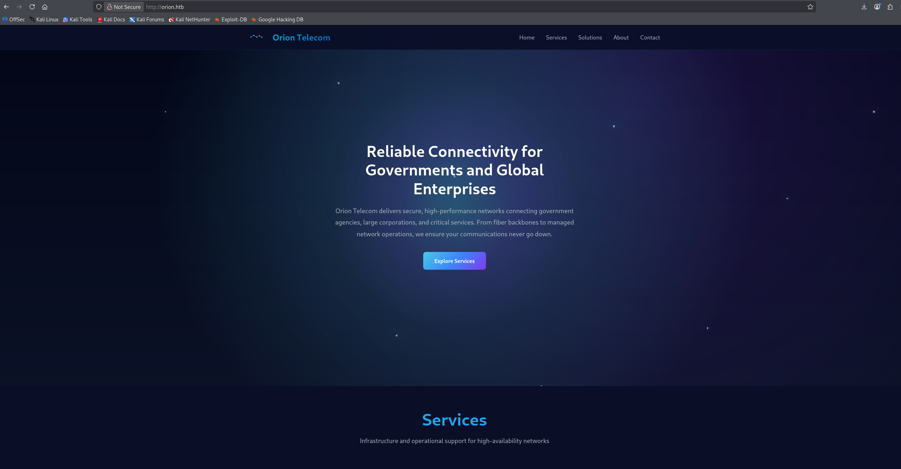

Para seguir enumerando la aplicación, probamos a acceder a un recurso inexistente. En la página de error se filtra información interesante sobre las tecnologías utilizadas:

- **nginx 1.18.0**
- **Yii Framework 2.0.51**
- Aplicación basada en **PHP**

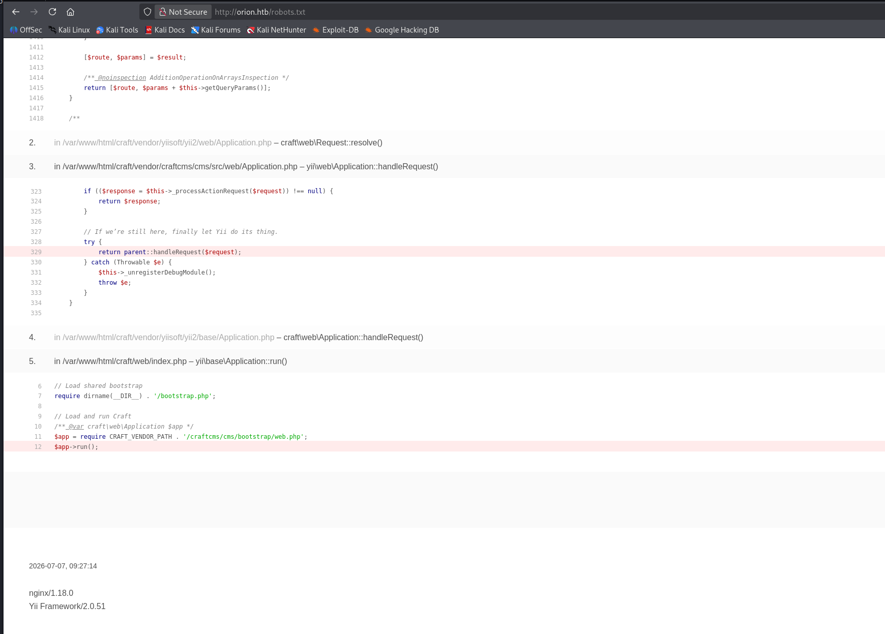

Además, utilizando **whatweb** contra el dominio, se identifica que la aplicación está utilizando **Craft CMS**.

**whatweb http://orion.htb**

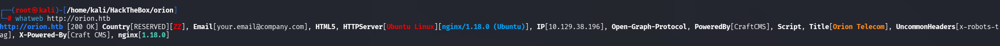

A continuación, se enumeran directorios con **dirb**:

**dirb http://orion.htb**

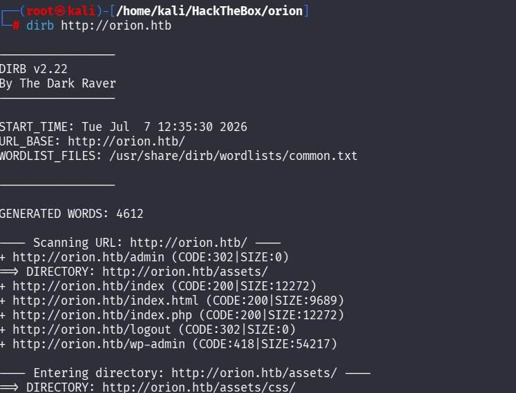

Durante la enumeración aparece el directorio **/admin**, el cual muestra un panel de autenticación de Craft CMS.

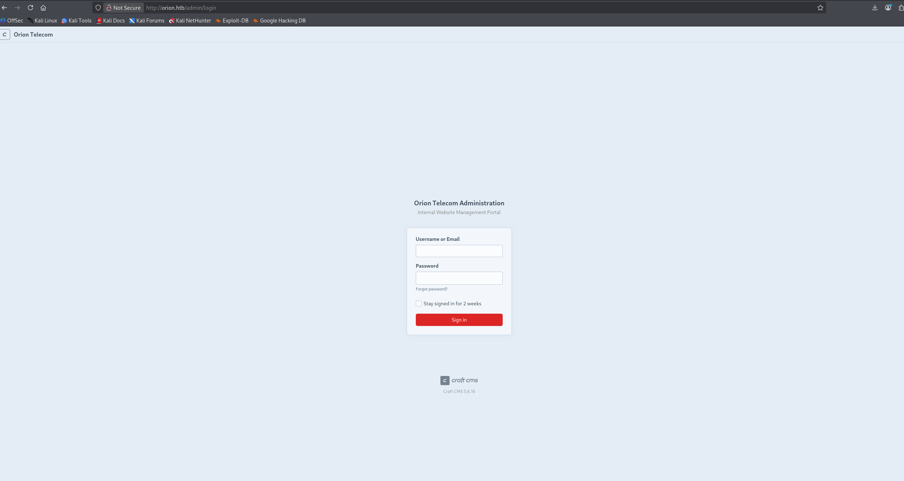

## 🖥️ Acceso al servidor

En el panel de login se puede observar que la versión de Craft CMS utilizada es la **5.6.16**.

Tras buscar información sobre esta versión, se identifica que es vulnerable a **[CVE-2025-32432](https://sensepost.com/blog/2025/investigating-an-in-the-wild-campaign-using-rce-in-craftcms/)**, una vulnerabilidad de ejecución remota de código pre-autenticada en Craft CMS.

La vulnerabilidad afecta al endpoint encargado de generar transformaciones de imágenes:

**/index.php?p=admin/actions/assets/generate-transform**

La funcionalidad legítima de este endpoint consiste en recibir un **assetId** válido junto con un objeto **handle**, que indica parámetros de transformación de la imagen como el ancho o el alto.

Sin embargo, Craft CMS procesa el contenido de **handle** de forma insegura. Esto permite introducir propiedades especiales utilizadas por Yii, como **as session**, y forzar la creación de objetos PHP controlados por el atacante.

En este caso, se utiliza la clase **GuzzleHttp\Psr7\FnStream**, que permite definir una función a ejecutar cuando el objeto se destruye. Mediante el atributo **_fn_close**, se indica que se ejecute la función **phpinfo**.

Es decir, no estamos obteniendo todavía una shell, sino comprobando que el servidor ejecuta código PHP controlado por nosotros.

Para realizar esta comprobación, primero se captura una petición a **http://orion.htb/admin/login**.

Desde Burp Suite obtenemos dos elementos importantes:

- El valor de la cookie de sesión.
- El token CSRF necesario para enviar peticiones válidas a Craft CMS.

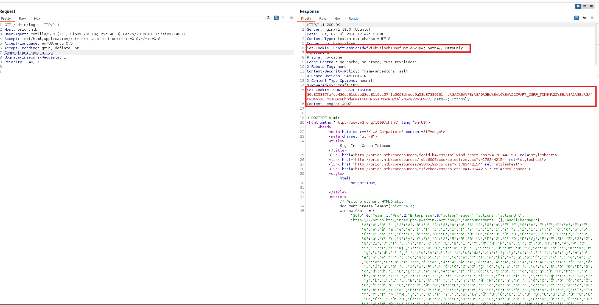

Con estos valores, se realiza una petición **POST** al endpoint vulnerable:

**/index.php?p=admin/actions/assets/generate-transform**

El cuerpo de la petición contiene el siguiente JSON:

    {
        "assetId": 11,
        "handle": {
            "width": 123,
            "height": 123,
            "as session": {
                "class": "craft\\behaviors\\FieldLayoutBehavior",
                "__class": "GuzzleHttp\\Psr7\\FnStream",
                "__construct()": [
                    []
                ],
                "_fn_close": "phpinfo"
            }
        }
    }

En este payload:

| Campo | Explicación |
|---|---|
| **assetId** | Identificador de un asset válido dentro de Craft CMS |
| **width / height** | Parámetros normales de una transformación de imagen |
| **as session** | Abusa del sistema de behaviors de Yii |
| **class** | Clase usada para pasar la validación esperada por Craft/Yii |
| **__class** | Clase que realmente se instancia |
| **GuzzleHttp\\Psr7\\FnStream** | Clase utilizada para ejecutar una función al destruirse el objeto |
| **_fn_close** | Función que será llamada al finalizar el ciclo de vida del objeto |
| **phpinfo** | Función PHP utilizada como prueba de ejecución de código |

Al enviar la petición, el servidor devuelve la salida de **phpinfo()**.

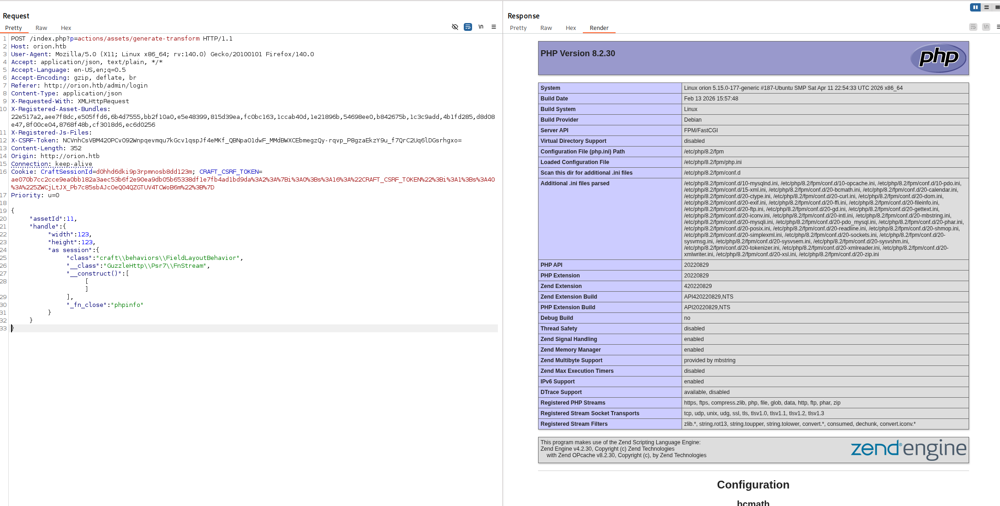

Esto confirma que la vulnerabilidad existe y que se ha conseguido ejecución de código PHP en el servidor.

A continuación, se procede a explotar la vulnerabilidad de forma más cómoda utilizando Metasploit con el módulo **linux/http/craftcms_preauth_rce_cve_2025_32432**.

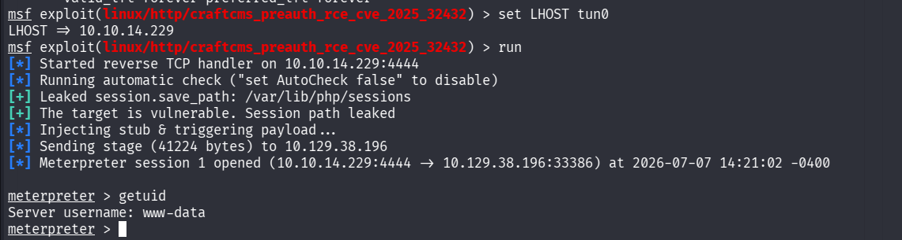

Una vez obtenida la sesión, se lanza una shell interactiva con:

**script /dev/null -c /bin/bash**

Este comando permite mejorar la interacción con la terminal dentro del sistema comprometido.

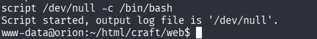

## 🔓 Escalada de privilegios

Una vez dentro del servidor, se comienza la enumeración local del sistema.

Dentro del directorio de la aplicación Craft CMS encontramos un archivo oculto **.env** en **~/html/craft/.env**.

Este tipo de fichero suele contener variables de entorno sensibles, como credenciales de base de datos, claves de aplicación o configuraciones internas.

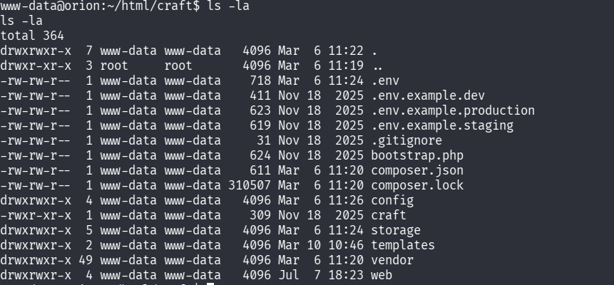

En este caso, se encuentran credenciales de acceso a la base de datos:

| Campo | Valor |
|---|---|
| Base de datos | **orion** |
| Usuario | **root** |
| Contraseña | **SuperSecureCraft123Pass!** |

Con estas credenciales, accedemos a MySQL:

**mysql -u root -p**

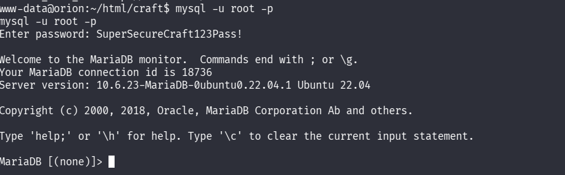

Una vez dentro de MySQL, listamos las bases de datos disponibles. Como sabemos que Craft CMS utiliza la base de datos **orion**, accedemos a ella con:

**use orion;**

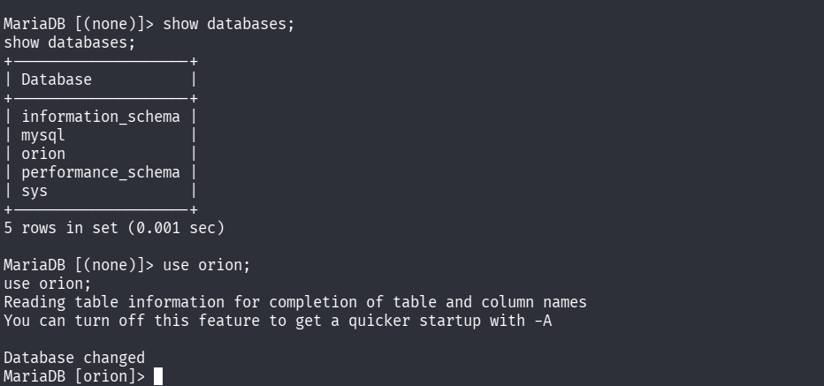

Después, listamos las tablas y revisamos la tabla de usuarios.

**SELECT * FROM user;**

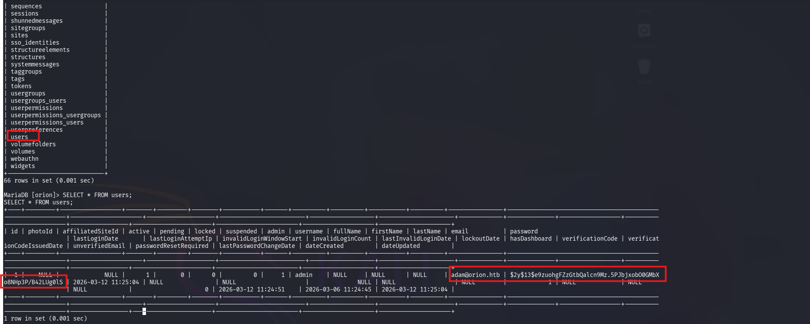

En la tabla se encuentra el usuario **adam@orion.htb** junto a su contraseña hasheada.

Para identificar el tipo de hash, guardamos el valor en un fichero y utilizamos **hashid**. La herramienta indica que se trata de un hash compatible con **Blowfish/bcrypt**.

Para intentar obtener la contraseña en claro, usamos **john** con el diccionario **rockyou.txt**:

**john --wordlist=/usr/share/wordlists/rockyou.txt hash.txt**

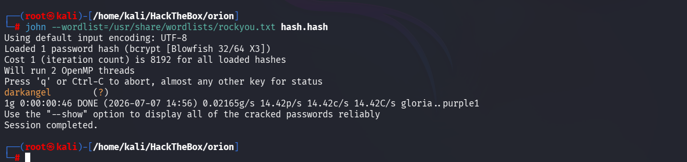

La contraseña obtenida es **darkangel**.

Con estas credenciales, se comprueba el acceso al panel de Craft CMS, iniciando sesión correctamente como el usuario encontrado.

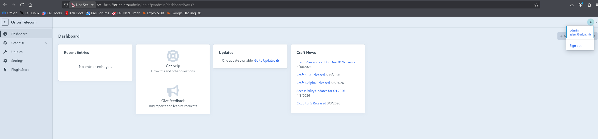

Como ya disponemos de una credencial válida, probamos reutilizarla por SSH contra la máquina víctima:

**ssh adam@orion.htb**

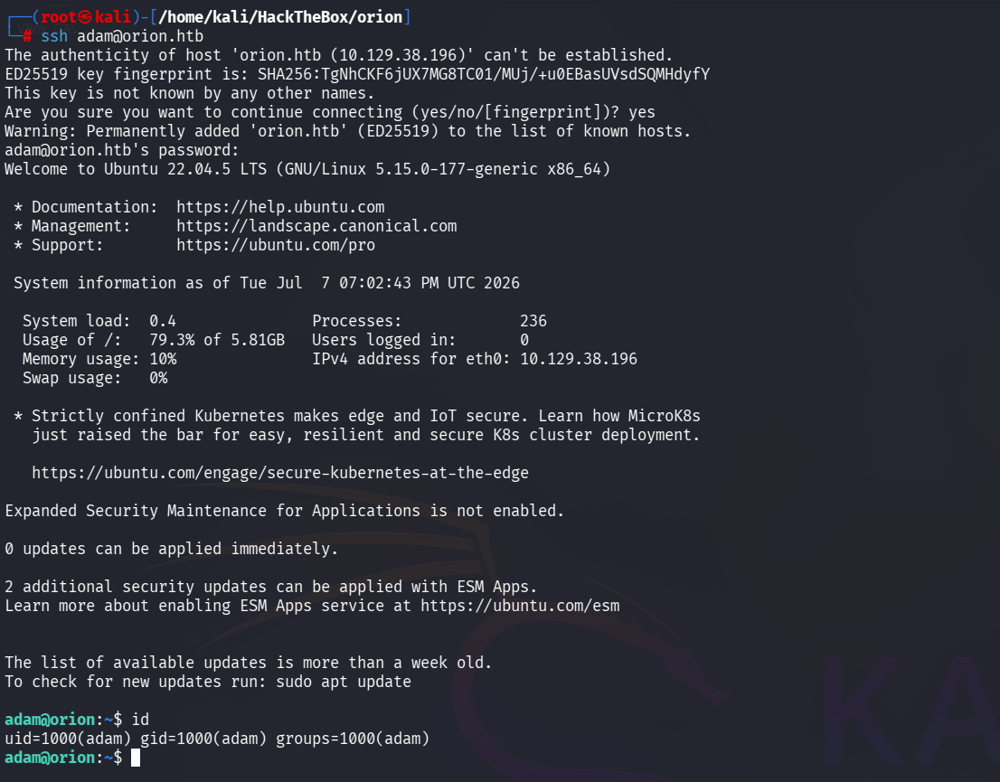

El acceso es correcto. Dentro del directorio personal de **adam** encontramos la flag de usuario.

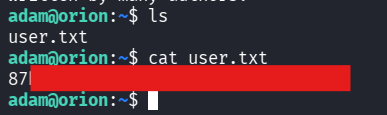

## 🔐 Escalada a root

Para continuar con la escalada de privilegios, enumeramos los servicios locales que están escuchando en el sistema:

**ss -tlnp**

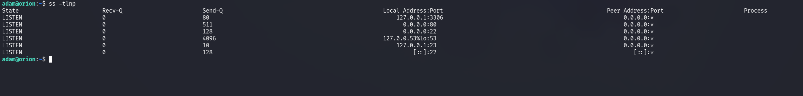

Durante la enumeración se identifica que el servicio **Telnet** está escuchando en el puerto **23**.

A continuación, se revisa la versión instalada de Telnet:

**telnet --version**

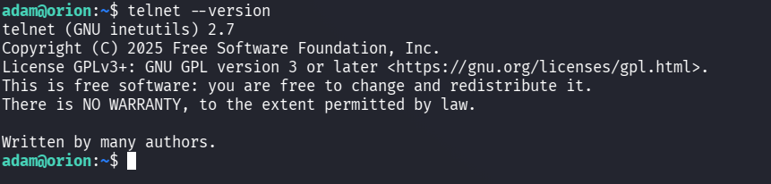

La versión identificada es vulnerable a **[CVE-2026-24061](https://www.virtualhackinglabs.com/news/cve-2026-24061-analysis-critical-telnet-vulnerability/)**.

Esta vulnerabilidad permite abusar del parámetro **USER** para pasar opciones al binario de login. En este caso, se utiliza **-f root**, lo que permite intentar iniciar sesión como el usuario **root** sin pasar por el flujo normal de autenticación.

Se explota con el siguiente comando:

**USER="-f root" telnet -a 127.0.0.1**

Tras ejecutarlo, se obtiene acceso como **root** y se lee la flag final.

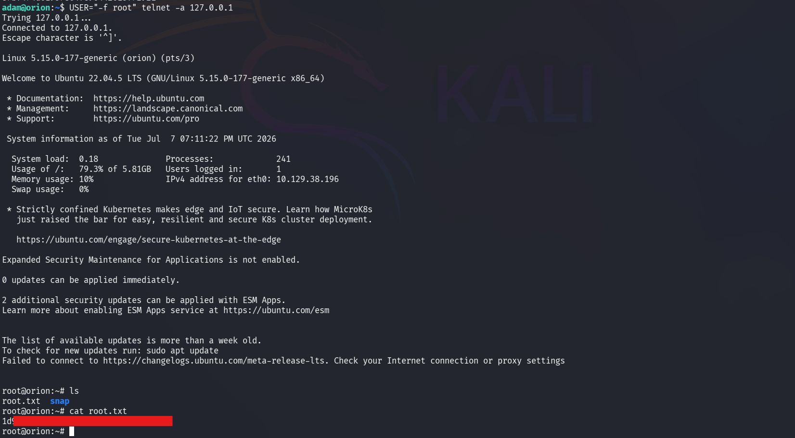

##   ¡Hola! Me llamo Saúl Ruiz 
### Analista de Ciberseguridad | Seguridad Ofensiva y Pentesting

Soy Analista de Ciberseguridad y Técnico Superior en Administración de Sistemas Informáticos en Red. Actualmente desarrollo mi carrera en entornos SOC, participando en tareas de análisis, monitorización e investigación de eventos de seguridad.

Mi interés principal se orienta hacia la seguridad ofensiva, el pentesting y el análisis técnico, áreas en las que sigo formándome de manera constante para crecer profesionalmente dentro del sector.

A través de mi proyecto personal <b>[@PlaSysX](https://linktr.ee/PlaSysx)</b>, comparto contenido relacionado con informática, ciberseguridad y aprendizaje práctico, con el objetivo de aportar valor a quienes también quieren seguir creciendo en el mundo tecnológico.

 

