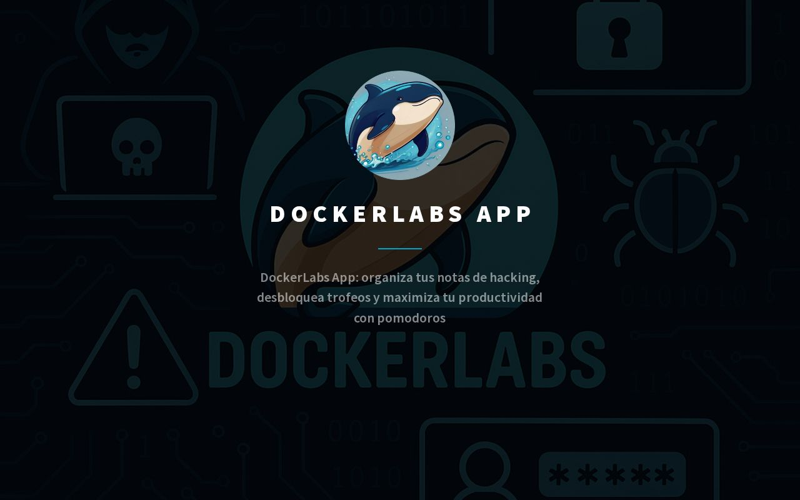

<h1>✍🏻 WriteUps & CTF Solutions</h1>
  

Este repositorio contiene todos los **WriteUps y soluciones** de diferentes plataformas de ciberseguridad como **DockerLabs**, HTB, TryHackMe y otras.  
Los WriteUps están organizados por **plataforma y dificultad**, con explicaciones detalladas, screenshots y comandos utilizados en cada paso.

> [!IMPORTANT]
> 
> Este repositorio se actualiza constantemente con nuevos WriteUps y soluciones

 

## ❓ ¿Qué son los WriteUps?

Un **WriteUp** es un documento que explica **paso a paso** cómo se resolvió un desafío de Un write-up en ciberseguridad es un informe detallado que explica cómo se ha identificado, explotado y resuelto una vulnerabilidad o reto de seguridad, como los que se encuentran en CTFs, pruebas de penetración o investigaciones de fallos en sistemas. Incluye el contexto del reto, el proceso de análisis, las técnicas y herramientas utilizadas, la explotación o resolución, y las lecciones aprendidas, normalmente con ejemplos, capturas y código para que otros puedan entenderlo.

Realizar write-ups tiene varias ventajas: permite aprender de forma profunda al obligarte a documentar cada paso; sirve como historial profesional y portafolio, mostrando tus habilidades técnicas; mejora la capacidad de comunicación al explicar conceptos complejos; funciona como referencia para futuros retos o proyectos reales; ayuda a construir reputación y networking si se comparte en comunidades o GitHub; y desarrolla el pensamiento crítico y la atención al detalle, fundamentales en ciberseguridad.
 

## 🐋 WriteUps en DockerLabs

Soluciones de máquinas de **DockerLabs** organizadas por dificultad.

### Muy Fácil

- [`Obsessions`](./DockerLabs/Obsessions/README.md) → Enumeración de servicios, análisis web y explotación de FTP, SSH y HTTP, con escalada de privilegios mediante abuso de sudo y binarios vulnerables.

- [`Vacaciones`](./DockerLabs/Vacaciones/README.md)  → Enumeración de servicios, fuerza bruta por SSH, análisis de servidor HTTP y escalada de privilegios en Linux.

- [`Vacaciones`](./DockerLabs/tproot/README.md)  → Enumeración de servicios y detección de VSFTPD 2.3.4 con backdoor explotable

 

##   ¡Hola! Me llamo Saúl Ruiz 
### Estudiante en Ciberseguridad

Soy estudiante de Administración de Sistemas Informáticos en Red con pasión por la ciberseguridad y el mundo de la informática. Desde pequeño disfruto explorando tecnología y aprendiendo de manera autónoma. Además, combino mis estudios con la creación de contenido y recursos educativos sobre informática a través de mi proyecto personal <b>[@PlaSysX](https://linktr.ee/PlaSysx)</b>

Si quieres aprender informática, mejorar tus habilidades, descubrir trucos y soluciones prácticas, y formar parte de nuestra comunidad, puedes seguirnos en PlaSysX.

 

