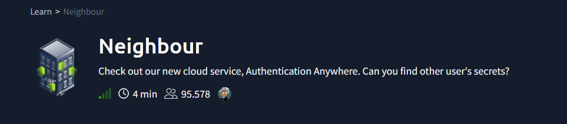
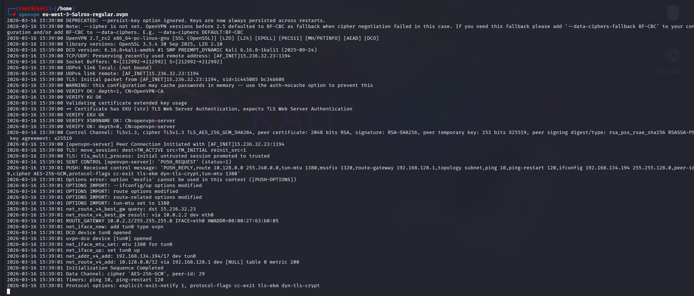
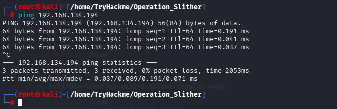
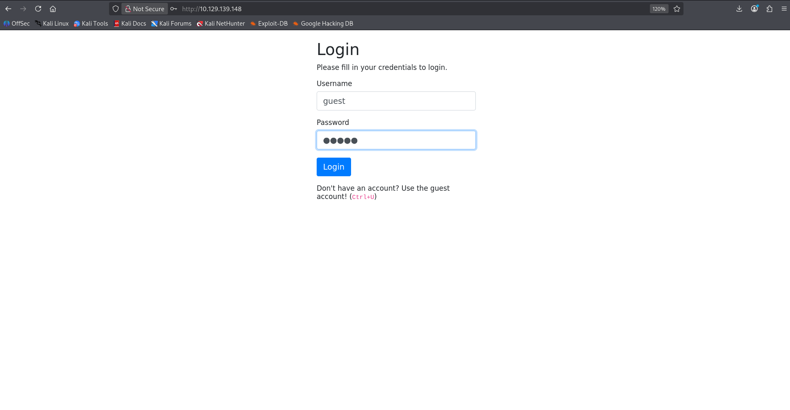
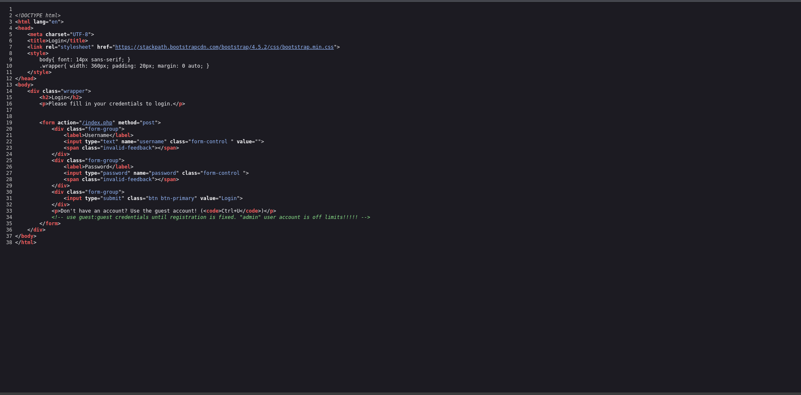
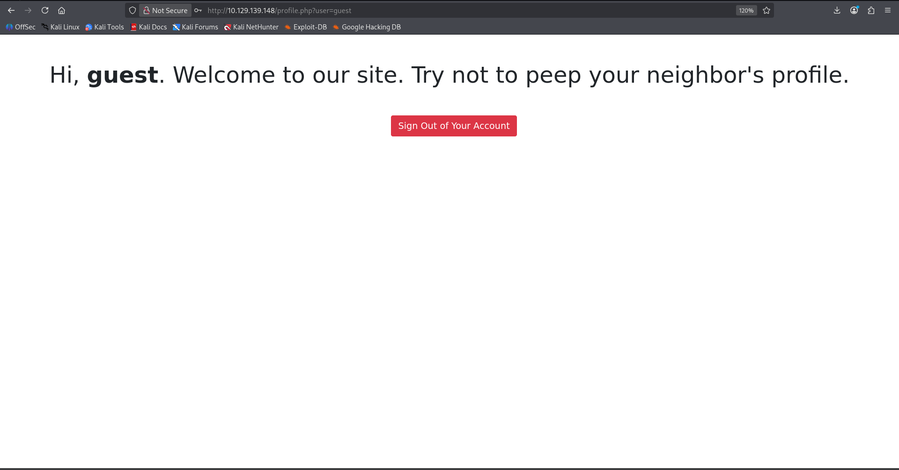
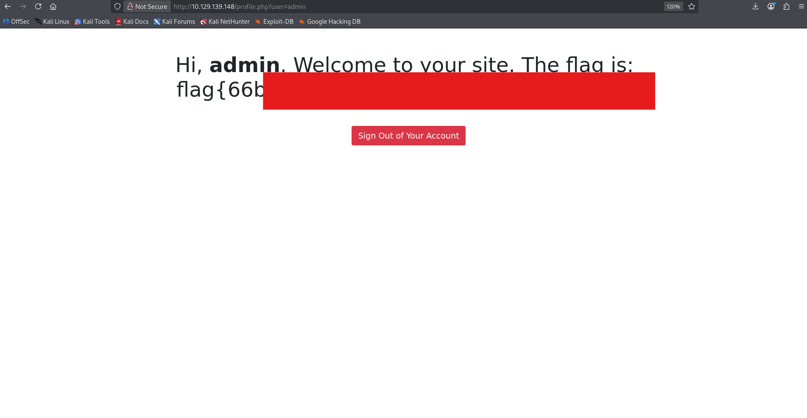
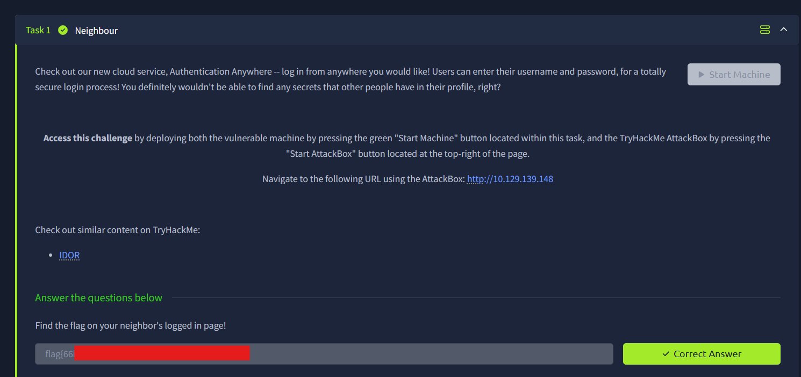

<h1>Neighbour</h1>
  

## ❓ ¿Qué es Neighbour?

Neighbour es una máquina web sencilla enfocada en la identificación de credenciales expuestas en el código fuente y la explotación de una vulnerabilidad **IDOR (Insecure Direct Object Reference)**. Permite practicar análisis básico de aplicaciones web, manipulación de parámetros en URL y comprensión de fallos de control de acceso en aplicaciones vulnerables.

## 🔝 Despliegue Neighbour

Tras descargar el archivo ovpn que ofrece [la plataforma](https://tryhackme.com/access), es necesario en terminal ejecutar el comando **sudo openvpn archivo vpn**

Además, es necesario comprobar conectividad entre nuestra máquina kali y el objetivo .

> [!NOTE]
>
> La dirección IP mostrada en la siguiente imagen es solo de referencia, ya que TryHackMe asigna una IP diferente en cada despliegue de la máquina.

## 🔍 Solución

Al entrar por primera vez a esta página web, se encuentra un panel de logueo, el cúal las credenciales se extraen a través del código fuente presionando **Control + U**

Dentro del código fuente del panel de logeo se encuentra un comentario en la línea 34 con el usuario **guest** y contraseña **guest**.

Tras iniciar sesión, se observa un mensaje de bienvenida al usuario autenticado y una URL que contiene el parámetro `?user=guest`. Esto sugiere una posible vulnerabilidad **IDOR (Insecure Direct Object Reference)**, ya que el identificador del usuario se controla directamente mediante un parámetro modificable en la URL.

Dado que en el código fuente aparecía una referencia al usuario **admin**, indicando además ciertas limitaciones asociadas a dicho perfil, se deduce que este usuario existe dentro de la aplicación. Por ello, se modifica manualmente el valor del parámetro, sustituyendo `guest` por `admin`, con el objetivo de comprobar si es posible acceder a recursos pertenecientes a otro usuario.

Ya cambiado, se encuentra la flag del usuario admin.

Se verifica la flag en la tarea Neighbour.

## 🔧 Remediación

Para evitar una vulnerabilidad IDOR, el servidor debe comprobar que cada usuario solo pueda acceder a sus propios datos, aunque se modifique el parámetro de la URL.

En este caso, aunque se cambie `guest` por `admin`, la aplicación debería verificar si ese acceso está autorizado antes de mostrar la información. Además, evitar utilzar parámetros críticos en las URLs.

##   ¡Hola! Me llamo Saúl Ruiz 
### Analista de Ciberseguridad | Seguridad Ofensiva y Pentesting

Soy Analista de Ciberseguridad y Técnico Superior en Administración de Sistemas Informáticos en Red. Actualmente desarrollo mi carrera en entornos SOC, participando en tareas de análisis, monitorización e investigación de eventos de seguridad.

Mi interés principal se orienta hacia la seguridad ofensiva, el pentesting y el análisis técnico, áreas en las que sigo formándome de manera constante para crecer profesionalmente dentro del sector.

A través de mi proyecto personal <b>[@PlaSysX](https://linktr.ee/PlaSysx)</b>, comparto contenido relacionado con informática, ciberseguridad y aprendizaje práctico, con el objetivo de aportar valor a quienes también quieren seguir creciendo en el mundo tecnológico.

 

